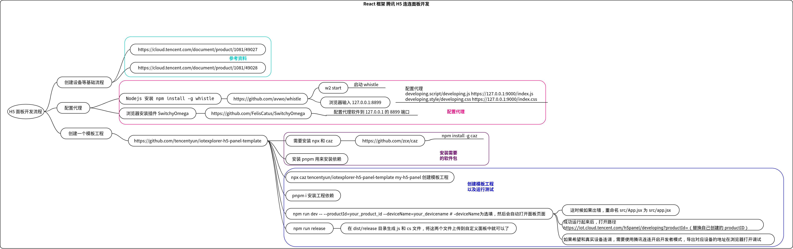

### React 框架开发腾讯连连 H5 面板

#### 一些基础
1. 在 JSX 语法中，可以在 {} 中放置任何有效的 javascript 表达式, 例如 1 + 1
2. Props 具有只读性
3. state 是私有的，并且完全被当前组件控制
4. 使用以下方式传递到父类的构造函数中
```
constructor(props) {
    super(props);    this.state = {date: new Date()};
  }
```
5. Class 组件应该始终使用 props 参数来调用父类的构造函数。
6. 组件挂载和卸载时会分别执行以下方法,这些方法是生命周期方法
```
  componentDidMount() {  }
  componentWillUnmount() {  }
```
7. 不要直接修改 state,而是使用 this.setState({msg_value:sth}), 构造函数是唯一可以给 this.state 赋值的地方
#### Roadmap


8. [react](https://react.docschina.org/) 国内学习 react 很好的网站
#### 经验

* 引用 iconfont 图标字体
	* 通过 **font-class** 方式引用, 这种格式的图标都是单色的
		1. 登陆 iconfont, 将需要的图标添加到项目中，在项目下会生成的 .css 格式的代码: at.alicdn.com/t/font_3157379_rnq949pe62q.css
		2. 在 .less 文件中 import 这个 css 样式文件， ``@import "https://at.alicdn.com/t/font_3157379_rnq949pe62q.css";``
		3. 在 .jsx 文件中就可以使用对应的图标了 eg: <i class="iconfont icon-info"></i>
	* 通过 **symbol** 方式引用, 这种格式的图标是 svg 格式并且支持带彩色的
		1. 登陆 iconfont, 将需要的图标添加到项目中，在项目下会生成的 .js 格式的代码: at.alicdn.com/t/font_3157379_rnq949pe62q.js
		2. 安装 ``pnpm install --save @ant-design/icons`` 包 [https://github.com/ant-design/ant-design-icons](https://github.com/ant-design/ant-design-icons)
		3. 在 .jsx 文件中引入这个 symbol
		``` js
        const IconFont = createFromIconfontCN({
        scriptUrl: '//at.alicdn.com/t/font_3157379_rnq949pe62q.js',
        });
		```
		4. 在 .jsx 文件中使用对应的字体
		``` js
        <svg class="icon" aria-hidden="true">
        <use xlinkHref="#icon-candou"></use>
        </svg>
		```
* 给自定义的 class 进行渲染
	``` jsx
class Demo_test_less extends React.Component {
  constructor(props) {
    super(props);
  }

  render() {
    return (
      <div className="test_demo"> /* className 关联的是该控件的 format 的名称 */
        "Hello china"
      </div>
    );
  }
}
在对应的 less 文件中定义这个渲染的类型， 这个名字要和类中引用的 className 保持一致
	``` less
    .test_demo {
        background:rgb(206,219,222);
    }
	``` less
	```

