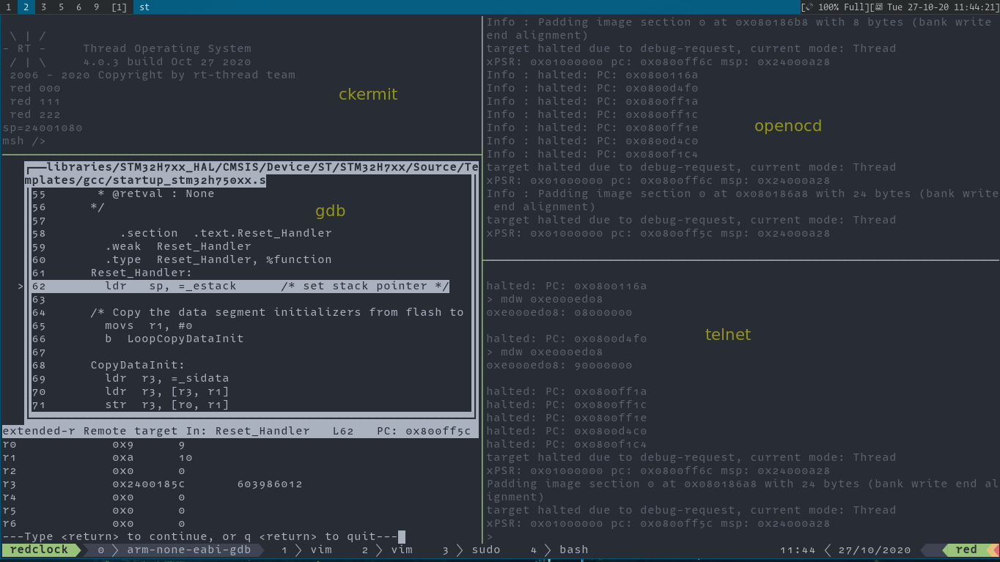
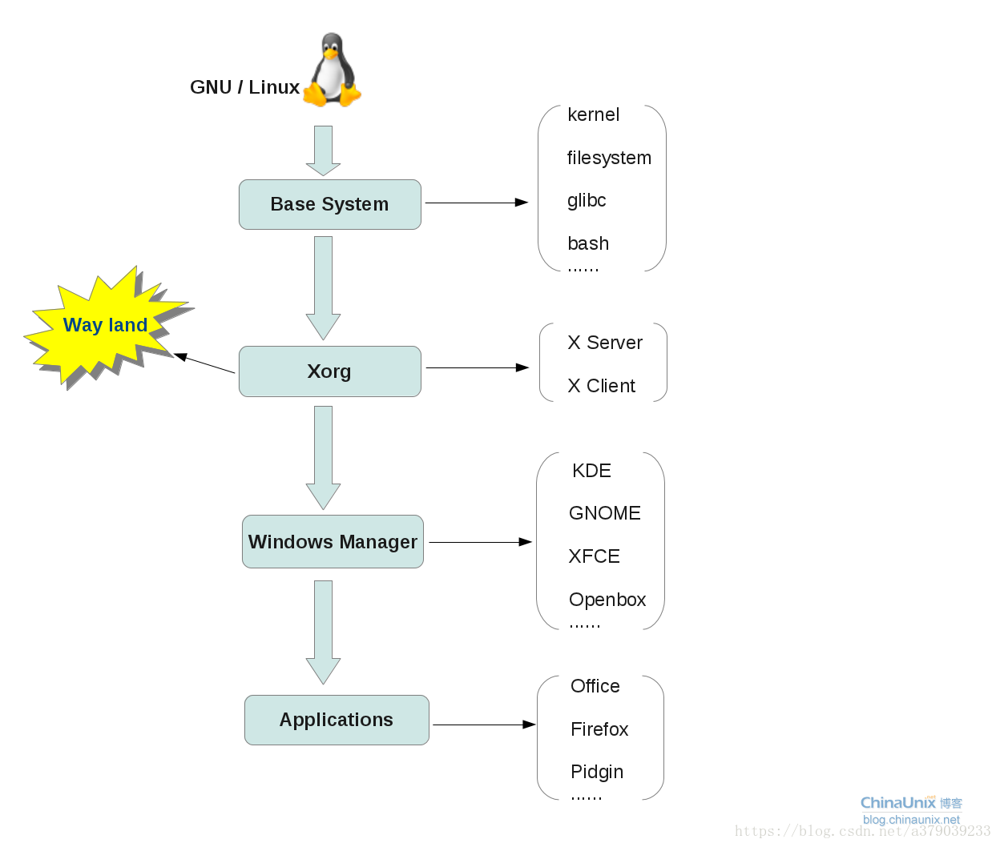

1. Fedora 添加库和禁止、使能库

    1. dnf config-manager --add-repo /etc/yum.repos.d/fedora_extras.repo # 添加一个新的仓库
        1. sudo dnf config-manager --set-enabled fedora-extras # 使能这个仓库源
        2. sudo dnf config-manager --set-disabled fedora-extras # 禁止这个仓库源
        3. sudo rm /etc/yum.repos.d/fedora_extras.repo # 删除配置文件
    2. dnf repolist 列出当前所有的 repos
    3. dnf config-manager --set-disabled repository 禁止库 repository
    4. dnf config-manager --set-enabled repository
    5. sudo dnf remove $(dnf repoquery --installonly --latest-limit=-1 -q) # 也可以使用命令：sudo dnf remove --oldinstallonly
    6. figlet 工具可以将字符串图像化
    7. sudo dnf whatprovides "_A_" ，查找哪个软件包提供名称包含 A 的资源
    8. 设置 hostname 为 red.WS

    ```bash
        hostnamectl set-hostname red.WS
    ```

    8. sudo dnf update 軟件包名稱 # 更新指定的軟件包
    9. sudo dnf upgrade # 升级, 和 dnf update 有相同的功能，都会更新已经安装的软件包，但是更建议使用 `dnf upgrade` ，因为他工作更加准确，类似 `dnf --obsoletes update`,更新过时的软件包
    10. sudo dnf grouplist 列出当前的软件组
    11. dnf list glibc-\*langpack\* 列出已经安装的语言包
        1. dnf list installed # 列出已经安装的软件包
    12. sudo dnf repoquery -l 软件包名称，列出指定软件包名称包含的所有文件
    13. sudo dnf install xxxxx --setopt install_weak_deps=false # 不安装指定软件的弱依赖
    14. ``sudo dnf update --exclude=kernel*`` # 忽略内核的更新更新系统软件包
    15. ``sudo dnf download firefox`` # 下载指定的安装包，但是不安装

2. scp 和 ssh sshpass 命令

    1. 复制 filename 到 serverip 设备的 dir 目录，键入该命令会提示输入 username 的密码
    2. scp filename username@serverip:/dir
    3. 通过 ssh 连接 serverip，用户名是 username
    4. ssh username@serverip
    5. 提前将密码放到 -p 选项地方，其他和一般的 scp 命令一样
    6. sshpass -p "passwdxxx" scp filename username@serverip:/dir
    7. ssh -p xx user@ip ssh -p 参数连接指定的端口 xx

3. git 使用笔记

    1. git log --oneline 每一个 commit 只显示一行
        - git log --pretty=oneline 每一个 commit 只显示一行
        - git log --pretty=ref xxx 查看指定 xxx 的提交，并且显示修改日期
        - git log --pretty=ref -n=yy xxx 查看指定 xxx 的提交，并且显示修改日期，显示 yy 条数据
    2. git log -nx 显示最近的 x 次提交
    3. git help --web [command] 在浏览器查看 git [command] 的 help 信息
    4. git cat-file -t hash 查看一个hash值表示的类型（比如说是提交、tag、、、）
    5. git cat-file -p hash 查看一个hash值的详细信息
    6. git config 的配置信息可以参看 .git 目录的 cofig 文件
        - git config --global user.name 'iysheng' # 修改 global 配置的用户名为 iysheng
        - git config user.name 'Yang sheng' # 修改当前仓库的用户名为 Yang sheng,当前仓库的配置会覆盖 global 的配置
        - git config --list # 列出来当前的配置
        - git push <remote name> --delete <branch name> # 删除远端指定的分支
        - git branch -D branchname # 删除本地指定的分支名
        - git config user.email iyysheng@gmail.com # 配置当前仓库的用户邮件地址
        - git commit -s -m "commit message" # 提交信息, -s 选项可以在 commit 添加 signed off 的尾部
    7. commit 是当前工作区的一个快照，只能包含一个 tree，一个 tree 可以包含多个 tree 和 blob，tree 可以认为是目录类型，blob 是文件类型
    8. detached HEAD(分离头指针) git checkout commitid 的时候就会创建出分离头指针，分离头指针就是说 HEAD 直接指向一个 commit，没有关联到一个分支的情况，这时候需要git branch commitid 创建出一个分支，关联这次 checkout；
    9. git diff commit_id0 commit_id1 ；对比两次提交的差异, commitid[0.1] 没有必要说必须是当前分支的 commitid
    10. HEAD^1 或者 HEAD^ 表示 HEAD 的父亲， HEAD^^ 或者 HEAD^1^1 父亲的父亲，HEAD~ HEAD 的父亲，HEAD~2 父亲的父亲
    11. git branch -d 分支名；删除分支，如果分支没有被 merge，那么会提示无法删除；git branch -D 分支名，强制删除分支
    12. git commit --amend ；修改最近一次提交的注释 message
    13. git rebase -i commit_id ；然后就可以修改待修改的 commit 的 message；git rebase 还可以做很多事情；记得保存 parent，其中 commit_id 可以以 HEAD 为索引进行偏移，举例 head~3 以当前 HEAD 向前推 3 个提交位 rebase 的基
        - 在 github 提交 pr 时可能的场景：在 commit A 提交了 pr, 经过了一段时间，远端仓库合并了一些其他的 commits, 这时候 HEAD 到了 commit B，此时如何快速将自己的 pr 修改为在 commit B 基础上的呢？可以首先 `git fetch upstream` 然后 `git rebase upstream/指定分支(一般是 main 或者 master)`，这时候可能会提示有冲突，如果有冲突，解决冲突，然后执行 `git rebase --resume` 最后就是 `git push 自己仓库 自己分支 -f` 重新提交就可以了。
        - 使用 git rebase 可以快速修改两次提交的顺序
    14. git diff --cached ；暂存区和 HEAD 的差异
    15. git diff ；工作区和 HEAD 的差异
    16. git diff -- 文件名；对比工作区某个文件和 HEAD 的差异
    17. git diff commit_id0 commit_id1：对比两次 commit_id 的差异
    18. git diff commit_id0 commit_id1 -- 文件名；对比指定文件，在 commit_id0 和 commit_id1 这两次提交的差异
    19. git reset HEAD；将暂存区的变更撤回工作区，暂存区的内容就和 HEAD 的一样了
    20. git reset HEAD -- 文件名； 将暂存区的某个文件的变更撤回工作区
    21. git reset --hard commit_id：清除最近的几次提交，将工作区和暂存区强制回退到指定的那次提交
    22. git checkout -- 文件名；将工作区某个文件的变更撤销
    23. git rm 文件名；删除某一个文件
        1. git rm --cached xxx # 删除对指定文件的跟踪，但是不删除本地文件,并且已经跟踪的文件，是无法被 .gitignore 规则忽略的，删除跟踪后才可以，针对 submodule 情景，不需要使用某个 submodule 时，需要使用这个命令删除指定的目录
    24. git stash；暂存状态快照到“栈”

        1. git stash show : 显示做了哪些改动，默认显示第一个存储，如果需要显示其他的存储，后面需要添加 stash@{$num}，eg:

        ```bash
        ▸ git stash list
         stash@{0}: WIP on master: bf7ecd9 libibverbs-41mlnx1-OFED.4.6.0.4.1.46101.src.rpm from http://www.mellanox.com/downloads/ofed/MLNX_OFED-4.6-1.0.1.1/MLNX_OFED_SRC-4.6-1.0.1.1.tgz
        ▸ git stash show
         Makefile.in             |  466 ++-
         aclocal.m4              | 9377 +----------------------------------------------
         autom4te.cache/output.0 | 9005 +++++++++++++++++++++++++--------------------
         autom4te.cache/output.1 | 9009 +++++++++++++++++++++++++--------------------
         autom4te.cache/requests |  735 ++--
         autom4te.cache/traces.0 | 4279 ++++++++++-----------
         autom4te.cache/traces.1 | 3341 ++++++++++++++---
         config.h.in             |   98 +-
         config/libtool.m4       |  259 +-
         config/ltoptions.m4     |    4 +-
         config/ltsugar.m4       |    2 +-
         config/ltversion.m4     |   13 +-
         config/lt~obsolete.m4   |    4 +-
         configure               | 7173 ++++++++++++++++++++----------------
         14 files changed, 19857 insertions(+), 23908 deletions(-)
        ```

        2. git stash show -p : 显示存储的改动，默认显示第一个存储，如果需要显示其他的存储，后面需要添加 stash@{$num}，eg:

        ```bash
        ▸ git stash show -p stash@{0}
        diff --git a/Makefile.in b/Makefile.in
        index 3592fae..9e74afb 100644
        --- a/Makefile.in
        +++ b/Makefile.in
        @@ -1,7 +1,7 @@
        -# Makefile.in generated by automake 1.15 from Makefile.am.
        +# Makefile.in generated by automake 1.16.5 from Makefile.am.
         # @configure_input@

        -# Copyright (C) 1994-2014 Free Software Foundation, Inc.
        +# Copyright (C) 1994-2021 Free Software Foundation, Inc.

         # This Makefile.in is free software; the Free Software Foundation
         # gives unlimited permission to copy and/or distribute it,
        @@ -105,7 +105,11 @@ bin_PROGRAMS = examples/ibv_devices$(EXEEXT) \
                examples/ibv_polldcinfo$(EXEEXT)
         subdir = .
         ACLOCAL_M4 = $(top_srcdir)/aclocal.m4
        ```

        3. git stash drop stash@{num} : 删除指定的栈
        4. git stash clear : 删除所有缓存的栈

    25. git stash list；查看当前“栈”的快照
    26. git stash apply；从“栈”顶恢复快照，但不删除“栈”的这个快照
    27. git stash pop；从“栈”顶恢复快照，但是会删除“栈”的这个快照
    28. .gitignore 文件包含了 git 不希望管理跟踪的文件或者文件类型
    29. git clone --bare；克隆一个不带工作区的裸仓库
    30. git remote add 远端源名称 远端源地址；添加一个远端仓库
    31. git push --set-upstream 远端仓库名 本地分支；推送本地分支到远端仓库
    32. 哑协议表示不带进度条，智能协议带进度条 file://路径名表示智能协议，单独路径名表示哑协议，ssh https http 这些都是智能协议
    33. 修改 ~/.gitconfig 文件，添加 alias 字段，可以添加命令别名
    34. 如果是 fork 其他人的仓库，建议添加一个 upstream 的 remote 源，可以同步更新原版的源，通过 git pull upstream/master 或者分为两个步骤：git fetch upstream; git merger upstream/master
    35. 提交 pull request ，需要首先将代码提交到自己 fork 后打仓库，然后在 github 上点击创建 pr，在 github 上点击 New pull request，根据步骤就好
    36. git val -l ：查看定义打 git 相关的变量; ~/.gitconfig 文件，用户定义打 git 打配置文件， [core]\n editor = vim 使用 vim 取代 默认的 nano 作为 git 的默认编辑器（提交、rebase 等时候调用的编辑器）
    37. git push 的时候卡住，添加了git config --global core.askpass "git-gui--askpass" 就可以解决；通过 http 或者 svn 时候，push 的时候可能会需要账号密码，可能当时是被键入账号和密码的程序卡住了？？？
    38. git status 修改 core.quotepath 为 flase；修改为 false 可以保证大于 0x80 的字节不会以 hex 模式显示，可以解决中文乱码的问题；具体细节可以参考 man git-config 搜索 quotepath
    39. git reset commitid filenames ：回退某个文件到某次提交
    40. git reset --hard commitid ：可以撤销在本地还没有 push 的 commit
    41. git branch -a 查看所有分支
    42. git branch -r 查看远程分支
    43. git checkout branchname 切换到某个分支, git checkout -f branchname 强制切换到指定分支
    44. git commit --amend 文件名；//修改某次提交的日志信息，还可以追加提交的文件
    45. git log --stat ： 查看提交记录，包含每次提交的文件列表
    46. git diff commitid ；// review the files modify detiles this commit
    47. git show commitid ；// 查看某一次提交修改的代码
    48. git pull 和 git fetch 的区别
        1. 简单来说， git pull 完成了两部分的动作： git fetch 和 git merge
        2. 一般的操作说明 git pull remote_repo remote_branch
        3. 分为两个步骤的命令 git fetch remote_repo remote_branch ；git merge remote_name/branch_name / 或者 git merge FETCH_HEAD（备注： FETCH_HEAD 指向的是最新一次的 fetch）
    49. git send-email # 需要安装 git-email
    50. 针对某次提交 checkout 出来一个分支，否则的话如果直接 git checkout commitid，会造成分离头指针的情况
        ```bash
        git branch branch_name commitid # 在某次 commitid 的时刻，创建出一个分支
        git checkout commitid # 针对某次 commitid 直接检出，这时候就会出现分离头指针，在分离头指针的情况下，也可以再次 git branch branch_name commitid 切出来分支
        git checkout commitid filename # 检出指定文件的某次提交的版本
        ```
    51. git diff HEAD^ HEAD ; 将最近的一次提交打成一个补丁文件
    52. git branch -m 旧分支名 新分支名 # 修改分支名称
    53. git submodule update --init --recursive # Download sub module command
        1. git submodule 列出来当前仓库引用到的所有 submodules
        ```bash
        ▸ git submodule
         cbee4e028d66e5d9cc0ef2c45656a1f9438bd319 packages/FlashDB (1.0.0-3-gcbee4e0)
        ```
        2. git submodule set-url <path> <newurl> 修改 path 这个 submodule 新的路径
        3. git submodule update <path> # 单独只更新指定 path 的 submodule,在很多 submodule 并且仓库都很大的时候建议单独 update,
        4. git submodule add <url> <path> # 添加一个 submodule
    54. git clone --recursive reposite # recursion download sub module
        1. git clone --filter=blob:none --no-checkout <url> # [下载较大的仓库的时候](https://about.gitlab.com/blog/2020/03/13/partial-clone-for-massive-repositories/)，可以使用该命令实现类似 git clone continue 的功能，会拉取 `default branch` 的数据，这个命令实现的是类似取消拉取大型数据？？？
        2. git checkout <branch> # 如果要检出其他分支时，会再次自动拉取所需的内容，类似实现多次拉取的效果
        3. git 会记录 filter 的设置，如果希望回复默认拉取完整仓库的数据，需要执行
        ```bash
        git config remote.origin.promisor # true 恢复默认
        git config remote.origin.partialclonefilter # blob:none,取消拉取大型数据？？？支持分段拉取
        ```
        4. git clone --depth 1 <url> # 浅层 clone 仓库，只拉取最后一次 log 的日志
        5. git fetch --unshallow # 拉取完成当前分支, 在浅层 clone 的基础上拉取当前分支的所有提交记录
        6. git fetch --depth 1 origin 远程分支名称 # 浅层拉取仓库的指定分支
        7. git checkout 远程分支名称 # 切换为指定的分支，然后再使用 git fetch --unshallow 拉取所有提交记录
        8. git remote set-branches origin 分支名称 # 如果当前不在这个分支的时候要执行这句话，接着才可以正常切换到这个新的分支
    55. git rm --cached 文件路径 # 取消对指定文件的跟踪
    56. [git submodule 命令的一般方法](https://www.vogella.com/tutorials/GitSubmodules/article.html)
        ```
        git submodule add -b branch_name [URL to Git Repo] # 添加子模块的跟踪路径和对应的分支
        git submodule add [URL to Git Repo] [path in current pro]# 添加子模块的跟踪路径到指定的路径
        git submodule init # 初始化 submodule 的配置
        1. git submodule mv [旧的子模块目录名] [新的子模块目录名] # 修改旧的子模块目录名为新的子模块目录名
        2. git submodule sync # 同步对子模块的修改
        ```
    57. 在设置了 git mergetool 为 vimdiff 后，[在合并冲突时的一般使用方法可以参看](https://www.cnblogs.com/snake-hand/archive/2013/06/12/3133055.html) [还可以参看](https://www.dazhuanlan.com/2019/12/04/5de7cbeb6d522/?__cf_chl_jschl_tk__=eafb6a75757065654d1411064f7ece546be9e2df-1600563251-0-AaFC7OSqFZO7wzxjhGFCEy53WsqMSSymUJRzyv23xj5QLZgPE_uvd-mZ9Si6tTGfN9D0jdyrX9SD-maksubKac0rBJXemvwc146YShw8JOYmSbM0W6x0x07mtkNPx_QfAmLIL-NHMvJnoZG9pjJvLxmO8wY16wCNrWoDKOb-R_-l_91bY8AJmVFHuP4X7OgH2OxEY1qfcZGSPf9lvMJj7RaXXm3tfoZwsqW-7C7T7-beP4vcz5-ZzjsOFwOFVM7P__REvExMF6qR6nw76W9Q2TnULIk2o09kZUWY7PUlpuRW7fb-90m6_X6KmlB-_4GlLg)
        1. 弹出的 4 个 buffer,分别为 LOCAL,BASE,REMOTE,MERGEE
        2. LOCAL 是我们本地的分支， REMOTE 是要合并到当前分支的外部分支上的内容，BASE 是 LOCAL 和 REMOTE 两个分支的共同祖先,MERGED 合并结果，将会保存到本地 repo.
        3. 首先需要切换到 MERGED buffer,然后根据吧需要，执行 diffget LO 或者 diffget BA 或者 diffget RE, 记得然后执行下 diffupdate 命令，或者 w! 直接保存
        4. 在多个 diff 处跳转快捷键 **]+c** 跳转到下一个 diff 处， **[+c** 跳转到上一个 diff 处
    58. git cherry-pick commit_id,合并某次提交到当前分支
        1. git cherry-pick commit_id0..commit_id1 # 批量合並 commit_id0 ~ commit_id1 之間的所有提交，不包括 commit_id0
        2. git cherry-pick commit_id0^..commit_id1 # 批量合並 commit_id0 ~ commit_id1 之間的提交，包括 commit_id0
        3. git cherry-pick --abort # 終止合並，當合並出問題時候，可以執行這個選項
    59. git clean 參數 （刪除那些未 git add 的文件，一般地： git clean -dfx 就可以情理所有需要清理的文件，謹慎考慮不要用 -f 強制刪除，使用 -i 確認下）
        1. -n 顯示將要刪除的文件和目錄
        2. -x 刪除忽略的文件
        3. -X 僅僅刪除忽略的文件
        4. -d 刪除目錄
        5. -f 強制執行
        6. -i 交互式地刪除文件，即會給你選擇是否刪除
        7. -e 過濾掉一些不需要刪除的文件
    60. git apply {patch 文件}
        1. git apply {patch 文件}：打 patch 有冲突无法合并时，不会打上布丁
        2. git apply --stat {patch 文件} : 查看 patch 文件包含的改变
        ```bash
        ▸ git apply --stat /tmp/rtc.diff
         bsp/gd32103c-eval/Kconfig            |    5 +
         bsp/gd32103c-eval/README.md          |    1
         bsp/gd32103c-eval/drivers/SConscript |    3 +
         bsp/gd32103c-eval/drivers/drv_rtc.c  |  134 ++++++++++++++++++++++++++++++++++
         4 files changed, 143 insertions(+)
        ```
        3. git apply --check {patch 文件} : 检查 patch 文件格式
        ```bash
        ▸ git apply --check /tmp/rtc.diff
        error: patch failed: bsp/gd32103c-eval/Kconfig:97
        error: bsp/gd32103c-eval/Kconfig: patch does not apply
        error: patch failed: bsp/gd32103c-eval/README.md:48
        error: bsp/gd32103c-eval/README.md: patch does not apply
        error: patch failed: bsp/gd32103c-eval/drivers/SConscript:24
        error: bsp/gd32103c-eval/drivers/SConscript: patch does not apply
        ```
        4. git apply --reverse {patch 文件} ： 取消 patch 的使用，将之前已经打过的 patch 撤销
        5. git apply --reject {patch 文件} ： 强制打 patch，有冲突的内容保存到 rej 文件
    61. git log # 显示提交信息
        1. git log --author="red" # 查找某一个作者的提交
        2. git log --after="2021-01-02" # 显示 2021-01-02 日期之后的提交
    62. git clone -b branch_name url # 拉取指定分支的代码
    63. git 配置默认使用 vim 作为编辑器
        - `git config --global core.editor "vim"`
        - `export GIT_EDITOR=vim`
        - `export VISUAL=vim export EDITOR="$VISUAL"`
    64. `git config --global url."https://hub.fastgit.xyz/".insteadOf "https://github.com/"` 使用 cdn 加速替换 clone 路径拉取项目代码
    65. Github 插件仓库[https://github.com/XIU2/UserScript](https://github.com/XIU2/UserScript)
    66. git log -E 使用 [extended-regexp 扩展正则表达式的用法](https://en.wikibooks.org/wiki/Regular_Expressions/POSIX-Extended_Regular_Expressions)
        - git log -E --author="(Yang sheng)|(iysheng)" # 查找作者是 Yang sheng 或者 iysheng 的提交
    67. git checkout <commit> <filePath> # 可以直接检出指定文件或者文件夹
    68. git add 文件 -f # 可以强制添加被 .gitignore 忽略的文件
        1. git add -u # 仅仅添加删除和修改的文件
    69. git push xxx --mirror # 推送所有分支(refs/\*\*\*\*)到远端, 比 --all 推送的更多
    70. git push xxx --all # 推送所有分支(refs/heads)到远端
    71. git pull/fetch xxx --all # 拉取所有分支(refs/heads)到远端
    72. git log --pretty=oneline xxxx # 查看指定文件的所有修改历史
    73. git describe --always --dirty --tags 命令可以打印出来详细的版本信息
    74. git 使用 hook 的方法，进入 `.git/hook` 目录，重命名 .sample 文件，eg: 修改 pre-commit.sample 为 pre-commit，添加可执行权限就可以了
    75. git describe --always --dirty --tags 命令可以打印出来详细的版本信息
    76. git ls-files # 列出来跟踪的所有文件
    77. git blame -L <start>,<end> 文件名 # 查看指定文件在指定的起始和结束行范围内的代码改动.
    78. git blame -L :funcname 文件名 # 查看指定文件在指定的起始和结束行范围内的代码改动.
    79. git rm --rf --cached xxxx 然后再 git add xxxx 可以解决有些第三方的软件包无法 git add 或者提示 fatal: in unpopulated submodule xxxx 的问题
    80. git log -S "被删除的代码片段" --patch 代码片段所在的路径 # 可以快速找到在哪次提交中删除了这部分代码
    81. git log --pretty=oneline --since="2023-01-01" --util="2023-05-01" xxxx # 查看指定文件在``2023-01-01``日期之后到 ``2023-05-01`` 之间的所有修改历史
    82. ``git log -S'代码片段' -- 文件路径`` 查找指定代码在哪次提交中引入的
    83. ``git ls-files`` 查找跟踪的所有文件，方便定位为什么 ``git add -f xxx`` 还是显示未跟踪 xxx 的问题,可能是已经跟踪了同名的 xxx 文件，这次又要重新跟踪 xxx 目录导致的
    84. ``.gitignore`` 文件示例,如果想只跟踪``.c .cpp .h .S .s``等这些源文件，可以使用下面的写法
        ```
        # * 表示忽略所有文件
        *
        # !*/ 表示取消对目录的忽略
        !*/
        # !*.c 表示取消对 .c 文件的忽略,后面的也是类似取消对 .cpp 文件的忽略等
        !*.c
        !*.cpp
        !*.h
        !*.hpp
        !*.S
        !*.s
        ```
    85. 使用 curl 下载 gihtub 上的某次提交 diff，比如:``curl -LfO https://github.com/libffi/libffi/commit/cbfb9b4.patch``，路径格式是 `` https://github.com/libffi/libffi/commit/commitid.patch``
    86. 还可以下载多次提交之间的所有补丁，和 ``git cherrp-pick`` 语法有点类似。下载两次提交的补丁，包括首尾:`` curl -LfO https://github.com/libffi/libffi/compare/170bab47c90626a33cd08f2169034600cfd9589c^..2835f72cc7ee57edfc987da4b88b1f4c7c0386c3.patch`` ， 下载两次提交之间的所有补丁，不包括首: `` curl -LfO https://github.com/libffi/libffi/compare/170bab47c90626a33cd08f2169034600cfd9589c..2835f72cc7ee57edfc987da4b88b1f4c7c0386c3.patch``， 格式 `` curl -LfO https://github.com/libffi/libffi/compare/commit1^..commitid2.patch``，带有 `^` 表示包含 commit1 和 commit2 在内的所有提交补丁，不带 `^` 表示不包含 commit1 这次提交的补丁
    87. 下载 pr 是类似的操作 ``curl -LfO https://github.com/user/repo/pull/123.patch``

4. 本地搭建 git 服务器
    1. 创建一个 git 用户（为了方便用户提交的时候统一走 git 用户），git 用户的目录权限很重要（权限要正确，否则无法通过阿里云连接）
    2. chmod 755 ~ [备注：关于目录 .ssh/ 和文件.ssh/authorized_keys 的权限需要严格按照这个权限，否则无法正常通过密钥文件验证，但是，测试的时候，还是可以通过 systemctl status sshd.service 查看]
    3. chmod 700 ~/.ssh
    4. chmod 600 ~/.ssh/authorized_keys
    5. 将用户的公钥追加到文件 ~/.ssh/authorized_keys
    6. 修改 sshd 的配置文件 /etc/ssh/sshd_config 修改权限 PubkeyAuthentication yes
    7. 重启 sshd 服务器【提示，无法连接时，可以通过命令查看 systemctl status sshd.service 无法连接的原因，一般都是 ssh 服务的原因 】
5. 使用 bc 命令实现进制之间的转换

```bash
# ibase 和 obase 的使用，obase 会根据 ibase 的值，解析传入的参数，并且字母必须用大写
echo 'ibase=16; obase=10; 10' | bc   # 结果仍然是 10
echo 'ibase=16; obase=A; 10'  | bc   # 结果变成是 16
echo 'ibase=10; obase=16; 25' | bc   # 结果 19
```

6. tig 的使用说明，tig 是基于 ncurses-based ，命令行下图形化查看 git 仓库相关信息的工具
    1. 查看某次 commit 和这次 commit 提交的代码修改
    2. 查看当前暂存和未存的修改（main 视图就可以查看）
    3. 增加和剔除暂存的修改（在 main 视图[tig 命令直接的视图]通过 s 按键到 status 视图，再通过 u 快捷键可以增加或者删除文件到暂存区，返回 main 视图可以通过 q 退回上一个视图，或者直接按键 m）
    4. 编辑 commit 并提交（在 status 视图，按键 C ，然后按键 i 编辑提交信息，然后按键 :x 可以提交了）
    5. 查看仓库的所有 tag 和分支（按键 r [branch 视图]）
    6. 查看某次提交的树形视图（在某次提交或者 tag 处，按键 t 查看）
    7. 明确了 tig 的几个视图； main 视图，tree 视图，status 视图，stash 视图[查看所有暂存的提交，按键 c 切换到该视图，该视图一般和 status 视图配合使用]，branch 视图，log 视图[按键 l 切换到该视图]
    8. Q 直接退出 tig，q 退出到上一个视图
    9. 在查看文件时，要使用 j、k 这些按键
    10. d 到跳转到对应选择的 diff 视图，比如某次 commit、 stage 的和 unstage 的
    11. O 可以最大化当前窗口
7. ls -lt 默认是按照文件的修改时间排序的，相应的 ls -ltu 是按照文件的访问时间排序， ls -ltc 是按照文件的 i 节点的修改时间排序
8. open 函数打开的文件名，要对包含的目录具有可执行权限位，这个位也被成为搜索位
9. unlink 函数，减少文件的链接记数；rename 函数，重新命名文件或者目录
10. ls -F 选项[在不同文件类型的文件名后添加指示器]；会在符号链接文件后加一个 @ 符号，在目录文件后加 / 符号
11. 文件具有 3 个时间【ls -u 文件数据的组后访问时间；ls 文件内容的最后修改时间；ls -c 文件 i 节点的最后更改时间】；要知道文件 i 节点和文件数据内容是分开存放的
12. tig
    1. o 选项可以配置一些 tig 选项，左右方向建可以切换对应的配置选项，目前只有 16 个选项，根据选项的提示符号，按对应的符号修改不同的选项值，建议参看 tig 的官方 manual，在 home 目录下还可以创建一个 .tigrc 配置文件初始化 tig
    2. e 按键可以打开编辑器，可以编辑对应的文件在 status view
13. netstat 命令，查看进程监听的网络端口号，一般用法

```bash
netstat -lntup # 列出所有监听服务的 socket(-l) 和对应的端口号(-n)，包括 tcp(-t) udp(-u) 以及PID/进程名称(-p)
netstat -rn # 列出 gateway 路由等信息
netstat -tn | grep ESTABLISHED | grep :22 # 查看 22 端口的链接
```

14. systemd 是 Linux 的系统和服务管理器;init 进程的替代品，systemctl 命令是管理 systemd 的主要工具

```bash
systemctl # 列出正在运行的服务
systemctl list-units --type=service # 列出所有已加载的服务
systemctl list-units --type=service --state=active # 列出所有已加载并且处于活动的服务
systemctl list-units --type=service --state=running # 列出所有已加载并且正在运行的服务
```

15. ss 用来 dump socket 的统计信息，显示的内容类似于 netstat，但是 ss 可以显示更多 TCP 和状态信息。

```bash
ss -ltup # 显示正在监听(-l)的 TCP(-t) UDP(-u) 的进程信息(-p)
```

16. 修改 /etc/resolv.conf 文件修改 dns
17. 远程桌面连接主要使用两种协议，第一种就是微软在 Windows上 的 RDP（Remote Desktop Protocol）协议，第二种就是 VNC（Virtual Network Console）协议，
    不过 Linux 远程桌面连接 Windows （使用 rdp 协议），需要安装工具 rdesktop，基本的用法

```bash
rdesktop -u 用户名 远程 windows 的 IP 地址
```

18. 重新 mount 挂载为只读属性的磁盘为可读写， -o 参数表示 mount 的选项， remount 表示需要重新 mount

```bash
mount -o remount,rw [磁盘路径]
```

19. 使用 df 查看磁盘剩余空间情况

```bash
df -h 以可以识别的单位直接打印出来剩余磁盘空间容量
df -l 只显示本地磁盘的信息
```

20. 阅读 pdf 和电子书的软件

```
sudo dnf copr enable atim/yacreader # pdf 软件
sudo dnf install yacreader # 电子书
sudo dnf copr enable bugzy/lector
sudo dnf install lector
```

21. emoji 图标的格式，以冒号开头和结尾例如（:tada:）
22. xlicp 复制内容，在 X 系统里面，从一个窗口复制一段文字到另一个窗口，有两套机制，分别是 Selections 和 cut buffers。
    1. 用的 copy & paste 是利用的 cut buffers 机制;
    2. 另外用鼠标选中一段文字，然后在另一个窗口按鼠标中键实现复制，利用的是 selections 机制。selection 又可以分为 master 和 slave selection。当用鼠标选中一段文件，这段文字就自动被复制到 master selection。然后在另一个地方按鼠标中键，就自动把 master selection 的内容粘贴出来。当你想复制少量文字的时候，两种方法都是很方便的。但是当复制大段文字的时候就挺麻烦。另外就是你可能会频繁的执行一些复制粘贴工作，不停的用鼠标选中文字，然后再粘贴。这是对手指的折磨。

```bash
xlicp -i file # 复制 file 文件的内容到 X master session，使用鼠标中键可以将赋值的内容粘贴出来
```

23. ranger 终端的文件管理器，安装成功后，需要首先执行 ranger --copy-config=all，复制所有的配置文件到 ~ 目录

    1. 浏览模式下，通过 o 选项打开排序选项，比如 oc 按照最后访问时间降序排序
    2. 在 st 终端模拟器下，预览图片

    ```bash
    sudo pip3 install ueberzug # 测试发现 w3m method 使用未成功 (https://github.com/ranger/ranger/issues/1820)
    # 安装 ueberzug 并修改 rc.config 文件，method 为 ueberzug 可以正常预览，还需要额外注释掉 set use_preview_script true 这一行！！！
    ```

    3. jk 分别对应上下移动, h 为跳转到 parent 目录, l 为跳转到下一级目录
    4. 各种文件的作用，可以使用 ranger copy-config=all 复制默认的配置文件到 ~/.config/ranger
        - commands.py 包含了各种函数的实例
        - rc.conf 设置各种选项，以及绑定函数的快捷键
        - fifle.conf 决定了选不同后缀名文件的打开软件
        - scope.sh 实现了各种类型文件预览的脚本
    5. 打开文件并且让 ranger种类型文 选择哪一个程序打开该文件（通过 rfile），快捷键是 r
    6. y[d,n,p] 可以不复制整个文件，需要借助 xclip
        - yd 仅仅复制选择的目录
        - yn 复制选中的文件名
        - yp 复制路径
    7. 如果移动多个文件，并且这多个文件不在同一个目录，切换目录后，需要使用 ya 或者 da，添加选中的目录
    8. 如果同一时间工作在不仅一个目录，可以给每一个目录创建一个 tab N，然后通过 alt + N，切换到指定的 tab
    9. 所有文件的预览在 scope.sh 脚本文件实现
    10. ? 获取 help 信息
        - m 打开 man page
        - k 打开快捷键绑定列表
        - c 打开有效的命令列表和描述
        - s 打开配置和当前的值
    11. I 重命名当前文件， A 重命名当前文件的后缀
    12. :flat 命令，可以修改目录的折叠层级
        - :flat -1 表示无限展开
        - :flat 0 表示仅仅当前目录
        - :flat 1 表示一级、依次类推
    13. ranger 插件集合
        - https://github.com/cdump/ranger-devicons2 显示类型图表插件
        - https://github.com/fdw/ranger-autojump 自动跳转的插件，打开的目录会自动添加到 autojump 数据库，然后就可以通过 autojump 根据模糊搜索跳转到对应的目录了
            - 记得需要添加 `autojump source /usr/share/autojump/autojump.bash &> /dev/null` 到 `~/.bashrc` 文件, 否则会报 `Please source the correct autojump file in your shell's` 错误
    14. 添加 **set vcs_aware true** 到 ~/.config/rc.conf 文件，放开版本控制
    15. ranger 的 S 键可以快速切换到最后浏览的目录，但是是以新开一个 shell 的方式，如果退出当前 shell，还是返回之前的目录
    16. m+字符，打书签，这个书签是持续性的，可以使用 `+书签名再次跳转到指定的书签
    17. dU 显示当前文件夹大小以及文件夹下内容的大小
    18. zh 切换显示隐藏文件也可以用 ctrl+h

24. cmake 笔记

    1. cmake 需要更改安装目标的时候，可以使用 DESTDIR 环境变量修改默认的安装路径，而使用 CMAKE_INSTALL_PREFIX 影响范围更广

        ```bash
        make DESTDIR=/home/yys/pctools install # 会将编译出来的文件安装到目录 /home/yys/pctools/usr/local/ 目录
        ```

    2. cmake 在配置的时候，会存在 cache file,所以如果修改了 cmake 的配置文件再次执行 cmake 构建的时候，如果发现修改的没有效果，可以首先删除 CMakeCache.txt 文件，然后再 cmake 构建
    3. link_directories() 添加库的搜索路径，eg: target_link_libraries(example2 nanogui) 特别指定将 nanogui 链接到 example2, 默认链接的动态库，如果是静态库，需要添加完整的名称, 并且包含绝对路径，即 ``/xx/yy/zz/libnanogui.a``
    4. include_directories() 添加库头文件路径, eg: target_include_directories(example2 PRIVATE "C:/Program Files (x86)/YAML_CPP/include") 特别指定目标 example2 的头文件搜索路径
    5. cmake -DCMAKE_TOOLCHAIN_FILE=定义工具链的文件可以实现交叉编译，也可以直接 `cmake --toolchain=../cross.cmake` 使用 --toolchain 指定交叉工具链的配置文件。比如指定交叉编译工具链的文件示意：

        ```text
        set(CMAKE_SYSTEM_NAME Linux)
        set(TOOLCHAIN_PATH /home/red/.local/bin/m3568-sdk-v1.0.0-ga/gcc-buildroot-9.3.0-2020.03-x86_64_aarch64-rockchip-linux-gnu)
        set(CMAKE_C_COMPILER ${TOOLCHAIN_PATH}/bin/aarch64-linux-gcc)
        set(CMAKE_CXX_COMPILER ${TOOLCHAIN_PATH}/bin/aarch64-linux-g++)
        set(CMAKE_INSTALL_PREFIX "/tmp/haarch64_yjoy") # 必须要加上双引号，要不然无效
        ```

    6. -DCMAKE_INSTALL_PREFIX 指定 install 路径
    7. FIND_PATH() 查找包含指定文件的目录
    8. find_package() 有两种模式：默认地，首先使用模块模式搜索，然后才会使用配置模式搜索
        - 模块模式： 查找 Find<package>.cmake，搜索路径是 CMAKE_MODULE_PATH，和 cmake 的安装路径
        - 配置模式： 搜索 <lowercastPackageName>-config.cmake或<PackageName>Config.cmake文件。如果 find_package() 命令中指定了具体的版本，也会搜索 <lowercastPackageName>-config-version.cmake或<PackageName>ConfigVersion.cmake 文件，因此配置模式下通常会提供配置文件和版本文件，并且作为包的一部分一起提供给使用者。
    9. file(GLOB_RECURSE GUI_RESOURCES "src/GuiLite/resouce/\*.cpp") # 查找指定路径下所有 cpp 文件，存储到 GUI_RESOURCES 变量中
    10. execute_process() 命令,可以执行指定的命令将命令返回的结果保存到变量.

        ```cmake
        execute_process(
        COMMAND git rev-parse --short HEAD  # 获取仓库的 commitid
        OUTPUT_VARIABLE LED3000_COMMIT_ID   # 将 commitid 保存到变量 LED3000_COMMIT_ID
        ECHO_OUTPUT_VARIABLE                # 直接将打印同步输出到标准输出
        OUTPUT_STRIP_TRAILING_WHITESPACE    # 去除结尾多的空格
        ERROR_VARIABLE FAILED_GET_LED3000_COMMIT_ID # 如果命令执行出错结果保存到这给变量
        )
        ```

    11. configure_file() 复制一个文件到另一个文件,并修改文件的内容

        ``` cmake
        configure_file(${CMAKE_SOURCE_DIR}/led3000/version.h.in # 原始文件是 version.h.in
        ${CMAKE_SOURCE_DIR}/led3000/version.h # 目标文件是 version.h
        )
        ```

        其中，version.h.in 文件内容为

        ``` cmake
        #ifndef __VERSION_H__
        #define __VERSION_H__
    
        #define LED3000_MAJOR_VERSION @LED3000_MAJOR_VERSION@
        #define LED3000_MINOR_VERSION @LED3000_MINOR_VERSION@
        #define LED3000_PATCH_VERSION @LED3000_PATCH_VERSION@
        #cmakedefine LED3000_COMMIT_ID "@LED3000_COMMIT_ID@"
    
        #endif /* ifndef __VERSION_H__ */
        ```

        如果 CMakeLists.txt 文件中设置:
        set(LED3000_MAJOR_VERSION 0)
        set(LED3000_MINOR_VERSION 1)
        set(LED3000_PATCH_VERSION 2)
        set(LED3000_COMMIT_ID "abc")
        转换之后生成的 `version.h` 内容为:

        ``` C
        #ifndef __VERSION_H__
        #define __VERSION_H__
    
        #define LED3000_MAJOR_VERSION 0
        #define LED3000_MINOR_VERSION 1
        #define LED3000_PATCH_VERSION 2
        #define LED3000_COMMIT_ID "abc"
    
        #endif /* ifndef __VERSION_H__ */
        ```

    12. 引用系统环境变量，格式 `$ENV{LD_LIBRARY_PATH}`, 定义系统环境变量：`set{ENV{LD_LIBRARY_PATH} xxx}`
    13. ``cmake -LAH`` 可以列出来所有的变量和对应值
    14. 变量 PKG_CONFIG_EXECUTABLE 定义 pkg-config 可执行文件
    15. cmake 创建的 make 工程，如果想要查看详细的编译过程，添加 `VERBOSE=1`， 比如 `make -j VERBOSE=1` 或者使用 ``cmake --build . --verbose``
    16. ``pip install cmakelang`` 会安装 cmake-format 来 format CMakeLists.txt 使用指令 ``cmake-format CMakeLists.txt`` 或者 ``cmake-format -i CMakeLists.txt`` 直接修改 CMakeLists.txt

25. Linux LVM 文件系统一般概念
    1. 基本概念缩写
        1. Physical Volume = pv 物理卷
        2. Volume Group = vg 卷组
        3. Logical Volume = lv 逻辑卷
    2. The physical volume commands are for adding or removing hard drives in volume groups. Volume group commands are for changing what abstracted set of physical partitions are presented to your operating in logical volumes. Logical volume commands will present the volume groups as partitions so that your operating system can use the designated space.(物理卷相关的命令是用来添加或者删除卷组的磁盘。卷组相关的命令是用来修改在逻辑卷向操作系统显示的物理分区集合。逻辑卷命令将卷组作为分区显示，以便操作系统可以使用指定空间)
       
    3. pvdisplay 查看当前 lvm 的信息
    4. pvcreate /dev/sda[x] 创建一个物理卷
    5. vgcreate name /dev/sda[x] 创建一个卷组
    6. lvcreate -L 50G -n 逻辑卷名字 卷组名字 # 创建逻辑卷
    7. mkfs.ext4 /dev/卷组名字/逻辑卷名字 # 格式化新创建的卷组为 ext4 文件系统
    8. vgextend 卷组名字 物理磁盘 # 将物理磁盘添加到指定名字的卷组
    9. lvextend -L 大小 /dev/卷组名字/逻辑卷名字 # 扩展指定逻辑卷的大小指定大小
    10. lvextend -L +大小 /dev/卷组名字/逻辑卷名字 # 扩展指定逻辑卷的大小 + 指定大小
    11.  简单来说是，每一个磁盘设备对应一个物理卷 pv，然后多个 pv 可以组成一个虚拟的卷组 vg，然后会从 vg 中划分不同的逻辑卷 lv。一般挂载的时候针对的也是 lv. [详细描述可以参看](https://www.cnblogs.com/diantong/p/10554831.html)
    12. 一般地，扩展完 lv 的空间之后会伴随着磁盘格式化，比如 fedora server 40 默认安装的 root 空间只有 15G，扩展完 lv 之后还要伴随着磁盘格式化，可以执行`lvextend -L +xxG --resizefs /dev/fedora/root`，这里添加了 `--resizefs` 命令选项，会自动同步到文件系统，否则只是扩展了 lv 还是看不到磁盘空间变大。
        1. 如果没有添加 `--resizefs` 选项，需要额外的步骤根据不同的文件系统扩大空间，如果是 xfs 执行 ``sudo xfs_growfs /dev/fedra/root ``； 如果是 `ext2/ext3/ext4` 执行 ``sudo resize2fs /dev/fedora/root``; 如果是 btrfs 执行 ``sudo btrfs filesystem resize max /dev/fedora/root``， 验证扩展结果 ``lvdisplay /dev/fedora/root``

26. [shutdown](https://www.computerhope.com/unix/ushutdow.htm) 命令指定关机时间

```bash
sudo shutdown 21:00 # 指定当天 21:00 关机
sudo shutdown +15 # 指定当天 15 分钟后关机
sudo shutdown -r now # 现在重启系统
sudo shutdown -P # 现在关闭系统，关闭电源
```

27. du -s 文件或者目录 # 显示总的占用空间大小单位 KB

```bash
du -s /home/red # 显示 red 目录占用总的磁盘空间
du -sh * # 查看当前目录所有文件的大小，对目录文件，只显示总的文件大小
```

28. echo -e 选项可以解析 \ 特殊格式字符 eg: \n 换行；-n 选项不用自动添加换行输出
29. pandoc 可以将 md 文件转换为 word 格式（包括、但不仅限于）
    1. pandoc name.md -t ms -o something.pdf 将 name.md 文档转换为 pdf 文档，ms 引擎需要安装 groff 程序，测试这个 pdf 转换引擎对中文支持很不友好
    2. pandoc name.md -t latex -o something.pdf 将 name.md 文档转换为 pdf 文档，ms 引擎需要安装 texlive 程序
        1. 需要安装中文字体，不然转换结果也不友好，有[三种方法](https://github.com/jgm/pandoc/wiki/Pandoc-with-Chinese)可以修复这类问题:
            - 在 md 开头添加 front matter，指定 mainfont
            - 在 md 开头添加 front matter，指定 documentclass
            - 命令行 pandoc -V 定义 mainfont="中文字体名称"
        2. 通过 --pdf-engine=xelatex 指定使用 texlive 的 latex pdf 转换引擎
    3. 转换包含中文的 html 到 pdf
    ```bash
    pandoc a.html --pdf-engine=xelatex -V mainfont="WenQuanYi Micro Hei Mono" -o a.pdf
    ```
30. feh 可以用来修改屏幕壁纸，配合 dwm 使用，效果很好
31. 命令行连接 wifi 的一般步骤，使用 iw 和 nmcli 工具
    1. iw dev # 查看当前设备的网卡信息
    2. iw 设备名字 link # 查看指定设备网卡的连接状态
    3. iw wifi网卡的名字 scan # 扫描 wifi 信号
    4. ip link set wifi网卡名字 up # 如果这个网卡没有 up ，那么首先 up 这个网卡
    5. nmcli device wifi connect SSID名字 password 密码 # 链接 wifi，指定 SSID 和 密码
    6. sudo nmcli connection up enp0s20f0u2u3 # 主动执行之前加载的配置,配置文件一般存储在 /etc/sysconfig/network-scripts/ 目录, 比如 ifcfg-enp0s20f0u2u3 网卡设置，也可以通过 sudo service NetworkManager restart 自动配置这个 USB 转网卡设备[脚本修改](#networkmanager)
    7. sudo nmcli connection load /etc/sysconfig/network-scripts/ifcfg-enp0s20f0u2u3 # 主动加载 /etc/sysconfig/network-scripts/ifcfg-enp0s20f0u2u3 配置的网卡设置, 加载之后要想生效, 还需要执行 `sudo nmcli connection up enp0s20f0u2u3` 来设置对应的网卡设备
    8. sudo nmcli connection reload # 主动加载所有的网卡配置脚本
    9. 也可以使用 wpa_supplicant 工具连接 wifi，如果连接以后发现没有获取到 ip 可能是因为没有通过 dhcp 从路由器获取到 ip:
        1. 通过 iw dev <接口> link 查看无线连接状态，确保已经连接到
        2. wpa_supplicant -B -i <接口> -c xxx.conf -dd # -dd 查看详细的日志信息
        3. 手动获取 ip # udhcpc -i <接口> 或者 dhclient <接口>
    10. 如果配置自动获取 ip 地址呢？
        1. 创建脚本 wpa_supplicant xxxxx 连接到 wifi 之后，延时一段时间 sleep 5 然后执行 dhclient <接口> 主动获取 ip
        2. 直接修改 /etc/network/interfaces 添加
        ```bash
        auto <接口>
        iface <接口> inet dhcp
        ```
        3. 使用 systemd 创建一个服务文件，关键的 `Execstart=wpa_supplicant xxxxx 连接 wifi` 以及 `ExecStartPost=dhclient <接口>` 获取动态 ip
    11. 修改指定网口为 dhcp ``nmcli connection modify eth0(网卡设备名) ipv4.method auto`` 或者 ``nmcli connection modify "Wired connection 1"(链接的名字) ipv4.method auto``
32. [安装 xdm ，作为 xorg 的显示管理器，引导 dwm 启动](https://wiki.archlinux.org/index.php/XDM#Installation)
    1. dnf install xdm
    2. systemctl enable xdm # 如果之前有其他的 display manager，需要先禁用掉之前的 display manager，比如 xfce 使用的是 lightdm, gnome 使用的是 gdm, 需要通过命令 sudo sytemctl disable gdm 禁用
    3. 编辑 ~/.xsession 文件，填写 exec dwm 引导 dwm 启动，重点要设置这个文件的权限为 700 ，否则会出错！！！
    4. 编辑 vim /etc/X11/xdm/Xsetup_0 文件，可以修改登陆背景，可以使用 feh 工具！！！
    5. 编辑 /etc/X11/xdm/Xresources 可以修改登陆界面窗口的效果, 通过设置 ``xlogin*geometry:                650x450+5+500`` 可以修改登陆框的位置
    6. 遇到问题**PAM unable to dlopen(pam_gnome_keyring.so)**，可以通过 systemctl status xdm 来确认是否出现该问题，此时需要安装
    ```
    sudo dnf install gnome-keyring
    ```
    7. 重要的一点，针对 fedora-server 还需要修改默认的启动级别为图形化界面.
    ```
    sudo systemctl set-default graphical.target
    ```
    8. 如果仍然有问题，可以查看保存有错误文件日志的文件： ~/.xsession.errors
    9. 修改 xdm 默认引导的串口管理器,需要修改 ~/.xinitrc 或者 ~/.xsession
33. 解决 [npm - a JavaScript package manager](https://github.com/npm/cli) 在国内卡的问题
    1. 直接使用 cnpm
    ```bash
    npm install -g cnpm --registry=https://registry.npm.taobao.org
    ```
    2. 配置 npm 的源，使用淘宝源替换官方的 npm 源
    ```bash
    npm config set registry https://registry.npm.taobao.org --global
    npm config set disturl https://npm.taobao.org/dist --global
    ```
    3. node 是
        * ``required: { node: '^18.0.0 || ^20.0.0 || >=22.0.0' },`` 这里截取的是某软件包依赖的 node 版本，关键点 ``^``(Caret Range) 表示允许次版本号和补丁版本号更新，主版本号不变，即 ``18.x.x``
34. firefox 快捷键
    1. ctrl + w 或者 ctrl + \<F4> ：关闭当前 tab
    2. ctrl + shift + p ：新建一个 private tab
35. [使用 jekyll 在 github 搭建个人博客](https://medium.com/20percentwork/creating-your-blog-for-free-using-jekyll-github-pages-dba37272730a)

    1. 安装 gem ruby jekyll 工具

    ```bash
    sudo dnf install gem ruby-devel
    gem install jekyll bundler
    ```

    3. 创建一个工程 redblog ，并查看

    ```bash
    jekyll new redblog # 可以通过网址访问查看，这里可能会有权限问题
    bundle config set path ~/redws # 指定一个用户有对应写权限的路径，再重新执行 jekyll new redblog
    cd redblog # 切换到创建的工程的目录
    bundle exec jekyll serve # 运行服务，然后可以通过 localhost 的 40 端口查看
    ```

    4. [修改 ruby 的源](https://mirrors.tuna.tsinghua.edu.cn/help/rubygems/)

    ```bash
    # 添加 TUNA 源并移除默认源
    gem sources --add https://mirrors.tuna.tsinghua.edu.cn/rubygems/ --remove https://rubygems.org/
    # 列出已有源
    gem sources -l

    # 替换 bundler 默认源
    bundle config mirror.https://rubygems.org https://mirrors.tuna.tsinghua.edu.cn/rubygems
    ```

    5. RubyGems 是对 Ruby 打包的打包系统，bundler Bundler 能够跟踪并安装所需的特定版本的 gem，以此来为 Ruby 项目提供一致的运行环境。Bundler 是 Ruby 依赖管理的一根救命稻草，它可以保证你所要依赖的 gem 如你所愿地出现 在开发、测试和生产环境中。

36. 添加 30-touchpad.conf 文件到 **/etc/X11/xorg.conf.d/** 目录，可以[修复触摸板单击不识别的问题](https://docs.fedoraproject.org/en-US/quick-docs/enable-touchpad-click/)

```bash
Section "InputClass"
        Identifier "touchpad"
        MatchIsTouchpad "on"
        Driver "libinput"
        Option "Tapping" "on"
        Option "TappingButtonMap" "lrm"
        Option "NaturalScrolling" "on"
        Option "ScrollMethod" "edge"
EndSection
```

37. [使用 systemd 添加一个新的服务](https://www.linode.com/docs/quick-answers/linux/start-service-at-boot/)，systemd 是最开始红帽开发 Linux 系统工具，包含用于启动和管理系统进程的引导系统。目前是大多数发行版系统的默认初始化系统。许多常用的工具比如 ssh 、 apache 都还有一个 systemd 的服务。
    1. 创建一个系统服务，在 /lib/systemd/system 目录添加一个 test.service 文件，添加可执行权限
    ```bash
    [Unit]
    Description=Example systemd service
    [Service]
    Type=simple
    ExecStart=echo "test systemd" # 填写要执行的命令
    [Install]
    WantedBy=graphical.target
    ```
    2. 使能这个服务在每次开机时候运行，或者说创建这个服务
    ```bash
    sudo systemctl enable test.service
    ```
    3. 开启这个服务
    ```bash
    sudo systemctl start test.service
    ```
    4. 查看这个服务的状态
    ```bash
    sudo systemctl status test.service
    ```
38. [Fedora tftp 服务器搭建](https://fedoramagazine.org/how-to-set-up-a-tftp-server-on-fedora/)
    ```bash
    dnf install tftp-server tftp -y # 安装软件
    cp /usr/lib/systemd/system/tftp.service /etc/systemd/system/tftp-server.service
    cp /usr/lib/systemd/system/tftp.socket /etc/systemd/system/tftp-server.socket
    修改 /etc/systemd/system/tftp-server.service 文件的 Requires 字段为 Requires=tftp-server.socket
    修改 /etc/systemd/system/tftp-server.service 文件的 ExecStart 字段为 ExecStart=/usr/sbin/in.tftpd -c -p -s /var/lib/tftpboot
    ```
    -   -c 字段表示允许新文件创建
    -   -p 字段表示不需要额外的权限检查
    -   -s 字段可以改善关于索引目录的问题
    ```bash
    修改 Also 字段为 Also=tftp-server.socket
    ```
    ```bash
    systemctl daemon-reload # 重新加载 daemon 服务
    systemctl enable --now tftp-server # 使能 tftp-server 服务
    firewall-cmd --add-service=tftp --perm # 配置防火墙放行 tftp 服务端口
    firewall-cmd --reload # 重新加载防火墙
    ```
39. 对比两个命令的性能工具[hyperfine](https://github.com/sharkdp/hyperfine)

    ```bash
    $ hyperfine --warmup 3 'fd -e jpg' 'find -iname "*.jpg"'
    Benchmark #1: fd -e jpg
      Time (mean ± σ):     126.0 ms ±   1.8 ms    [User: 286.5 ms, System: 164.8 ms]
      Range (min … max):   123.7 ms … 130.2 ms    23 runs

    Benchmark #2: find -iname "*.jpg"
      Time (mean ± σ):     155.5 ms ±   1.9 ms    [User: 80.0 ms, System: 73.7 ms]
      Range (min … max):   153.2 ms … 159.8 ms    19 runs
    ```

40. find 命令对匹配到的内容执行动作
    ```bash
    # 删除当前目录的 abc.txt 文件，结尾的 \; 符号很重要，否则会提示 exec 缺少参数
    find . -name "abc.txt" -exec rm {} \;
    # 将 abc/def 目录的内容打印出来,其他的 abc 目录的内容不会打印
    find . -path "./abc/*" ! -path "./abc/def/*" -prune -o "*.c" -print
    ```
    -   -prune 参数来忽略一个完整的目录树
    -   ! 表达式, 取反
41. firewall-cmd 防火墙管理客户端
    ```bash
    sudo firewall-cmd --add-port=3308/tcp # 当前 zone 开启 3308 tcp 端口
    sudo firewall-cmd --add-port=3308/tcp --permanent # 持久开启，当前 zone 开启 3308 tcp 端口
    sudo firewall-cmd --list-all # 列出默认的当前所在的 zone 和服务
    sudo firewall-cmd --list-all --zone=zone的名字 # 列出指定 zone 的服务
    sudo firewall-cmd --get-default-zone # 获取当前的 zone
    sudo firewall-cmd --set-default-zone= # 修改默认的 zone
    ```
42. coredump 调试文件
    ```bash
    echo "/tmp/core-%p" > /proc/sys/kernel/core_pattern # 修改 core 文件的产生路径和命名规则
    ```
43. 开启 ssh 服务
    ```
    sudo vim /etc/ssh/ssh_config # 取消注释 Port 22 端口这行内容
    sudo systemctl restart sshd # 重启 sshd 服务
    sudo systemctl enable sshd # 创建开机启动
    sudo firewall-cmd --add-port=22/tcp --permanent # 如果还是无法连接，尝试手动放开该防火墙端口
    ```
44. pkg-config 命令可以将第三方库的库文件以及头文件所在的位置指定出来，pkg-config 通过解析 .pc 类型的文件，可以找到对应模块的第三方头文件和库文件，这时候就有一个环境变量 PKG_CONFIG_PATH 来指定 pc 文件的路径
    ```bash
    pkg-config --cflags glib # 列出 glib 第三方库的头文件位置，自动添加了 -I
    pkg-config --libs glib # 列出 glib 第三方库库文件的位置，自动添加了 -L
    pkg-config --list-all # 列出所有可以使用的包
    ```
    -   PKG_CONFIG_SYSROOT_DIR 如果为空，系统会自动给交叉编译工具链时添加 sysroot 路径，这时候可以设置 PKG_CONFIG_SYSROOT_DIR=/ 来规避这个问题
    -   在 pkg-config 文件中的注释使用 `#` 开头
45. LD_LIBRARY_PATH 变量指定了程序运行时链接的动态库路径
46. shutter 是 Fedora Workstation 内置的截屏工具
47. Taskwarrior 是 Linux 的 TODO list 工具 1. [日期格式](https://taskwarrior.org/docs/dates.html) 2. [工具的 doc](https://taskwarrior.org/docs/) 3. [同步 task 的方法，使用 freecinc](https://freecinc.com/generated_keys)， [freecinc 官方网站](https://freecinc.com/)
    `         # 添加如下内容(相关的 .pem 文件在仓库中可以找到)到 ~/.taskrc
taskd.certificate=~/.task/freecinc/freecinc_59fa7927.cert.pem
taskd.key=~/.task/freecinc/freecinc_59fa7927.key.pem
taskd.ca=~/.task/freecinc/freecinc_59fa7927.ca.pem
taskd.server=freecinc.com:53589
taskd.credentials=FreeCinc\/freecinc_59fa7927\/a3d37766-d3da-459f-b923-913c33c784af
        `

```bash
sudo dnf install task # 安装 todolist
task learn cook due:2020-05-20T12:00:00 rc.dateformat:Y-M-DTH:N:S #task add something want todo due:Y-M-DTH:N:S rc.dateformat:Y-M-DTH:N:S
task ID done # 完成了某一个 task
# 统计任务相关的命令
task sum # 查看当前任务的概括以及完成度
task ghistory # 查看完成、正在进行和删除的任务的数量
task caleandar # 查看最近任务的日历信息
task burndown.daily # 按天图形化显示最近日期的任务概述（以火焰图的方式）
task burndown.weekly # 按周图形化显示最近日期的任务概述（以火焰图的方式）
task burndown.monthly # 按月图形化显示最近日期的任务概述（以火焰图的方式）
task ID modify project:project_name # 给某个任务的添加 project，将某个 task 划分到 project
task ID modify due:日期 # 修改某一个 task 的结束日期
task ID modify priority:M # 修改某个任务的优先级(H M L)
task ID modify +tag1 +tag2 # 给指定的任务添加 TAG 信息
task ID modify +next # 加速提高指定任务的优先级
task ID modify depends:OTHRE_ID # 修改指定的 task 依赖 OTHER_ID 对应的 task
task +tag list # 列出包含名称为 tag 的 task
task -tag list # 列出没有包含名称为 tag task
task +TAGGED list # 列出所有包含 tag 的标签
task tags.any: list # 列出所有包含 tag 的标签
task +DUETODAY list # 列出今天到期的所有 task，并且这个 DUETODAY 标签不可以直接添加活着删除从指定的任务，可以通过修改 taskid 的 due 参数来添加这个虚拟的 tag
task ID info # 查看当前 task 的信息
task add task任务描述 project:'工程名称'
task project:oldname modify project:newname
task add project:工程名等级一.工程名等级二 任务描述
task project:工程名等级一 count # 统计所有工程名等级一匹配的所有 task 的数量
task projects # 列出当前使用的 projects
task ID due: # 删除指定 ID 的 task 的截止日期
task ID modify scheduled:日期 YY-MM-DD # 修改指定的 task 的调度日期，当到达指定的日期的时候，就会修改指定的 task 为 ready 状态
task ID modify until:YY-MM-DD # 指定 ID 的任务当超过 YY-MM-DD 时会自动销毁这个任务
# rc.dateformat 参数会影响日期格式
task completed # 列出已经完成的 task
task all +COMPLETED # 列出已经完成的 task

timew # timewarrior 统计时间的工具，默认 Fedora 安装是没有自动补全的，如果需要自动补全可以参考 git bash 补全，从 timewarrior 源码获取 timew-completion.bash 文件，执行 source
timew start 'task 1' 'task 2' task3 # 开启 3 个任务并计时
timew summary task3 # 查看 task3 的概述总结
timew config tags.task3.description '任务三的描述'
timew track 9:00 - 11:00 task3
cp timew-1.3.0/ext/on-modify.timewarrior ~/.task/hooks/ # 从 timewarrior 的源码将脚本呢复制到 taskwarrior 的 hooks 目录，就可以将 timewarrior 集成到 taskwarrior
```

48. [文本和目录对比工具 meld](https://fedoramagazine.org/compare-files-with-these-graphical-diff-tools-in-fedora/)

```bash
sudo dnf install meld
```

49. [关于 PEERDNS 参数的描述](https://support.hpe.com/hpesc/public/docDisplay?docId=mmr_kc-0110350)，[参考文件](file:///usr/share/doc/initscripts/sysconfig.txt)简单来说如果设置了 PEERDNS=yes，就会通过 dhcp 获取 dns 来修改 /etc/resolv.conf 文件，如果设置了 PEERDNS=no，就不会通过 dhclient 获取 dns 修改 resolv.conf 这个参数，而是使用 DNS1、DNS2 修改 dns
    1. 修改的文件一般是 /etc/sysconfig/network-scripts/ifcfg-\*\*\*
    2. <a id='networkmanager'>NetworkManger 配置</a> 设置 USB 转网卡设备静态 IP 脚本文件(file:///etc/sysconfig/network-scripts/ifcfg-enp0s20f0u2u3)示例：
    ```
    TYPE=Ethernet
    BOOTPROTO=static
    NAME=enp0s20f0u2u3
    DEVICE=enp0s20f0u2u3
    # 特别要说的是这个 ONBOOT 特别重要，有了这个选项，可以使用 sudo service NetworkManager restart 重启网路时，自动配置这个网卡为指定的静态地址 IP
    ONBOOT=yes
    HWADDR=00:e0:4c:36:28:02
    IPADDR=192.168.100.200
    ```
50. [带有色彩个数输出的类 cat 工具](https://github.com/sharkdp/bat)
    1.  安装
    ```bash
    sudo dnf install bat
    ```
    2.  配置 man 使用 bat 带有色彩的打印
    ```bashrc
    export MANPAGER="sh -c 'col -bx | bat -l man -p'"
    export MANROFFOPT="-c"
    ```
51. [delta 一款支持 git 命令语法高亮的工具](https://github.com/dandavison/delta)
    1.  安装
    ```bash
    sudo dnf install git-delta # 安装
    ```
    2.  配置 .gitconfig 文件
    ```
    [core]
        pager = delta --plus-color="#012800" --minus-color="#340001" --theme='Monokai Extended'
    [interactive]
        diffFilter = delta --color-only
    ```
52. 设置系统时间和硬件时间， ARM Linux
    1.  设置系统时间
    ```bash
    date -s "2020-05-28 09:00:00" # 设置系统时间为 2020 年 5 月 28 日 9 点 0 分 0 秒，冒号很重要
    ```
    2.  将系统时间修改为 RTC 硬件时间
    ```bash
    hwclock -w # 将系统时间修改为硬件 RTC 时间
    ```
    3.  从 RTC 硬件时间设置系统时间
    ```bash
    hwclock -s # 将硬件 RTC 时间修改为系统时间
    ```
    4.  现实硬件 RTC 时间
    ```bash
    hwclock -r
    ```
    5. 查看时区信息
    ``` bash
    date +"%Z %z"
    ```
53. fd 匹配内容
    1. fd 会默认忽略隐藏文件和 .gitignore 指定忽略的文件，如果需要搜索隐藏文件和 .gitignore 指定忽略的文件，需要添加分别添加选项 -H 和 -I
    2. fd -e 后缀名可以匹配指定格式的文件:
        - fd -e c -e h . 路径 # 在指定的路径查找所有 .c 和 .h 后缀的文件，特别地， -e 后缀后面的 . 符号不要少，重要， 因为这个符号表示的匹配模式， . 表示任意的后缀是 c 或者 h 的文件
        - fd -e c # 在当前目录查找所有的 .c 文件，这时候可以省略 . 符号
    3. fd -s a.h # -s 表示搜索文件的时候，匹配大小写
    4. fd xxx -x do_sth # 在 do_sth 中 {} 表示匹配的完整文件名
54. mutt 工具学习
    1.  MXA 工具集合
        1. **MUA:Mail User Agent(email client)**
           mutttools
           这个是邮件客户端的前端
        2. **MTA:Mail Transport Agent(SMTP server)**
           exim,(postfix),sendmail,qmail
           这个是发送邮件的工具
        3. **MDA:Mail Delivery Agent**
           对 MTA 接收到的邮件进行派发，简单说是分到对应的目录（假如你创建了一些目录）
        4. **MRA:Mail Retrieval Agent(POP/IMAP client)**
           (fetchmail),getmail
           这个是接收邮件的工具
    2.  首先安装 mutt 然后安装 MTA
    ```
    sudo dnf install mutt postfix
    sudo alternatives --config mta # 修改默认的 mta 配置，可以扩展到其他默认工具配置
    ```
55. Fedora 安装对应内核的源码

```bash
sudo dnf install kernel-devel
# 安装成功后，就会在 /usr/src/kernels 目录看到对应的内核源码
# 国内镜像内核源码下载的源地址 https://mirror.bjtu.edu.cn/kernel/linux/kernel/
```

56. file 命令

```
file -L 连接脚本 # 可以跟踪连接脚本，查看所连接的目标的文件属性，默认 file 连接脚本不会跟踪到连接脚本的目标
```

57. tar 命令
    -   tar -tvf \*.tar # 查看指定的压缩包的文件列表
    -   tar -cvf a.tar 文件列表 # 创建 a.tar 的压缩包
58. **xrandr** 命令

```
xrandr # 现实屏幕连接的装信息
xrandr --output 分屏 --right-of 主屏 --auto # 屏幕扩展命令
xrandr --output 分屏幕 --off # 關閉一個屏幕顯示
xrandr --output 分屏幕 --brightness 0.6
```

59. gdb 调试 elf 文件
    1. gdb + elf 文件
        1. diassemble + 地址 # 反汇编指定地址的代码
    2. gdb -ex "target remote localhost:3333" # 执行 gdb 命令, 通过 -ex 参数传入
    3. set follow-fork-mode child # 打印子进程的 backtrace
    4. info symbol 地址 # 打印地址对应的符号
    5. gdb 烧录 flash 的方法，假如需要烧录 a.bin 文件到 flash 的 0x8001000 位置，那么需要将 bin 文件通过 xxx-objcopy 命令转存为 elf 文件，比如 a.elf 文件，再通过 load a.elf 0x8001000 指令将该文件下载到 flash 中。转存的命令为 `arm-none-eabi-objcopy -I binary -O elf32-littlearm -S a.bin a.elf`， 其中 -I 和 -O 选项指定了平台信息，具体查看支持的平台信息请参看 arm-none-eabi-dump -i 查看。
    6. 带有调试参数的命令是 `gdb --args ./test arg0 arg1 arg2 ...` 不能直接 `gdb ./test arg0 arg1 arg2 ...`
60. [python 脚本执行 shell 命令，并且获取字符串格式的打印输出](https://docs.python.org/3/library/subprocess.html#subprocess.check_output)
    1. subprocess.check_output("git branch --show-current", shell=True, text=True) # text = True 强制输出为 str 类型，默认是 byte 类型的输出
61. 使用 sed 修改字符串

```bash
echo "hello world" | sed 's/world/china/g'
```

62. 安装 fcitx5 ，关键的一个地方[修改X11 的默认输入法](https://wiki.archlinux.org/index.php/Fcitx#Input_method_module)

    1. 创建一个文件 **~/.pam_environment**，实测发现在 fedora + dwm 环境，修改的文件是 **~/.xsession** 文件，添加到处环境变量语句

        ```bash
        export GTK_IM_MODULE=fcitx
        export QT_IM_MODULE=fcitx
        export XMODIFIERS=@im=fcitx

        fcitx5 &
        ```

    2. 如果是在 **.pam_environment** 在这个文件配置，测试配置为 fcitx 可以正常使用 fcitx5
        ```bash
        GTK_IM_MODULE DEFAULT=fcitx
        QT_IM_MODULE DEFAULT=fcitx
        XMODIFIERS DEFAULT=@im=fcitx
        ```
    3. 安装必要的包,检查可以使用 **rpm -qa** 查看所有安装的包,特别地 fcitx5-gtk 这个包如果不安装的话会导致在 firefox 环境无法使用，[只能在终端使用](https://github.com/fcitx/fcitx5/issues/123)
        - fcitx5-data-0-0.7.20200912gitd0383bc.fc33.noarch
        - fcitx5-0-0.7.20200912gitd0383bc.fc33.x86-64
        - fcitx5-qt-0-0.3.20200912git02bbbf6.fc33.x86-64
        - fcitx5-configtool-0-0.4.20200912git8f113a7.fc33.x86-64
        - fcitx5-chewing-0-0.3.20200822git7f7ea5e.fc33.x86-64
        - fcitx5-devel-0-0.7.20200912gitd0383bc.fc33.x86-64
        - fcitx5-rime-0-0.4.20200912git6da82ec.fc33.x86-64
        - fcitx5-lua-0-0.3.20200912gitff218dd.fc33.x86-64
        - fcitx5-chinese-addons-data-0-0.3.20200912git591848d.fc33.noarch
        - fcitx5-chinese-addons-0-0.3.20200912git591848d.fc33.x86-64 \* fcitx5-gtk-0-0.4.20200916git8835e96.fc33.x86-64
    4. rpm -q --changelog package # 查看指定 package 的 change log

63. **xxd** 命令，二进制显示和处理文件工具

```

xxd -s 0x30 file # 跳过文件的前 0x30 字节内容显示
xxd -s -0x30 file # 只显示文件的最后 0x30 字节内容
xxd -i file # 以二进制显示文件，并直接导出到 .c 文件，作为数组的方式
xxd -r -s count file # 在 file 文件前填充 count 字节的 0

```

64. **htop** 工具
    1. M 按照内存大小排序
    2. P 按照 CPU 占用大小排序
    3. T 按照运行时间大小排序
65. GCC 修改字节对齐的大小

```C
/* 按照字节对齐存储 */
#pragma pack(1)
.....
#pragma pack()
```

66. pacman 选项

```bash
sudo pacman -Sy # 更新软件包缓存
sudo pacman -SU # 更新包
```

67. ckermit [记录串口终端的打印](http://www.columbia.edu/kermit/logserial.html)

```bash
C-kermit> SET SESSION-LOG TEXT
C-kermit> log session filename(待保存打印的文件名)
C-kermit> c 连接
```

68. scons 工具学习
    1.  scons -c 清理，类似 make clean
    2.  scons GetDepend 或的方法
    ```python
    if GetDepend('APP_SUPPORT_SCREEN_MONITOR') or GetDepend('APP_SUPPORT_WBLCD_MONITOR'):
    	do sth
    ```
69. make 学习笔记

    1. **wildcard** Makefile 的通配符 函数

```Makefile
# 匹配 path 路径下所有的 .c 文件
$(wildcard path/*.c)
```

    2. Makefile 的执行动作要用 Tab 键隔开
    3. Makefile 执行 shell 脚本,格式 $(shell pwd)
    4. 如果是在目标的 command 中执行 shell 命令直接 pwd 就可以

70. arch 配置 tftp 服务

```bash
sudo pacman -S tftp-hpa # 安装程序
```

71. c++filt 可以转换反编译出来的 C++ 的函数名为可视的函数名
72. linux 启动级别

```
# 默认需要切换到图形启动等级才可以正常到 xmd 的登陆界面
sudo systemctl set-default graphical.target
# intel 1000 系列无线网卡驱动安装
sudo dnf install iwl1000-firmware

# systemd level 系统等级的描述
1. multi-user.target level 2(无 nfs)
2. multi-user.target level 3(带 nfs)
3. graphical.target level 5
```

73. [emoji 图表网站](https://emojipedia.org/)
74. rpm 命令
    1. rpm -ivh 安装软件包
    2. rpm -qa （缺省时，查询所有安装的包,非缺省时，查询指定的包，可以使用通配符）
    3. rpm -qpR xxx.rpm （安装软件之前检查 rpm 的依赖）
75. 通过 systemd 创建一个服务，系统启动时候自动删除额外的资源包
    1. 复制 [remove_extra_firm.service](https://github.com/iysheng/Notes/blob/master/Linux/Misc/remove_extra_firm.service) 到 /usr/lib/systemd/system/ 目录作为 systemd 的 unit 文件
    2. 复制 [remove_extra_firm.sh](https://github.com/iysheng/Notes/blob/master/Linux/Misc/remove_extra_firm.sh) 到 /usr/bin/ 目录执行 **dnf remove** 动作
76. [通过gdb+openocd调试stm32](https://blog.csdn.net/zhengyangliu123/article/details/54934719),连接成功的效果图
     1. 编译对应的 elf 文件，需要添加 -g 参数添加调试信息 2. openocd 连接版卡 3. arm-none-eabi-gdb \_.elf 文件 4. target extend-remote localhost:3333 连接设备 5. monitor reset 发送 reset 命令给 openocd 6. monitor halt 发送 halt 命令给 openocd 7. load 加载 gdb 启动时传递的参数 8. gdb 的调试命令
    1. list 打印代码
    2. b 添加断点
    3. c 继续执行
    4. s 单步执行
    5. n 跳出子函数单步执行
    6. finish 完成并跳出当前子函数
    7. p 打印变量或者函数或者寄存器
    8. info reg 查看寄存器
    9. bt 查看堆栈
    10. i b 查看断点
    11. d index(断点的编号) 删除指定编号的断点
    12. x 查看内存地址
    13. set {int}0x1000=1 修改内存地址
    14. info reg 查看寄存器值
    15. delete 断点编号,删除指定的断点
    16. 打印内存：x /nxfu addr (以x/f/u（16 进制，浮点数，无符号）格式打印n个u类型存储单元的以addr开头的内存值)
        - f: o(octal) x(hex) d(decimal) u(unsigned decimal) t(binary) f(float) a(address) i(instruciton) c(char) s(string)
        - u: b(byte) h(halfword) w(word) g(gaint, 8 bytes)
        - for example: x/256xb addr, x/256xw addr
    17. ~~break \* main + 10 # 在 main 函数起始 + 10 行位置打断点~~
    18. set $pc=xxxxx 修改寄存器的数值，需要在寄存器名称前添加 $ 符号
    19. - 命令， 会到一个跟随现实代码的窗口
    20. 可以通过 gdbinit 文件，创建启动脚本，执行 gdb 时候自动执行 .gdbinit 文件定义的命令，配置文件示例:
        ``text
    # 需运行以下命令开启gdbinit安全配置文件
    # echo "add-auto-load-safe-path `pwd`/.gdbinit" > ~/.gdbinit
    # 特别地,如果设置 set auto-load safe-path /
    # 那么会使用当前目录下的 .gdbinit 文件
    #设置elf文件和连接远程服务器s
    file /home/yangyongsheng/Projects/red_smart_led/out/smart_led.elf
    target remote localhost:3333
    load #开启代码显示
    tui enable #设置断点
    b main #运行程序
    j Reset_Handler
    ``
    21.`set mem inaccessible-by-default off`关闭 gdb 的内存访问限制
    22.`set debug remote 1` 开启 gdb 的调试打印
77. [Jim-Tcl](http://jim.tcl.tk/index.html/doc/www/www/index.html) 是一个轻量化的命令解释器， 是 tcl 的子集
78. zip -r a.zip 待壓縮的文件
    -   unzip -O 936 指定字符集来解压文件，修复有时候解压文件在 linux 显示乱码问题,或者也可以修改环境变量：UNZIP="-O CP936" 以及 ZIPINFO="-O CP936"
    -   针对不支持 -O 选项的 unzip (比如 solus), 可以参考 [在官方 unzip 上打补丁](https://www.linuxfromscratch.org/blfs/view/svn/general/unzip.html), 更新 unzip
79. chown -h red:red 軟連接名稱 # 修改軟連接的用戶需要添加 -h 參數
80. 字體庫相關的命令
81. 更新字體庫

    ```bash
    sudo fc-cache
    ```

    2. 列出當前支持的字體

    ```bash
    fc-list
    ```

    3. fc-match -s monospace # 列出等宽字体的优先级
    4. **gucharmap** - gucharmap is a featureful unicode character map

82. Ruby 相关内容
    1.  gem 包管理命令 (gem 是 ruby 的包管理器)
        -   gem install [gemname] 安装 gem 的包
        -   gem install -l [gemname].gem 本地安装 gem 包
        -   gem install [gemname] --version=[ver] 安装指定版本的 gem 包
        -   gem update 更新所有的 gem 包
        -   gem uninstall [gemname] 删除指定的 gem 包
        -   gem uninstall [gemname] --version=[ver] 删除指定版本的 gem 包
        -   gem list [--local] 查看本机已安装的所有 gem 包
83. [trash-cli Command Line Interface to FreeDesktop.org Trash.](https://github.com/andreafrancia/trash-cli)
    -   trash-put 将文件和目录放到回收站
    -   trash-empty 清空回收站
    -   trash-list 列出来回收站的内容
    -   trash-restore 回复一个指定的文件
    -   trash-rm 删除一些文件从回收站
84. [install fcitx chinese](https://wiki.archlinux.org/index.php/Fcitx5#Chinese)

    1.  sudo dnf install fcitx5 fcitx5-configtool fcitx5-qt fcitx5-gtk
    2.  sudo dnf install fcitx5-chinese-addons
    3.  修改环境变量以及自动启动 `fcitx5`，编辑文件 ~/.bashrc

    ```bash
    ### 修改环境变量
    export GTK_IM_MODULE=fcitx
    export QT_IM_MODULE=fcitx
    export XMODIFIERS=@im=fcitx

    #### run fcitx5
    PIDOFFCITX=`pidof fcitx5`
    if [ $PIDOFFCITX != '' ];then
        echo "fcitx is running" > /dev/null
    else
        fcitx5 -d &> /dev/null
    fi
    ```

85. libreoffice 编程
    -   =A1+10 Displays the contents of cell A1 plus 10. 求和
    -   =A1*16% Displays 16% of the contents of A1. 乘以 * 0.16
    -   =A1 \* A2 Displays the result of the multiplication of A1 and A2. 乘法
    -   =ROUND(A1;1) Displays the contents of cell A1 rounded to one decimal place.
    -   =EFFECTIVE(5%;12) Calculates the effective interest for 5% annual nominal interest with 12 payments a year.
    -   =B8-SUM(B10:B14) Calculates B8 minus the sum of the cells B10 to B14. 先求和再做差
    -   =SUM(B8;SUM(B10:B14)) Calculates the sum of cells B10 to B14 and adds the value to B8. 求和
86. **Makefile** 语法描述
    -   `strip` 函数，删除开头和结尾的空格，eg:
    ```makefile
    $(strip a b c ) => a b c #删除了结尾的空格
    ```
    -   wildcard 函数进行通佩符匹配
    ```makefile
    ABC=$(wildcard pattern...) # 多个匹配模式之间使用空格隔开
    ```
    -   patsubst 匹配替换
    ```makefile
    DEF=$(patsubst %.c,%.o,$(wildcard *.c)) # 将所有 .c 替换为同名的 .o 并赋值给 DEF
    ```
    -   匹配的目标和依赖表述
    ```makefile
    OBJS:=a.o b.o
    $(OBJS):%.o:%c
        dosth
    ```
    -   VPATH 变量，所有依赖的搜索路径，VPATH 定义了一个目录的 list，对依赖搜索的时候会按照 list 定义的顺序去对应的目录中查找, 通常情况下不仅仅会在 VPATH 目录搜索依赖，还会搜索目标。
    ```makefile
    VPATH = src:../headers
    foo.o:foo.c 等价 foo.o:src/foo.c
    ```
    -   vpath 可以针对指定类型的文件指定搜索的路径
    ```makefile
    vpath pattern directories #  指定 pattern 类型的文件去 directors 目录中查找
    vpath pattern # 清除指定 pattern 类型的文件关联的搜索路径
    vpath 清除之前定义的所有有关 pattern 和对应的搜索路径
    ```
    -   make 中目录搜索的过程
    -   make 的递归使用方法，表示在 makefile 中使用 make 命令，当你在一个大型系统中包含多个子目录时，使用这种方法是一个不错的选择。可以这样写：
    ```makefile
    subdirs:
        cd subdir && $(MAKE)
    或者
    subdirs:
        $(MAKE) -C subdir # 执行这个动作之后会修改 CURDIR 这个环境变量为 -C 紧跟的目录
    ```
    -   $(error xxxxx) # 打印出错信息，会卡在这里, 和 $(info xxxx) 类似，只不过级别不一样
87. [alacritty](https://github.com/alacritty/alacritty) 一款快速的，跨平台的，openGL 的终端模拟器

    -   vi 模式: `Ctrl Shift Space`
    -   前向搜索模式`Ctrl Shift f` 后向搜索模式`Ctrl Shift b` 搜索的目标的时候，`Enter` 表示向前跳转，`Shift Enter` 表示向后跳转，`Escape` 表示退出
    -   Control - 减小字体大小, Control + 增大字体大小

88. [X,X11,Xorg,XServer,XClient,Xlib 概念](https://blog.csdn.net/a379039233/article/details/80782351)
    

    -   X 即 X window System,由 MIT 研发,设计哲学之一是:提供机制,而非策略.在 Unix Like 上使用的 GUI 被称为 X 或者 X11. X11 是一个软件而不是一个操作系统. X11 利用网络架构来进行图形界面的执行和绘制.较为著名的版本是 X11R6 这一版,目前大部分的 X 都是这个版本演化来的.现在大部分的发行版使用的 X 都是由 Xorg 基本会提供的 X11. X11 使用 MIT 授权.
    -   Xorg 项目旨在创建和维护一个自由\可再发行并且开源的 X11. 他是一个开发源码,基于 X11 桌面所需要的基本软件.
    -   Xwindow 在推出之后快速演化,在 1987 年时,已经是第 11 版本了,简称 X11.这个版本的核心协议基本稳定,不需要特别大的改动.所以目前 X window 依然是 X11.
    -   X11 只定义了如何和内核通讯,如何和 Client 通讯,具体的策略依然是交给开发者自己. X window 是基于网络架构的客户端\服务器模式,基本是分成 X server 和 X client 两个组件而已.
    -   X client 基于 X11 协议的客户端,X Client 最重要的工作是处理来自 X Server 的请坐,将这些动作处理成为绘图资料,再将这些绘图资料传回给 X server.
    -   X server 基于 X11 协议的服务端,管理硬件设备,键盘\鼠标\显示器等.X Client 主要就是告知 X server 要绘制什么.X server 的主要功能(不论是 Xorg 或者 XFree86 都是一个 Xserver), 就是在管理 X server 所在主机上面有关显示的硬件配置.
    -   Xorg 基金会, Xorg 也是一个 X server. X org 项目提供了一个 X window 的开源实现
    -   X Window Manager 视窗管理员,特殊的 X client,负责管理所有的 X client 软件. XFCE\GNOME\KDS 等都是 X window manager 的具体实现.
    -   Display Manager 提供登入需求,登入能够进入到 GUI 界面.
    -   startx start X window system. 可以接 X Client 和 X Server 的参数.在默认的情况下(使用者尚未有 ~/.xinitrc 文件时),输入 startx,等价执行 xinit /etc/X11/xinitrc /etc/X11/xinit/xserverrc 这个指令,为什么不直接执行 xinit 而使用 startx 呢.因为必须要取得一些参数, startx 可以帮我们快速找到这些参数而不必手动输入. X window 最先要启动就是 X server, X server 启动的脚本参数是透过 /etc/X11/xinit 中的 xserverrc
    -   Xlib C 语言版本的 X 接口的函数库
    -   X session 指的是, X server 启动后直到 X server 关闭这段时间一切和 X 相关的动作都属于 Xsession 的内容.管理 X session 的程序成为 Display Manager, 常见的有 gdm\kdm\xdm 等.
    -   如果没有指定 DM 开机运行的话,手动启动 DM 使用的是 startx , 可以知道 startx 的作用可以看作是 DM 的一种隐形实现. 他使用 xinit 命令,分别根据 /etc/X11/xinit/xinitrc 和 /etc/X11/xinit/xserverrc 中所指定的设置唤起 X. 其中 Xserverrc 执行 Xserver 的运行任务, xinitrc 则运行 Xsession 命令. 综合来说 DM 完成三个任务:1. X server 启动, 2. X sessoion 初始化, 3. X session 管理.
    -   X server 给 X Client 发送的消息叫 **Event**, XClient 向 XServer 发送的消息叫 **Request**
    -   xcb/Xlib 都是 X client 库的一种. 一个 window 在 X11 的协议中就是一个结构体,允许 X client 连接到 X server 在显示屏上显示一些内容,以及录入一些东西. window 很简单,包含 x,y 坐标,一个宽度 width 和高度 height.这就构成了一个 window 的边框.windows 也包含有一个定义的栈顺序,如果一个 window 在这个栈中的高位,就可以覆盖低位的 window.
    -   因为历史原因,展示一个窗口就做 mapping(MapWindow),隐藏一个窗口叫做 unmapping(UnmapWindow).值得注意的是unmapping 窗口并不会销毁这个窗口.有点类似最小化的意思.
    -   使用 xlib 基于 X window 开发程序时,需要注意一下几点:
        1. 所有的 window 都在一个 root window 中
        2. 所有的 sub-window 都在他的 parent window 或者被截断的
        3. 一个 parent window 会有一个 title bar
        4. menus, buttons, dialogue boxes 都被认为是 window
        5. 所有的长度在屏幕都是以像素数量测量的
        6. 每一个 window 都拥有他自己的坐标信息
    -   运行 X window server 的屏幕是 root window,如果是 root window 的 chid window.那么这个 window 会包含有一个 title.
    -   在 X window,什么都是一个 window.不仅仅是 menu\button\... 等,有一个例外就是光标
    -   原始的坐标系,左上角是原点,x 轴从做向右边,y 轴从上到下边

89. nm 工具获取文件的符号表
    1. 小写表示为局部,大写为全局(或者说外部)
    2. 小写的 u/v/w 是特殊的含义: u:唯一的全局符号,这是 GNU 的扩展 v: 表示这是 weak 属性的符号 w: 表示也是 weak 属性的对象,但是没有被声明 weak 属性???
    3. U 表示未定义的符号
    4. r 表示只读数据符号
    5. T 表示全局代码段, t 表示本地的代码段
       linux 下直接以 16 进制显示串口接收的内容.

        ```
        sudo stty -F /dev/ttyUSB0  raw speed 115200
        sudo cat /dev/ttyUSB0 | hexdump -C
        ```

    6. ``nm -D xxx.so`` 解析动态库中的符号表
    7. ``nm xxx.a`` 解析静态库中的符号表

90. 链接脚本的 KEEP 关键字用来强制保存特定的 sections

    * eg:
        ```ld
        SECTIONS
        {
           .text :
           {
               . = ALIGN(256);
               KEEP(*(.isr_vector))  # 其中第一个 * 表示文件范围 (.isr_vector) 表示 section 的名字
               . = . + 0x1000;
           }
        }
        链接脚本的一般语法: <filename>(<section>)
        ```

    * We see that each of our symbol has a section. This is due to the fact that we compiled our firmware with the -ffunction-sections and -fdata-sections flags

90. route 工具是用来显示和配置路由相关的命令

    -   route -n 显示路由信息
    -   route del 可以删除指定的路由
    -   route add default gw ip 信息 添加默认的路由信息

91. debug kernel [dynamic printk](https://cateee.net/lkddb/web-lkddb/DYNAMIC_DEBUG.html)
    1. mount -t debugfs none /sys/kernel/debug
    2. 修改 dynamic_magic/control 文件来控制动态切换打印信息,可以精确到某一个 module/file/func 级别，eg:
        ```bash
        echo -n 'module dd +p' > dynamic/control 放开 dd 模块的调试级别打印信息
        ```
92. [repo](https://gerrit.googlesource.com/git-repo/) 管理大型 git 仓库
    1. 安装
        ```bash
        git clone https://gerrit-googlesource.lug.ustc.edu.cn/git-repo # 将 git-repo 路径添加到 PATH 环境变量
        ```
93. [tio](https://github.com/tio/tio) 一款好用的工具終端工具
    -   支持映射特殊符號，比如 \n 直接映射到 \r\n, # tio -m INLCRNL
    -   支持打印時間戳 # 目前在 Fedora 35 上測試異常,已經提及偶啊 [issue](https://github.com/tio/tio/issues/131)
    -   支持日志保存 # 通過 -l 參數制定保存的日至路徑
94. cp 命令特殊用法
    -   cp -t TARGET_DIR SOURCE0 SOURCE1 \*\* # 將 SOURCE0 SOURCE1 等內容全部複製到目錄 TARGET_DIR 中
95. [ufw](https://help.ubuntu.com/community/UFW) 是一个防火墙配置工具，列举一些常见的命令
    -   sudo eopkg install ufw # solus 安装 ufw
    -   sudo ufw enable # 开启 ufw
    -   sudo ufw disable # 关闭 ufw
    -   sudo ufw allow port # 放开指定的端口
    -   sudo ufw status # 查看 ufw 规则
    -   sudo ufw status numbered # 对 ufw 的每条规则进行编号
    -   sudo ufw delete 编号 # 删除指定编号的规则
    -   sudo ufw reload # 重新加载 ufw 规则
    -   sudo systemctl enable ufw # 创建一个开机自启动的 ufw 服务
    -   sudo systemctl disable ufw # 关闭开机自启动的 ufw 服务
    -   sudo systemctl start ufw # 启动 ufw 服务
    -   sudo systemctl stop ufw # 启动 ufw 服务
96. ss -ntpl # solus 使用 ss 命令替换 netstat 命令
97. 7zz x 压缩包.7z # 按照路径的信息解压缩 7z 文件
98. [jless](https://github.com/PaulJuliusMartinez/jless) 一款命令行解析 json 格式数据的工具，具有很好的可视化效果
99. **json** 格式的数据语法,映射（就是 key 和 value）, json 没有注释：
    -   并列的数据之间用逗号 `,` 隔开
    -   映射用冒号 `:` 表示, 将 key 和 value 隔开
    -   并列数据的集合(数组 arrays)用方括号 `[]` 表示
    -   映射的集合(对象 object)用大括号 `{}` 表示
    -   object 是 key:value 对的集合,一个 object 开头 `{` 结尾 `}`
100.    从结构上看，所有的数据最终都可以分解成三种数据类型
        -   标量(scalar) ，就是单独的字符串(string)或者数字(number)
        -   序列(sequence), 若干个相关的数据按照一定顺序并列在一起，也叫数组(array)
        -   映射(mapping), 名/值(Name/value), 数据有一个名称，还有一个与之相对应的值，这又称作散列(hash)或字典(dictionary)
101.    [vit](https://github.com/vit-project/vit) 一款配合 taskwarrior 使用的可视化工具
102.    修改 Linux 默认的编辑器,修改环境变量 **EDITOR** `export EDITOR=/usr/local/bin/vim >> ~/.bashrc`
103.    64 Bit Fedora 运行 32bit 程序需要安装软件包 `glibc.i686`
104.    [insect](https://github.com/sharkdp/insect) 一款命令行的科学计算器
105.    addr2line 调试程序
        -   arm-none-eabi-addr2line -a 0x08009e1f -p -e \*.elf # 根据指定出问题的地址，找到对应的那句代码
106.    [Modpoll Modbus Master Simulator](https://www.modbusdriver.com/modpoll.html) 可以用来调试的一个 Modbus 命令行工具
107.    tcpdump 调试网络

        -   tcpdump -i enp0s20f0u3u3 port not 22 # 过滤来自指定网卡非 22 端口的数据
        -   tcpdump -i enp0s20f0u3u3 port not 22 -w xxx.pcap # 过滤来自指定网卡非 22 端口的数据,将抓包的数据保存到文件 xxx.pcap 文件,这个文件可以用 wireshark 分析
        -   tcpdump -n host 10.20.52.91 -i enp0s20f0u3u3 # 过滤来自指定 host 指定网卡的数据包
        -   tcpdump host 10.20.52.91 and port 123 -i enp0s20f0u3u3 # 过滤来自指定 host 指定网卡,指定 ip 和端口的数据报文
        -   tcpdump host 10.20.52.91 and port 123 -i enp0s20f0u3u3 -A -vvv -XX # 过滤来自指定 host 指定网卡,指定 ip 和端口的数据报文,并以 16 进制详细打印报文头内容
        -   tcpdump -i enp0s20f0u3u3 udp port 5168 -A -vvv -nn -XX # 过滤指定网卡、udp 格式、指定端口的数据包
        -   tcpdump -i enp0s20f0u3u3 udp port 5168 -A -vvv -nn -XX and dst xxxx # 过滤指定网卡、udp 格式、指定端口的数据包,发送到指定设备的包,dst表示发送到指定设备
        -   tcpdump -i enp0s20f0u3u3 udp port 5168 -A -vvv -nn -XX and src xxxx # 过滤指定网卡、udp 格式、指定端口的数据包,从指定设备发出来的包,src表示从指定设备接收的包
        -   tcpdump -i enp0s20f0u3u3 udp port 5168 and src xxxx and dst xxx -A -vvv -nn -XX ### 过滤指定网卡、udp 格式、指定端口的数据包,从指定设备发出来并到指定设备的包,src表示从指定设备接收的包
        -   tcpdump -i enp0s20f0u3u3 udp port 5168 and src xxxx and dst xxx -A -vvv -nn -XX and not arp and not igmp ### 过滤指定网卡、udp 格式、指定端口的数据包,从指定设备发出来并到指定设备的包,src表示从指定设备接收的包,并且过滤 arp 和 igmp 包
        -   tcpdump -i enp0s20f0u3u3 udp port 5168 and src xxxx and dst xxx -A -vvv -nn -XX and not arp and not igmp and not 123 ### 过滤指定网卡、udp 格式、指定端口的数据包,从指定设备发出来并到指定设备的包,src表示从指定设备接收的包,并且过滤 arp 和 igmp 包，并过滤掉 123 端口的 NTP（网络校时包）
        -   -XX 输出包的头部数据
        -   -vvv 打印非常详细的信息 | -vv 打印比 -vvv 稍微不详细的信息 | -v 打印比 -vv 稍微不详细的信息
        -   -nn 直接以 IP 和端口号的方式显示，而非主机名和服务名称
        -   特殊的端口: hostmon (5355)

1. 交叉编译工具连查看动态库的依赖信息

    - arm-linux-musleabi-readelf -d xxx.so 查看指定动态库的依赖

1. gzip 文件解压缩

    - gzip -kd xxx.gz # 解压 gzip 文件，保留原始文件
    - gunzip xxx.gz # 解压 gzip 文件

1. [Fedora 部署 nginx 服务](https://fedoraproject.org/wiki/Nginx)

    - 如果一直出现 403 Forbidden, 可以按照如下思路排查：
        1. 确认下根目录是否存在，根目录的 index 文件是否存在
        2. 关闭 selinux : `setenforce 0`
        3. 如果外部 ip 无法访问，内部 ip 可以访问，那么将防火墙打开对应的 80 端口，这个端口是 nginx 默认的服务端口,使用 firewall-cmd 打开防火墙端口：`sudo firewall-cmd --add-port=22/tcp`

1. [GitBlit](http://gitblit.github.io/gitblit/) 快速搭建 git 服务器

    - [无法正常创建 tickets](https://stackoverflow.com/questions/41735685/cant-create-proposal-ticket) 需要添加 `tickets.service = com.gitblit.tickets.BranchTicketService` 到文件 `data/gitblit.properties`
    - [tickets 的使用方法](http://gitblit.com/tickets_using.html)
        1. 标准的 tickets 可以通过 web uii 创建，包括:Bug, Enhancement, task 和 Question
        2. proposal ticket(也就是 pr) 不能通过 web ui 创建，需要使用命令行，向指定的 ref (HEAD:refs/for/new)提交, 提交之后会返回一个 ticketid,如果后续需要追加 commit 到这个 pr,那么需要向 origin 的 ticket/{id} 这个分支提交
    - 如果发现使用 ssh 生成的 key 无法直接 push 或者 poll，可以参看 [issue](https://github.com/gitblit-org/gitblit/issues/1419) 的处理方法,核心有两点：

        1. 检查 ssh 的 key 是否匹配

            ```bash
            ssh -l yangyongsheng -i ~/.ssh/id_rsa -p 12390 10.20.52.50 keys ls # 检查远端服务器的 key 的 MD5

            # 检查本机的 ssh 的 md5 或者 sha256
            ssh-keygen -l -f ~/.ssh/id_rsa -E md5
            ssh-keygen -l -f ~/.ssh/id_rsa -E sha256
            ```

        2. 如过匹配可能是本机不支持 RSA 的签名算法，需要修改 `/etc/ssh_config`， 添加如下两行的内容
            ```bash
            PubkeyAcceptedKeyTypes +ssh-rsa
            HostKeyAlgorithms +ssh-rsa
            ```
        3. 特别地，通过 `ssh -v -p 12390  yangyongsheng@10.20.52.50 keys ls` 命令可以看到更多的细节

2. ethtool 工具查看以及修改网卡参数


    * ethtool eth1 查看 eth1 网卡参数
    * ethtool -s eth1 speed 100 duplex full # 修改为百 M 速度

1. 通过环境变量 **XDG_SESSION_TYPE** 可以查看系统使用的是 wayland 还是 X11
1. mermaid 可以通过语句绘制漂亮的 diagram， typora 可以使用 memaid 类型的代码块来绘制
1. weston 知识
    - **WESTON_DATA_DIR**  是定义weston 相关 app 运行资源(一些 png 图片等)的环境变量

1. newlibc 中的 sbrk 使用链接脚本的 end 标记

    ```C
    void * __attribute__((weak))
    _sbrk (ptrdiff_t incr)
    {
      extern char   end asm ("end"); /* Defined by the linker. 使用链接脚本定义的 end 标记确定 heap 区 */
      ...
    }
    ```

1. evtest 测试 /dev/input/eventX 测试对应的输入设备

    * cat /proc/bus/input/devices  查看所有的输入设备

1. nfs 无法写入的时候，需要在 /etc/exports 文件将这个目录的权限修改,以 /tmp/abc 目录为例 `/tmp/abc *(no_root_squash,rw,sync,no_subtree_check)`, 重点是 **no_root_squash** 这个配置

    * sudo exportfs -v # 可以打印出来 nfs 配置的挂载目录信息（实际的配置在文件 /etc/exports）
    * nfs 挂载不成功的时候，比如说打印: ``kernel: svc: failed to register nfsaclv2 RPC service (errno 111)``， 很可能是  /etc/netconfig 文件配置不对，找一个正确的配置就可以
        ``` bash
        udp6       tpi_clts      v     inet6    udp     -       -
        tcp6       tpi_cots_ord  v     inet6    tcp     -       -
        udp        tpi_clts      v     inet     udp     -       -
        tcp        tpi_cots_ord  v     inet     tcp     -       -
        rawip      tpi_raw       -     inet      -      -       -
        local tpi_cots_ord - loopback - - -
        unix tpi_cots_ord - loopback - - -
        ```
    * nfs 挂载不成功的时候，检查下 rpcbind 服务是否正常运行，使用 systenmd 查看状态(systemctl status rpcbind )和 journalctl 查看日志来分析
    * [fedora 40 安装 nfs 服务器指导](https://www.server-world.info/en/note?os=Fedora_40&p=nfs&f=1)

119. `cat /proc/sys/kernel/printk` 会打印出来 4 个数据，分别表示

1. console_loglevel ：优先级比这个高的会打印出来
1. default_message_loglevel ：如果 printk 没有明确指定打印级别，那么默认是这个级别
1. minimum_console_loglevel ：console_loglevel 可以设置的最高级别
1. default_console_loglevel ：console_loglevel 默认的级别

1. **netcat** 可以用来调试网络，作为网络串口助手类似的工具

    - netcat -v 10.20.52.123 567 -u -p 123 # 使用源端口 123 向目标端口 567 目标 ip 10.20.52.123 发送 udp 连接
    - echo '0059000800000000' | xxd -r -p | netcat -v 10.20.52.99 567 -u -p 123 # 通过 netcat 发送 16 进制数据 0x00 0x59 ...

1. iperf 工具，网络压力测试工具
1. 服务端运行： `iperf -u -s -i 1` # -u 表示以 udp 模式运行 不加该参数默认是 tcp 模式，-s 表示作为客户端, 和嵌入式板卡测试时候发现，如果最后统计丢包率，可能十分不准确，这时候可以通过追加 **-i 1**，让服务端每次都打印出来速度信息
1. 客户端运行：
    1. `iperf -u -c 192.168.1.5 -b 100M -t 60 -i 2` # -u 表示在 udp 模式下，以 100M 的速率想服务端上传数据，进行带宽测试,测试时间为 60s
1. iperf3 工具和 iperf 类似可以用来测试网络带宽，服务端启动 `iperf3 -s` ， 客户端启动 `iperf3 -c xxx.xxx.xxx.xxx`
1. 拆分文件命令介绍
1. csplit 工具方便对文件按照指定的正则表达式进行拆分.

    1. csplit 工具
    ```bash
    csplit 文件名 /正则表达式/[偏移]
    csplit a.txt /abc/+1
    ```

    2. split 工具 split -b 拆分大小 待拆分的文件名 文件前缀

    ```bash
    split -b 1G a.bin a_split. # 就会将 a.bin 以单个文件块为 1G 大小进行拆分，默认拆分为 a_split.aa a_split.ab ...
    ```

1. ddcutil 工具可以设置外接 HDMI 显示器的亮度, 具体方法:

    ```bash
    # ddcutil detect 查看支持的显示器信息
    # ddcutil setvcp 10 50 命令码 10 表示设置亮度 50 表示设置的亮度值
    # ddcutil getvcp 10 命令码 10 表示获取亮度
    # ddcutil vcpinfo 查看显示器信息的信息
    ```

1. [sokit](https://github.com/sinpolib/sokit/releases/tag/v1.3.20150507) Linux 平台图形化的 tcp/udp 调试工具
1. 解决普通用户需要 sudo 权限打开 tty 设备的问题
1. 简单粗暴，直接 `sudo chmod 666 /dev/ttyACM0` # 直接修改对应设备的权限
1. 将 red 用户添加到 dialog 组， `sudo usermod -aG dialout red`, 不需要重启系统,将当前用户添加到 dialout 组 `sudo usermod -a -G dialout $USER`
1. 修改 udev 的 rules 规则，将对应的权限修改为 666, 这种方法需要在 /etc/udev/ 目录下找到对应的规则文件
1. `errno` 工具可以方便查找错误号
1. errno -l # 列出所有的错误号
1. errno 11 # 查看 11 号错误号信息
1. `kill` 命令也可以用来查看指定的信号
1. kill -l # 列出所有的信号量
1. kill -l 11 # 查看 11 号信号量的意义
1. 默认创建的 socket 都是阻塞型的,但是可以通过函数 `setsockopt(m_socket, SOL_SOCKET, SO_RCVTIMEO, &tv, sizeof(tv))` 先
1. 针对多播:
   1. 可以通过修改设置禁止回环`setsockopt(m_socket, IPPROTO_IP, IP_MULTICAST_LOOP, &(loop_enable), sizeof(loop_enable))`,即自己发送出去的数据自己不会读回来.
1. `cutecom` 一款 Linux 下的串口 GUI 工具
1. strace 命令
1. strace -f -o xxx.log 命令 命令参数
1. mutt 邮件客户端配置(procmail, fetchmail, msmtp)
1. procmail 负责邮件转发（这里转发给 mutt, 对应的配置文件 ~/.procmail）

    ``` bash
    VERBOSE=yes
    DEFAULT=/var/spool/mail/user_name
    MAILDIR=$HOME/Mail
    LOGFILE=$HOME/.procmail.log
    ```
1. fetchmail 负责拉取邮件（从服务器拉取邮件, 对应的配置文件 ~/.fetchmailrc）,测试配置文件使用 ``fetchmail -v`` 测试
    ``` bash
    set daemon 60 # 在后台每隔 60s 运行一次
    poll xxxxxxx(服务器地址) proto pop3 port 110
        user "xxxxxxxxxxxxx" password "xxxxx" # 用户名和密码
        keep # 不删除服务器的邮件
        mda "/usr/bin/procmail -d %T" # Mail Delivery Agent
        sslproto '' # ssl 协议类型，空表示无 ssl
    mimedecode
    ```
1. msmtp 负责发送邮件,对应的配置文件 ~/.msmtprc,测试使用 ``msmtp --serverinfo -d``
    ``` bash
    account default
    host xxxxxxxxxx # 服务器地址
    from xxxxxxxxxx # 用户名抬头
    auth login
    #auth plain
    tls off
    user xxxxx # 用户名
    password xxxxx # 密码
    logfile ~/.msmtp.log
    ```
1. mutt 简单配置, ~/.muttrc
    ``` bash
    set sendmail="/usr/bin/msmtp"
    set use_from=yes
    set realname="xxxxxxxxxxxx"
    set from=xxxxxxxxxxxxx
    set envelope_from=yes
    ```

1. [ftp 服务安装](https://docs.fedoraproject.org/en-US/fedora/latest/system-administrators-guide/servers/File_and_Print_Servers/#s1-FTP)
1. sudo dnf install vsftpd # 安装 ftp 服务
1. sudo firmwall-cmd --permanent --add-service=ftp # 放开防火墙
1. sudo systemctl start vsftpd.service # 开启 ftp 服务
1. lsof 命令查看应用程序打开的文件名，比如查找打开 /dev/ttyACM0 的进程:`sudo lsof | grep "ttyACM0"`
1. [atftp](https://github.com/madmartin/atftp.git)　是一个新的　tftp 工具，可以替换古老的　tftp-hpa
1. syslog 和 journalctl 工具进行日志分析

    - journalctl 工具需要　syslog 基础
        1. -u service_name # 查看指定服务的日志
        2. -t --identifier=STRING # 过滤指定　identifier 的日志
        3. -x 可以额外打印更详细的日志信息
        4. -p 指定打印的优先级别，可以跟具体的级别(1，那么会打印0和1级别的日志)以及范围（1...5）打印包括1到5之间的所有级别日志
        5. -e 打印最后的几段日志信息
        6. -f 持续打印

1. `nproc` 命令可以返回 cpu 的核心数量
1. [nmcli 工具链接网络](https://access.redhat.com/documentation/zh-cn/red_hat_enterprise_linux/7/html/networking_guide/sec-adding_and_configuring_a_static_ethernet_connection_with_nmcli) （这个工具够强大）

    - `nmcli connection add type ethernet ifname enp4s0 ip4 192.168.91.211/24 gw4 192.168.91.1` 配置指定网卡静态 ipv4 和网关
    - `nmcli connection add type ethernet con-name xxxx ifname enp4s0 ip4 192.168.91.211/24 gw4 192.168.91.1` 配置指定网卡静态 ipv4 和网关,并创建一个链接的名字配置为 xxxx
    - `nmcli connection modify xxxx ipv4.dns "8.8.8.8 223.5.5.5"` # 取代原先的 dns 配置
    - `nmcli connection modify xxxx +ipv4.dns "8.8.8.8 223.5.5.5"` # 追加 dns 到原先的 dns 配置
    - `nmcli -p connection show xxxx` # 查看 xxxx 的详细配置
    - `nmcli con edit type ethernet con-name xxxx` 交互式添加一个网络配置条目, 会将新的配置存储在 `/etc/sysconfig/network-scripts/ifcfg-xxxx`, 但是在 Solus 上是存储在 `/etc/NetworkManager/system-connections/`
    - `nmcli connection show` 查看存在的网络连接
    - `nmcli connection modify enp2s0 connection.autoconnect yes` 设置指定的网络连接开机自动连接
    - `nmcli connection show enp2s0` 查看指定连接 enp2s0 的详细信息

1. printf 命令可视化打印

    - printf %02x 123 # 7b

1. 获取指定组中的数据成员： `getent group 组名`

    ```bash
    ▸ getent group dialout
    dialout:x:18:red # 查找 dialout 组的成员，字段分别是 组名：密码：组ID：组成员
    ```

1. 使用 tr 和 dd 命令配合,生成指定大小全 0XFF 的文件 : `tr '\000' '\377' < /dev/zero | dd of=filename bs=1024 count=1`

    - 在文件尾部追加 0XFF, ``echo -e -n '\xff' >> filename``

1. `timedatectl` 命令管理时区
    1. timedatectl # 查看当前时区
    1. timedatectl list-timezones # 列出所有可用时区
    1. sudo timedatectl set-timezone 时区名称 # 设置指定时区名字的时区
1. 查看 glibc 的版本：
    1. 如果是本机，可以直接运行 libc.so
    1. 如果是交叉编译，可以通过 `strings xxx/sysroots/armv7at2hf-neon-oe-linux-gnueabi/lib/libc.so.6 | grep "^GLIBC"` 查看
1. 使用 gcc 编译器时使用下述宏来判断具体的版本
    1. **GNUC** 主版本号
    1. **GNUC_MINOR** 次版本号
    1. **GNUC_PATCHLEVEL** 补丁级号
    1. 链接的时候，选项 -Wl,–gc-sections 表示将 -gc-sections 传递给连接器，让连接器忽视掉没有使用的符号减小生成文件的体积,但是前提是要在编译阶段添加 -ffunction-sections 和 -fdata-sections 编译选项
    1. 交叉编译的时候，gcc 会根据 ``-mcpu=cortex-m3 或者 -march=armv7-m, -mthumb 或者 -marm ``自动选择合适架构的 libgcc.a 文件，特别地 ``-mcpu = -march + 针对 CPU 的优化，-march 只影响指令集，不做 cpu 优化``
1. ATPCS 使用 r0-r3 传递参数
1. [mpv]() Linux 下的一款播放器，支持多种播放格式
1. ffmpeg 可以用来进行视频转换
    - 将 gnome3 默认录屏的 webm 格式转化为 mp4 格式：`ffmpeg -i input.webm -vf scale=1920x1080 output.mp4`
    - 将录制的 mp4 格式的视频降低文件大小，可以减低 fps `ffmpeg -i a.mp4 -r 20 b.mp4` 将 a.mp4 的帧率降低到 20fps 另存为 b.mp4
    - 将 MP3 音频采样率修改为 16000 ``fmpeg -i hongdou.mp3 -ar 16000 hongdoulite.mp3``
1. nslookup 工具查看指定域名的 ip

    - nslookup github.com 223.5.5.5 # 在 (223.5.5.5 这个 dns 域名解析服务器，可以省略)上查找 github.com 的 ip

1. `sudo systemd-resolve --flush-caches` 清空 dns 缓存
1. [zeal](https://github.com/zealdocs/zeal) 离线查看文档工具
1. [imhex](https://github.com/WerWolv/ImHex) 16进制 hack 工具
1. (sxiv)[https://github.com/xyb3rt/sxiv] 轻量化的图片查看器
1. [kernelshark](https://kernelshark.org/) 图形化查看跟踪内核线程的调度切换过程,配合 trace-cmd 跟踪 sched_wakeup* , sched_switch , sched_migrate* 得到 trace.dat 文件，然后使用 kernelshark 打开这个文件分析就行。如果是嵌入式设备，可能会存在交叉编译 tarce-cmd 工具的问题，这个时候要注意几点：
1. 编译 [trace-cmd](git://git.kernel.org/pub/scm/utils/trace-cmd/trace-cmd.git) 需要依赖两个库 [libtraceevent](https://git.kernel.org/pub/scm/libs/libtrace/libtraceevent.git) 和 [libtracefs](https://git.kernel.org/pub/scm/libs/libtrace/libtracefs.git)
1. 编译的时候,根据顺序要首先编译 libtraceevent 然后编译 libtracefs,最后编译 trace-cmd
1. 因为编译的时候,要使用 pkg-config 通过 .pc 文件，检索安装的库文件和头文件,所以在编译 libtraceevent , libtracefs 和 trace-cmd 的时候选择好 DESTDIR 和 PKG_CONFIG_PATH 变量(这个变量指定 pkg-config 工具检索 pc 文件的路径)
1. 编译 libtracevent, `CC=aarch64-linux-gnu-gcc CROSS_COMPILE=aarch64-linux-gnu- make DESTDIR=../build install`, 修改 ../build 目录下的 .pc 文件，修改 prefix 为实际的 prefix 路径
1. 编译 libtracefs, `PKG_CONFIG_PATH=../build/usr/local/lib64/pkgconfig CC=aarch64-linux-gnu-gcc CROSS_COMPILE=aarch64-linux-gnu- make DESTDIR=../build install` 修改 libtracefs 相关的 .pc 文件中的 prefix 文件
1. 编译 trace-cmd, `PKG_CONFIG_PATH=../build/usr/local/lib64/pkgconfig CC=aarch64-linux-gnu-gcc CROSS_COMPILE=aarch64-linux-gnu- LDFLAGS=-static make DESTDIR=../build install`, 这里关键的静态编译，这样的话就可以单独使用 `trace-cmd` 来跟踪内核
1. 使用 trace-cmd 抓取线程调度的示例：`trace-cmd record -e 'sched_wakeup*' -e sched_switch -e 'sched_migrate*' ` 生成 trace.dat 然后用 kernelshark 分析 trace.dat 就好了
1. [sysbench](https://github.com/akopytov/sysbench) 测试 CPU 的计算能力:`sysbench --threads=1 cpu run` 测试单核的计算能力
1. markdown 转 pdf，使用 pandoc 进行转换
    1. 安装相关的软件包 : ``sudo dnf install pandoc wkhtmltopdf``
    2. 如果有特殊的 theme 要求（从 typora 中提取的 github.css 风格文件），使用下述命令进行转换
        ``` bash
        md2pdf()
        {
        	if [ $# -lt 1 ] || ! [ -f $1 ];then
        		echo "No md file $1 2 pdf"
        		return
        	fi

        	file_name=`basename $1 | awk -F "." '{print $(NF-1)}'`
        	# echo "will convert ${1} 2 ${file_name}.pdf"
        	pandoc -f gfm -t html5 --metadata pagetitle="${1}" --css ~/.local/github.css ${1} -o ${file_name}.pdf
        }
        ```
1. 在 fedora 上安装 ``.NET`` [Install the .NET SDK or the .NET Runtime on Fedora](https://learn.microsoft.com/en-us/dotnet/core/install/linux-fedora?tabs=dotnet9)
    1. 一步到位： ``sudo dnf install dotnet-sdk-9.0``
1. ```rpm2cpio anydesk_6.3.3-1_x86_64.rpm | cpio -idmv``` 解析指定的 rpm 中的文件到当前目录
1. [fail2ban]() 出问题可以参看解决方法
    1. [failed-to-start-fail2ban-service](https://discussion.fedoraproject.org/t/failed-to-start-fail2ban-service/141973/8) Error connecting to fail2ban persistent database
        1. ``sudo chmod 600 /var/lib/fail2ban/fail2ban.sqlite3``
        1. ``sudo restorecon /var/lib/fail2ban/fail2ban.sqlite3``
    1. ``sudo fail3ban-client status sshd`` 查看指定服务禁用的 ip
    1. ``sudo fail2ban-client status`` 查看使用的哪些服务开启了 fail2ban
1. base64 工具对文件进行 ascii 编码
    1. ``base64 -w 0 xxx.bin >yyy.bin`` # 如果不加 ``-w 0`` 默认会字节对齐导致生成的文件中多出来额外的 0X0A
    2. ``base64 -d xxx.txt > yyy.mp3`` # 将 xxx.txt 中存储的 base64 编码文件反解码到 yyy.mp3 文件
1. [RPM 打包相关](https://fedoraproject.org/wiki/How_to_create_an_RPM_package/zh-cn#%E6%9E%84%E5%BB%BA_RPM_%E5%8C%85)
    1. rpmlint program.spec # 检查 spec 文件是否合规
    1. rpmbuild -ba program.spec # 构建这个包
1. apt 类发行版查找包含指定文件的包名称
    1. ``sudo apt install apt-file`` ，使用 apt-file 查找
    2. ``sudo apt update``
    3. ``apt-file search Xft.h`` ， 感觉并不好用
1. **conda** python 虚拟环境管理工具
    1. ``conda create -n demo python=3.6`` 创建与一个名称是 demo 的虚拟环境
    1. ``conda activate demo`` 激活这个虚拟环境
1. flatpak 包管理
    1. ``flatpak list --app`` 列出安装的 flatpak 包
    2. ``flatpak uninstall --delete-data xxx.xxx.xxx`` 卸载指定的应用程序
    3. ``flatpak uninstall --unused`` 删除无用的运行时库，可以释放一些磁盘空间
1. linux 会自动删除 /tmp 目录下的一些文件，如果想排除一些指定的文件，可以在 /etc/tmpfiles.d 目录下创建一个配置文件 test.conf,添加如下内容排除 /tmp/abc 目录不自动被清理
    ``` bash
    x /tmp/aarch64_libs
    ```
还可以检查下配置 tmpfile 的配置，执行命令 ``systemd-tmpfiles --cat-config``，还有一个命令 ``sudo systemd-tmpfiles --create /etc/tmpfiles.d/mytmp.conf`` 是应用指定的配置创建目录或者文件等。
1. dns 解析相关内容
    1. ``dig @NS10.DNSEXIT.COM yourdomain.com`` 通过指定的 dns 服务器 NS10.DNSEXIT.COM 服务器，查询 yourdomain.com 的 ip 地址
1. curl 工具下载
    1. ``curl -LfO https://dl.radxa.com/orion/o6/images/debian/orion-o6-debian12-desktop-arm64-b6.iso.gz`` # ``-L表示如果远端路径修改了，跟随新的路径继续尝试下载 -f表示有错误时不提示 -O 使用默认远端下载路径中的后缀文件，本身不做修改``
1. ``meson``
    1. ``meson configure build_dir`` # 列出 build_dir 目录所有的配置项
1. rust 工具链，国内安装
    1.  修改镜像源
        ``` bash
        export RUSTUP_DIST_SERVER="https://rsproxy.cn"
        export RUSTUP_UPDATE_ROOT="https://rsproxy.cn/rustup"

        ### 上述命令切换源
        ### 下述命令进行安装
        curl --proto '=https' --tlsv1.2 -sSf https://rsproxy.cn/rustup-init.sh | sh # 进行安装
        ```
1. ``iptables`` 详解，常见的有4个表(raw, mangle, nat, filter)

    ```
    ┌──────────┐ ┌───────────┐ ┌───────────┐ ┌───────────┐ ┌───────────┐ ┌───────────┐
    │          │ │           │ │           │ │           │ │           │ │           │
    │          │ │   table   │ │  command  │ │   chain   │ │ parameter │ │  target   │
    │          │ │           │ │           │ │           │ │           │ │           │
    │          │ └───────────┘ └───────────┘ └───────────┘ └───────────┘ └───────────┘
    │          │ ┌───────────┐ ┌───────────┐ ┌───────────┐ ┌───────────┐ ┌───────────┐
    │          │ │           │ │           │ │           │ │           │ │           │
    │          │ │           │ │    -A     │ │           │ │   -p      │ │ -j ACCEPT │
    │ iptables │ │           │ │    -D     │ │           │ │   -s      │ │ -j DROP   │
    │          │ │           │ │    -I     │ │INPUT      │ │   -d      │ │ -j REJECT │
    │          │ │           │ │    -R     │ │FORWARD    │ │   -i      │ │           │
    │          │ │ -t filter │ │    -L     │ │OUTPUT     │ │   -o      │ │           │
    │          │ │           │ │    -F     │ │PREROUTING │ │   --sport │ │           │
    │          │ │           │ │    -Z     │ │POSTROUTING│ │   --dport │ │           │
    │          │ │           │ │    -N     │ │           │ │    .      │ │           │
    │          │ │           │ │    -X     │ │           │ │    .      │ │           │
    │          │ │           │ │    -P     │ │           │ │    .      │ │           │
    │          │ │           │ │           │ │           │ │           │ │           │
    └──────────┘ └───────────┘ └───────────┘ └───────────┘ └───────────┘ └───────────┘

    ┌───────┐┌─────────────────────────────────────────────────┐
    │       ││ TCP                                             │
    │       ││ UDP                                             │
    │  -p   ││ ICMP                                            │
    │       ││ A protocol name from /etc/protocols             │
    │       ││ all                                             │
    └───────┘└─────────────────────────────────────────────────┘
    ┌───────┐┌─────────────────────────────────────────────────┐
    │  -s   ││network name                                     │
    └───────┘│                                                 │
    ┌───────┐│                                                 │
    │       ││Hostname                                         │
    │  -d   ││Subnet(192.168.0.0/24;192.168.0.0/255.255.255.0  │
    │       ││IP address                                       │
    └───────┘└─────────────────────────────────────────────────┘
    ┌───────┐┌─────────────────────────────────────────────────┐
    │  -i   ││                                                 │
    └───────┘│ Interface name(eth0)                            │
    ┌───────┐│ Interface name ends in a"+"(eth+)               │
    │  -o   ││                                                 │
    └───────┘└─────────────────────────────────────────────────┘
    ┌───────┐┌─────────────────────────────────────────────────┐
    │--sport││ Service name                                    │
    └───────┘│ Port number                                     │
    ┌───────┐│ Port range(1000:1010)                           │
    │--dport││                                                 │
    └───────┘└─────────────────────────────────────────────────┘
    ```
    * ``iptables -t [table] [command](-A -D -I -R -L -F -Z -N -X -P) [chain](INPUT FORWARD OUTPUT PREROUTING POSTROUTING) [parameter](-p -s -d -i -o --sport --dport) [target](-j ACCEPT | -j DROP | -j REJECT)``
    * ``iptables [-t 表名称] ``
    * -A 追加规则
    * -D 删除规则
    * -I 插入规则
    * -R 修改规则
    * -L 列出
    * -E 重命名
    * -F 清空
1. jq 是一个命令行工具格式化 json 数据格式
1. 命令行转换16进制为 ascii 码显示
    * ``echo "d a 2b 53 4f 43 4b 49 4e 44 3a 4f 4e d a d a" | tr -d ' ' | xxd -r -p | od -c``
    * ``echo "d a 2b 53 4f 43 4b 49 4e 44 3a 4f 4e d a d a" | tr -d ' ' | xxd -r -p``
1. v4l2-ctl 查看 v4l2 设备信息指令
    * `v4l2-ctl -d /dev/videoX --list-formats-ext` 查看摄像头支持的所有格式
    * `v4l2-ctl -d /dev/videoX --all` 查看当前的信息
    * `v4l2-ctl -d /dev/videoX --get-fmt-video` 查看当前设置
    * `v4l2-ctl -d /dev/videoX --info` 查看当前设备的基本信息
    * `v4l2-ctl -d /dev/videoX --list-ctrls` 列出所有可控制项
    * `v4l2-ctl -d /dev/videoX --set-ctrl brightness=150` 根据列出来的可控制项修改亮度为 150
    * `v4l2-ctl -d /dev/videoX --set-fmt-video=width=1920,height=1080,pixelformat=MJPG` 修改摄像头长度和宽度分别是 1920 和 1080,分辨率是 MJPG
1. centos 查看安装的软件包包含的文件: `repoquery -l 包名` 或者使用 `rpm -ql 包名`
1. `mmv` 命令
    1. `mmv "*.*" "#1"` 去除所有文件后缀名
    1. `mmv "*.txt" "#1"` 去除所有 txt 文件后缀名
    1. `mmv "*" "#1.bin"` 给所有文件添加 `.bin` 后缀名
