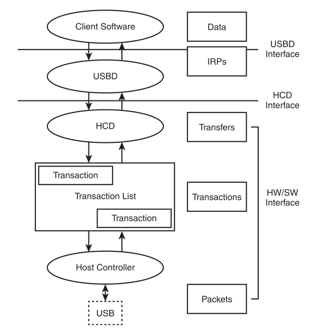

### 内核学习


#### USB driver skeleton

#### 关键概念
* USB 是 master-slave 通讯模型.
* USB system softwares 由两个关键部分组成: HCD(host controller driver) 和 USBD(USB driver)
* USB 通讯中两个关键的 interconnects(互连流) 是 endpoint 和 pipe
##### USB urbs (USB Request Blocks)

``` C
static struct usb_driver skel_driver = {
    .name        = "skeleton",
    .probe       = skel_probe,
    .disconnect  = skel_disconnect,
    .fops        = &skel_fops,
    .minor       = USB_SKEL_MINOR_BASE,
    .id_table    = skel_table,
};

/* USB  DEVICE 总线信息  */
struct usb_device
{

};

/* USB BUS 总线信息  */
struct usb_bus
{

};
```
使用宏 MODULE_DEVICE_TABLE 创建的表来实现热插拔

#### USB Host
当前有 device 连接到 USB 总线上, host 会分配给这个 device 一个唯一的 device address.
device 上的每一个 endpoint 都有一个设备分配的唯一 ID. 这个 ID 称为 endpoint number.
#### USB Device

#### USB OTG(On-the-Go)

#### USB Subsystems

#### 内核调试
内核调试参数 ``initcall_debug`` 查看内核启动过程的函数调用详细信息
