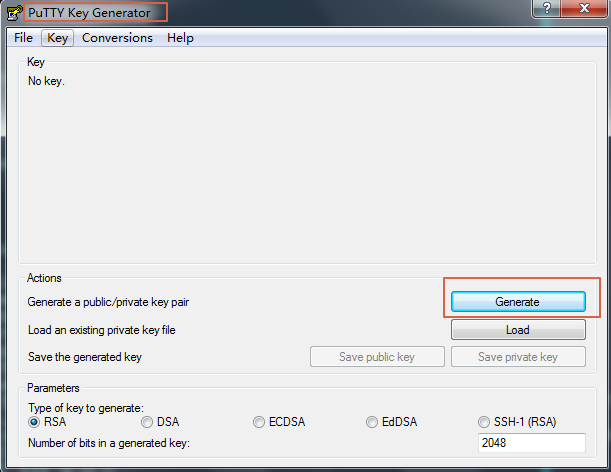
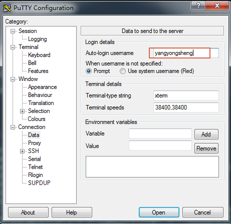
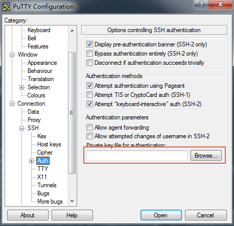
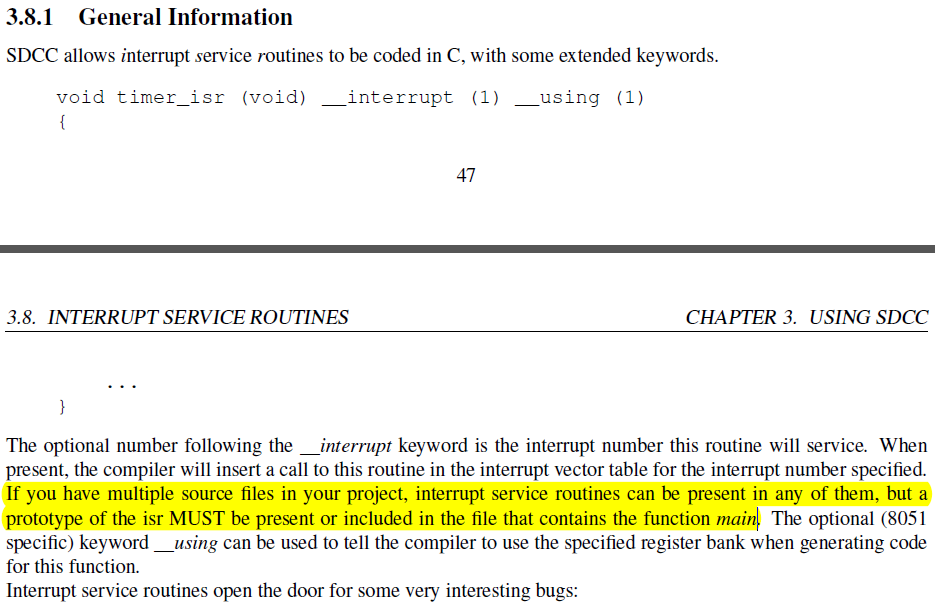

### 琐碎笔记

1. 好看的编程字体 Cascadia Code 和 Fira code，我已经通过 nerd-font 给 [Cascadia 打了字符补丁的字体](https://github.com/iysheng/Notes/blob/master/Linux/Misc/Cascadia%20Code%20Nerd%20Font%20Plus%20Font%20Awesome%20Plus%20Font%20Awesome%20Extension%20Plus%20Octicons%20Plus%20Font%20Logos%20(Font%20Linux).ttf)上传到 github 了
2. fedora23 xfce 支持 mp3播放 audacious 很重要的一个插件：audacious-plugins-freeworld-mp3
3. rootfs 知识要点
	1. 根文件系统要有 /init 否则会报不是根文件系统的错误
	2. busybox 的源码中有 rcS 等配置文件的示例
4. 在 YYfish Board 调试 2018.09 Uboot
	1. 添加了deug的串口打印，直接写寄存器，修改设备树
	2. 初始化SDRAM，修改设备树
	3. 修改MPU相关的设置，修改arch/arm/mach-stm32/soc.c 修改MPU的区域大小为32M，否则重定向到SDRAM的高地址之后，因为没有执行权限，系统就会崩掉
5. ubifs 使用方法
	1. 创建 ubifs 镜像文件 {一般命令：mkfs.ubifs -x none -m 2KiB -e 124KiB -c 64 -o abc.img -d abc，关键的参数 -x:制定压缩算法 -m 执行最小的 io 大小，nand flash 一般是 page 大小；-e 制定逻辑擦除块大小，逻辑擦除块大小一般是物理擦出块大小 - 2 * pagesize；-c 制定擦除块的个数，这个很关键，这个值要小于为 ubifs 划分的 nand 分区的擦除块的个数，比如，我为 ubifs nand 分区预留了 10MB，擦除块一共有 80 个，这里只填写了 64 个，也就是预留了 16 个 2MB 的空间；-d：制定的文件系统的根目录}
	2. 创建可以烧写到 flash 的镜像文件 {一般命令：ubinize -o abc.raw -m 2048 -p 128KiB -O 2048 abc.ini -v 关键参数 -o：制定生成的文件名字 -m 指定最小的 io，一般是 pagesize；-p 指定物理擦除块大小，这个值就是 nand flash 实际的物理擦除块大小；-O 参考网上的是 pagesize，这个后续还需要和 mkfs.ubifs 的一起分析下；abc.ini 表示产生镜像的配置文件，-v：打印提示信息；abc.ini 文件示例
	```
	[rootfs-volume]
	mode=ubi
	image=abc.img
	vol_size=8MiB/* 备注这个大小要和 mkfs.ubifs 的匹配 */
	vol_id=1
	vol_type=dynamic
	vol_name=arm_boot
	vol_alignment=1
	vol_flags=autoresize
	```
6. 交叉编译工具链那些事情
	1. 交叉编译工具链 --print-sysroot：工具链认为的根目录
	2. 交叉编译工具链 --print-search-dirs：工具链会搜索的目录，包括库文件、可执行文件等等，也就是说工具链会从这些目录中搜索库或者可执行文件
		* tcpdump -n host 10.20.52.91 -i enp0s20f0u3u3 # 过滤来自指定 host 指定网卡的数据包
7. 安裝中文输入法：
	1. 安装 fcitx 必要打软件包，参考 arch 的 wiki
	```
	sudo dnf install fcitx fcitx-im fcitx-configtool fcitx-** 拼音相关的软件包
	```
	2. 配置环境变量，修改文件 ~/.bashrc 添加内容
	```
	GTK_IM_MODULE=fcitx
	QT_IM_MODULE=fcitx
	XMODIFIERS=@im=fcitx
	```
	3. 配置完成后，注销系统重新登录就可以
	4. Ctrl+Shift+F 可以切换中文简体、繁体的切换
	5. [好看的皮肤 Fcitx5-Material-Color](https://github.com/hosxy/Fcitx5-Material-Color.git)
8. fzf 模糊搜索开源工具
9. ranger 终端的文件管理器，[ranger](https://github.com/ranger/ranger/wiki/Official-User-Guide) 使用 4 個主要的配置文件
	* 全局的 commands.py ， 包含了各種功能實現
	* 全局的 rc.conf ，設置各種配置，以及完成 key 到功能函數的綁定
	* rifle.conf 決定了使用哪個程序打開對應的文件
	* scope.sh shell 腳本產生一些文件預覽的效果
10. ImageMagick 终端的图片查看器，指令： display + 文件名，w3m 也可以在终端打开图片
11. tcping 可以 ping 任意地址的任意端口的工具
12. forgit ：A utility tool powered by fzf for using git interactively
13. 模拟器终端tilda，下拉式的
14. linux 通过安装 samba-vfs-glusterfs 可以很方便的通过 xfce 官方的文件管理软件 Thunar 打开远端 samba 共享的目录，格式： smb://192.168.0.5【备注：远端的 ip 地址】
15. dwm 窗口管理器
	1. 需要安装 xorg 相关的环境（还有一个 xinit），由于在 Fedora Server 默认启动的窗口管理器是 xdm，man xdm 的过程，实现登录自动到 dwm 的方法是在 home 目录下创建一个 .xsession 脚本，在该脚本中通过 `exec dwm` 启动 dwm 窗口管理器，并且在该脚本执行 `fctix &` 输入法程序
	2. 安装字体 wqy-*** 中文字体， Cascadia Code 字体，安装符号字体
	3. 中文输入法安装配置比较麻烦，关键在于确认 fctix 要在后台执行，已经通过命令
	imsettings-list 和 imsettings-switch 列出和选择 fctix 输入法
	4. feh 是一个设置电脑桌面的工具
	5. dwm 默认的一些基本操作
		1. Alt + 数字，在不同的 tags 切换
		2. Alt + Shift + 数字，将对应的窗口移动到指定编号的 tag 上
		3. Alt + Table 在最近的两个 tags 切换
		4. Alt + i 和 Alt + d 分别是增加以及减少 master 区域窗口的个数
		5. Alt + b 显示或者隐藏顶层的 tag、title 和 status 栏
		6. Alt + shift + space 全屏当前的窗口
	6. dwm 的一些补丁
		1. hide_vacant_tags：隐藏没有窗口的补丁
		2. scratchpad：画板补丁，默认是 Alt + \` 快捷键打开和关闭临时画板
		3. vanitygaps：同一个 tag 的窗口之间预留空隙
		4. autostart：自动启动 ~/.dwm/autostart_blocking.sh 和 ~/.dwm/autostart.sh 的补丁，一般会将状态栏显示脚本放在对应的上述两个脚本，以及桌面背景设置
		5. alpha ：背景透明，需要依赖渲染器件：比如：compton，这个工具需要提前在后台执行才可以保证正常的半透明效果， st 的透明补丁类似的
16. st 工具配置
	1. alpha：半透明化补丁，需要依赖渲染器件
	2. alphaFocusHighlight：基于半透明化补丁，可以突出显示正在选中的窗口
	3. ime：补丁，修复 st 下不能正常切换输入法的补丁，默认官方已经添加了该补丁
	4. scrollback：支持在 st 下实现界面回滚的补丁
17. openocd
	1. -s 选项，指定配置文件的搜索路径， -f 选项指定配置文件
	2. flash probe bank_id 探测flash
	3. flash list 列出flash
	4. flash erase_address addr length 擦除flash
	5. flash info bank_id 列出 bank_id 的flash信息
	6. flash write_bank bank_id filename offset 将文件写入到flash的指定地址
	7. flash write_image [erase] filename offset 将文件写入到flash的指定地址,可以选择写入之前先擦除flash
	8. mdw address [count] 显示address地址的内存，长度count
	9. mw[w,b] address value [count] 修改address内存数据，长度count
	10. 擦写 flash 之前一般需要 halt 住 cpu
18. tmux 一款终端分平软件 (三个基本概念：session、window、panel)
	1. [tpm](https://github.com/tmux-plugins/tpm)：tmux 的插件管理器
	2. nord 色彩配置，建议关闭 powerline 的箭头型符号
	```bash
	# 安装 nord 色彩配置
	set -g @plugin 'arcticicestudio/nord-tmux'
	# 建议关闭 powerline 的箭头型符号，除非已经安装了 powerline 字体
	set -g @nord_tmux_no_patched_font "1"
	```
	3. MODKEY + w # 显示当前所有 session 的所有 window
	4. MODKEY + l # 跳转到最近访问的上一个 windows (l:last)
	5. MODKEY + 空格 # 更换排版
	6. MODKEY + s # 显示所有的 sessions
	7. MODKEY + , # 修改 window 的名字
	8. MODKEY + $ # 修改 session 的名字
	9. MODKEY + ? # 查看支持的所有命令
	10. MODKEY + ; # 在最近的两个 pane 之间切换
	11. MODKEY + d # 退出当前会话，保持会话在后台
	12. MODKEY + ' # 跳转到指定编号的 window
	13. MODKEY + z # 隐藏当前 window 的其他 panel
	14. MODKEY + . # 移動當前的 window 位置
	15. MODKEY + { # 交換當前 window 中的 pane 和上一個 pane
	16. MODKEY + } # 交換當前 window 中的 pane 和下一個 pane
	17. tmux new -s session-name # 创建一个 session-name 的会话
19. autoconf configure 配置源码编译时，可以直接在 configure 前赋值 CFLAGS 、 LDFLAGS 等变量
``` bash
CLFAGS="-I /lib64" ./configure ....
```
20. 下载 github 某个用户的头像，可以直接 iysheng 的 uid 是 20969054，[查询 github 用户 uid 的网站](https://caius.github.io/github_id/)
``` bash
wget https://avatars.githubusercontent.com/<username>
wget https://avatars.githubusercontent.com/iysheng # 下载 iysheng 的头像
```
21. gnome 带有一个全屏幕的快捷键，可以去控制中心配置这个快捷键
22. 64 位 Fedora 编译 vim 遇到的问题
	1. tgetent()... configure: error: NOT FOUND! 方法：LDFLAGS="$LDFLAGS -fPIC"，[这样可以 configure 配置通过，但是还是无法编译通过！！！](https://github.com/vim/vim/issues/1081)
	2. Unknown type name ‘off64_t’ 方法：CLFAGS="-Doff64_t=__off64_t"
23. Linux 的控制终端由控制码、一个环境变量和一组共称为 terminfo 数据库的特殊文件实现。Linux 将每种终端类型的 terminfo 数据作为一个单独的文件存储在 terminfo 数据库目录。常见的位置是 /usr/share/terminfo/ ；terminfo 的数据格式是二进制的需要使用 infocmp 命令查看

---
### zephyr 学习笔记

#### 基础知识
zephyr 使用 cmake 来构建应用程序。构建过程分为两个阶段。第一阶段是配置阶段，执行 CMakeLists.txt 中的脚本生成可在主机上运行的构建脚本；第二阶段是构建阶段，使用配置阶段生成的构建脚本，来编译生成应用程序。
zephyr 使用 cmake 的目标（target）概念来组织构建过程，目标可以是可执行文件、库或者生成的文件。在 zephyr 构建过程中，引入的所有源代码，都是通过包含在库目标中来实现的，包括应用程序代码。库目标是关键。
库目标所包含的源代码都过 CMakeLists.txt 构建脚本添加：
``` bash
target_sources(app PRIVATE src/main.c)
```
上述代码定义了一个名为app的库目标(这个库目标在其他位置被定义过)被配置为包含源文件src/main.c。PRIVATE 关键字表示我们正在修改（构件库的）内部行为。如果改成 PUBLIC 会导致和 app 链接的库也包含源文件 src/main.c，一般是不需要这样的。但是在修改目标库的包含路径时，PUBLIC 关键字可能很有用。

#### Zephyr CMake Package(包)
Zephyr CMake Package(包) 非常适合创建基于 zephyr 的应用。Zephyr CMake Package(包) 确保 cmake 可以自动选择 zephyr 用来编译应用，无论是 zephyr 的集成式应用，还是 zephyr 的独立式应用。
在开发基于 zephyr 的应用时，开发者只需要在应用目录的 CMakeLists.txt 文件开头写上 find_package(Zephyr) 即可。
要使用 Zephyr CMake Package(包)，必须先将其导出到 CMake 用户包注册表。上述的意思是在 Cmake 用户包注册表中创建一个到当前 zephyr 的引用。

#### Porting to new board Cubieble1
|Board    |SOC    |SOC series|SOC Family|CPU core |Architecture|
|---------|-------|----------|----------|---------|------------|
|Cubiebl1 |ATB1109|ATB110X   |ATB       |Cortex-M0|ARM         |
#### 板级的配置文件放在目录 boards/arm/cubieble1
1. 可见的配置文件（默认的配置文件，以 .config 文件配置板级）放在 **boards/ARCHITECTURE/BOARD/BOARD_defconfig**
2. 不可见的配置文件(这个配置文件一般通过板级的宏控制，而不能在 menuconfig 配置) **boards/ARCHITECTURE/BOARD/Kconfig.defconfig**

#### Kconfig Extension 不同 source 的差别描述 
|Title|描述|
|---|---|
|source | 绝对路径，如果不存在对应目录的话就会出问题|
|osource| 绝对路径，如果不存在也不会报错，类似于 -include 或者 sinclue |
|rsource| 和 source 对比，差别是相对路径|


#### 工程配置流程
1. zephyr-env.sh 导出环境变量 ZEPHYR_BASE

#### Cortex-M0	
1. ARMv6-M 指令集
2. CPUID 0x410CC200	
3. The processor fully implements the Wait For Interrupt ( WFI ), Wait For Event ( WFE ) and
the Send Event ( SEV ) instructions.
4. Thread mode(这种模式下可能会使用 main stack，也可能使用processor stack,CONTROL.nPRIV
决定线程模式是特权的（该bit==0）还是非特权的（该bit==1），复位就在线程模式，中断退出就会到线程模式)
Is entered on Reset, and can be entered as a result of an exception return.
Handler mode(这种模式下只会使用 main stack，这种模式类似于特权模式，中断处理在这个模式)
Is entered as a result of an exception. The processor must be in Handler mode
to issue an exception return.
5. SPSEL, bit[1] Defines the stack to be used:
0 Use SP_main as the current stack（MSP）
1 In Thread mode, use SP_process as the current stack.（PSP）
In Handler mode, this value is reserved

#### 设备树 yaml 语法

具体关于设备树的细节参看 cmake/dts.cmake
scripts/dts/extract_dts_includes.py 创建设备树的头文件
这个脚本会将 dts 文件（dts文件，如果没有显式定义变量 DTS_SOURCE，那么默认是 ${BOARD_DIR}/${BOARD}.dts）导出为
zephyr/include/generated/generated_dts_board_unfixed.h
备注：导出的过程强依赖 dts/bingds/ 目录下的 *.yaml 类型文件

#### CDN 的全称是 Content Delivery Network，即内容分发网络。

CDN是构建在网络之上的内容分发网络，依靠部署在各地的边缘服务器，通过中心平台的负载均衡、内容分发、调度等功能模块，使用户就近获取所需内容，降低网络拥塞，提高用户访问响应速度和命中率。CDN的关键技术主要有内容存储和分发技术。——百度百科
放在Github的资源在国内加载速度比较慢，因此需要使用CDN加速来优化网站打开速度，jsDelivr + Github便是免费且好用的CDN，非常适合博客网站使用。[cdn](https://blog.csdn.net/qq_36759224/article/details/86936453)

#### Makefile
1. gcc 通过 -D 选项传递宏字符串时候，需要添加转义字符 \"字符串内容\"
	* -specs=文件 指定了一个可以覆盖 gcc 默认的 specs 的文件，default.specs 文件可以用命令 ``gcc -dumpspecs`` 查看, specs 文件定义了传递给 cc1 cc1plus as ld 等内容
	* PHONY 是一个抽象的 target, 比如你想执行某些目标但是并不会真正产生一些实质的文件，这时候可以将那个目标做为 .PHONY 的依赖
	* 编译选项 -w 表示禁止所有的警告信息, -Wunused-parameter 表示对未使用的参数打印出警告信息, -Wno-unused-parameter 表示不对未使用的参数打印警告信息
	* 一个很有用的编译选项 --sysroot=dir 指定编译器的 sysroot 这个很重要，在链接的时候如果提示找不到一些 .o 文件，很有可能是你的 sysroot 参数不对，这时候在链接的时候添加这个选项应该就可以了，找到正确的 sysroot
2. Makefile 的条件判断
``` Makefile
# arg1 和 arg2 之间不要随便添加空格
# 判断两个参数是否相等
ifeq (arg1,arg2) ifneq(arg1,arg2)
else
endif

# 判断 arg 是否定义
ifdef arg 或者 ifndef arg
else
endif
```
3. Makefile 执行 shell 程序
``` Makefile
$(shell echo "Hello World")
```
4. IRC [Beginner’s guide to IRC](https://fedoramagazine.org/beginners-guide-irc/)
    1. account 是账户，这个是持久的
    2. nickname 是昵称，被账户所有
    3. identify 意味着登陆你的账户
    4. NickServ 是一个 freenode 的服务，像一个用户那样
    5. [注册昵称的过程1](https://freenode.net/kb/answer/registration)
    6. [注册昵称的过程2](https://www.wikihow.com/Register-a-Nickname-on-Freenode)
5. 安装 dhcp 服务，支持客户端测试 dhcp 获取 IP
    1. 配置 /etc/dhcp/dhcpd.conf 文件，如下示例：
    ```
    # dhcpd.conf
    #
    # Sample configuration file for ISC dhcpd
    #
    
    # option definitions common to all supported networks...
    option domain-name "redWork.com";
    option domain-name-servers 8.8.8.8;
    
    default-lease-time 600;
    max-lease-time 7200;
    
    subnet 192.168.100.0 netmask 255.255.255.0 {
      range dynamic-bootp 192.168.100.99 192.168.100.210;
      option routers 192.168.100.200;
    }
    ```
    2. systemctl enable dhcpd
    3. systemctl start dhcpd
6. 内核的 spi 驱动框架
	1. 关键的几个结构体抽象：
		1. struct spi_master：spi 控制器本身的抽象；
		2. struct spi_device：spi 设备，如果没有外接 spi 设备时，那么就可以认为是 spi 控制器的代理，会通过对应的 spi_driver 即 driver/spi/spidev.c 这个源码注册的 name 是 "spidev" 的驱动完成 probe，就会注册对应的 spi 的字符设备，通过这个字符设备可以直接和 spi 控制器通信，具体的是通过 ioctl 完成数据的收发；
		3. struct spi_driver：spi 设备的驱动，通过函数 spi_register 来注册这个驱动到 spi 总线
	2. spi 控制器初始化的一般流程：
		1. 定义 platform_device 设备，包含控制器对应的 mem、irq、dma 等类型的资源；
		2. 注册对应的 platform_driver 驱动，在 probe 函数中会首先申请 spi_master 的内存空间，然后注册，在函数 spi_register_master 注册这个 master 的时候，通过 scan_boardinfo 函数会遍历设备定义的 spi_board_info 实例（这个表的注册依靠函数 spi_register_board_info），展开为 spi_device 实例，这个实例会关联到这个 master，在后续 driver probe 的时候，可以通过 master 找到对应的读写 spi 的方法，（挂在 spi_bus 上），然后注册到内核；
		3. 在后续注册 spi_driver 的时候，可以通过名称或者 id 匹配申然后执行对应的 probe，真正执行 spi 发送和接受功能的时候需要依靠 spi_master 的 transfer 成员函数；
	3. 通过函数 spi_write_then_read 读写时，要注意写寄存器时，有些设备需要额外设置寄存器地址的高 bit 为 1 ；类似 I2C 总线一样，高 bit 表示读写？？？
	4. 如果只写不读的时候可以使用 spi_write 函数
7. linux APP 程序 bool 运算的头文件是 #include <stdbool.h>
8. linux driver 程序，不支持浮点出发运算时，可以使用 do_div 函数，使用长整形执行除法运算，曲线方法
9. linux kernel 编译 doc 文档，eg：**make htmldocs**，编译出的文档在目录 Documentation/DocBook
``` bash
$ make help | grep "doc"
Linux kernel internal documentation in different formats:
 htmldocs        - HTML
 pdfdocs         - PDF
 psdocs          - Postscript
 xmldocs         - XML DocBook
 mandocs         - man pages
 installmandocs  - install man pages generated by mandocs
 cleandocs       - clean all generated DocBook files
```
10. sqlite
	1. 通过给某一个整形的键值添加 **INTEGER PRIMARY KEY** 或者 **ROWID**，就等价将这个值作为 [rowid](https://www.sqlite.org/autoinc.html#summary)，这个值在数据表中需要是唯一的，并且当没有明确给这个值赋值时，会自动加 1。
11. scons 构建工具，SCons 使用 SConscript 和 SConstruct 文件来组织源码结构，通常来说一个项目只有一 SConstruct，但是会有多个 SConscript。一般情况下，每个存放有源代码的子目录下都会放置一个 SConscript。
	1. scons --target=makefile # 构建 Makefile 的编译文件
	2. SConscript 文件可以控制源码文件的加入，并且可以指定文件的 Group。
	3. scons 的环境分为：
		1. 外部环境，执行 scons 的 shell 环境（针对 Linux）
		2. 构造环境，一个 SConscript 文件创建的唯一的一个对象！！！，外部环境可以使用 os.environ 获取。一个构造环境实际上是一个拥有方法的对象。如果你想直接访问构造变量的字典，你可以使用Dictionary方法： 
		``` python
		env=Environment(FOO='foo', BAR='bar')
		dict=env.Dictionary()
		for key in ['OBJSUFFIX', 'LIBSUFFIX', 'PROGSUFFIX']:
		print ("key=%s, value=%s"  %  (key,dict[key]))
		```
		3. scons -Q 禁止一些编译过程的打印信息，关注编译本身
		4. print(env['LINKFLAGS']) 可以打印出指定环境的 LINKFLAGS，还有其他的参数也可以用这个方法打印
12. C 语言的一些头文件
	1. uint8_t 对应的头文件 <stdint.h>
13. 在链接库编译时，库文件的位置会影响到是否正常链接成功，库文件的位置必须放在**源文件或者 obj 文件后**
	1. arm-none-eabi-gcc -ldemo $(objs) -o $@ /* 这个不可以正常连接 libdemo.a *\/
	2. arm-none-eabi-gcc $(objs) -ldemo -o $@ /* 这个可以正常连接 libdemo.a */
	3. gcc 的一些編譯選項參數
		* –start-group archives --end-group 正常情况，链接的时候库文件只会按它们出现在命令行的顺序搜索一遍，如果包里有未定义的引用标号，而且该包还被放在命令行的后面,这样链接器就无法解决该标号的引用问题。通过给包分组，这些包可以被循环搜索直到所有的引用都可以解决为止。使用该选项将降低性能。只有在无法避免多个包之间互相引用的情况下才使用。
		* --whole-archive 表示將後續的文件的符號都鏈接進來，而不管是否使用到，與之相反的是 --no-whole-archive 鏈接參數
		* -M 生成目标的依赖到 .d 文件, 不会忽略系统路径的头文件
		* -MMD/-MM 生成目标的依赖到 .d 文件, 忽略系统路径的头文件
		* -MF 将目标的依赖重定向到指定文件名的文件中
		* -Xlinker option  傳遞參數到鏈接器, 可以使用它来提供GCC无法识别的特定于系统的链接器选项,特別地，如果傳遞的參數是多個，那麼需要通過 -Xlinker 發送多次。在使用 GNU 鏈接器的時候，常見的是 ``option=value`` 的方式
		* [--specs=nosys.specs](https://launchpadlibrarian.net/170926122/readme.txt) 表示使用 newlib-nano.特别地， GNU 工具链释放出来的时候会带有两个预先基于 newlib 编译出的 c 库，其中一个对应的是标准的 newlib,另一个是 newlib-nano。文件名分别是 libc.a -> libc_nano.a; libg.a -> libg_nano.a
		* -print-search-dirs 打印搜索的目录
14. ar 打包为 .a 静态库的命令参数
	1. gcc $(src) -c $(objs) # gcc 编译为 obj 文件
	2. ar -r libdemo.a $(objs) # 将所有的 obj 文件连接为静态库
15. RT-thread 在 Linux 環境使用 pkgs 命令，首次啓動 scons --meunconfig 會自動安裝 env 命令，source ~/.env/env.sh 命令可以導出 pkgs 命令，同時還導出了 env 命令。選中 online 的包後可以使用 pkgs --update 命令下載選中的 online 的軟件包。
	1. pkgs --upgrade 用來更新 env 功能腳本本身和軟件包列表
	2. pkgs --update 用來更新軟件包本身
16. Rust 包管理 cargo
	* 更换 cargo 的源，创建文件 ```~/.cargo/config```
	``` bash
	[source.crates-io]
	registry = "https://github.com/rust-lang/crates.io-index"
	replace-with = 'hub'
	#[source.ustc]
	#registry = "https://mirrors.ustc.edu.cn/crates.io-index"
	[source.hub]
	registry = "https://hub.fastgit.org/rust-lang/crates.io-index.git"
	```
17. google search ``font name vk.com`` 查找字体
18. fedora samba 网络端口:
    1. smbd TCP 139 和 445
    2. nmbd UDP 137
    3.关闭防火墙或开放服务
    ``` bash
    systemctl stop firewalld
    sudo firewall-cmd --permanent --add-service=samba
    ```
    4.配置selinux
    ``` bash
    setsebool -P samba_enable_home_dirs on
    sudo setsebool -P samba_export_all_rw on
    ```
19. 護眼色的 rgb 值 #CCE8CF RGB(204, 232, 207) 或者 #C7EDCC RGB(199, 237, 204)
20. ld 的 --wrap 選項參數，可以對制定的符號進行包裹，eg: --wrap,malloc ， 如果當前文件中直接調用 malloc 符號但是卻沒有定義該符號，那麼會嘗試執行 __wrap_malloc 函數，如果執行的是 __real_malloc 那麼會嘗試執行 malloc 函數
	* 交叉编译工具链的　crt0 会尝试调用用户自定义的　hardware_init_hook() software_init_hook() 然后再执行　__wrap_main() 函数
21. [gn](http://weharmonyos.com/openharmony/compile/gn/docs/quick_start.html#running-gn) 用来生成 ninja 脚本. [GN 的官方網址](https://gn.googlesource.com/gn/+/main/docs/reference.md)
    * BUILD.gn 一般是整个工程的入口， .gni 文件一般用来作为子模块
    * --root 指定 gn 构建的根目录
    * --dotfile 默认会查找 root 目录下的 .gn 文件，如果需要明确指定该文件，那么使用 --dotfile 参数指定
        * .gn 文件会至少定义 buildconfig 变量，该变量表示的文件会被用来建立 build file 的可执行环境
        * .gn 文件一般也会定义 root 变量，定义 gn 构建的根目录
    * gn args --list 查看有效的參數和他們的默認值
    * gn 文件中的 // 符号表示根目录
    * gn desc <build_dir> <targetname> # 获取指定目标的信息
    * gn 會解析 json 文件，json 文件可以使用 /* 註釋 */ 添加註釋
    * gn 可以使用 import 導入 gni 文件
    * BUILD.gn 文件中的依赖，如果组件名称和目录一致，就可以省略具体的组件名称。eg: dir:target 如果 target 和 dir 目录一样， :target 可以省略
    * 模板(template) 提供了一種添加到 GN 內置目標類型的方法。根本上講，模板是 GN 構建可重用功能的主要方式。模板定義在 .gni(GN import) 文件內， 這中文件可以導入 .gn 目標文件.
    * action() 模板類定義了一個執行腳本的目標，該模板類有一些必要的參數。outputs 和 scripts 腳本.
    * 內置變量 root_build_dir 是 build command 執行的根目錄的絕對路徑
    * 內置變量 root_out_dir 是工具鏈輸出的根目錄的絕對路徑
    * rebase_path(input, new_base=="", current_base=".") # 將 input 表示的內容，可以是 list ,轉換爲以 new_base 爲基礎的路徑描述
        * new_base 缺省時，轉換路徑以系統絕對路徑
        * current_base 缺省時，是相對當前路徑
22. ninja 替换 make 进行构建
    * build.ninja 一般是构建的入口文件，类似 make 的 Makefile
23. ld 连接脚本
    * COMMON 表示的是未初始化的全局变量, 不包含静态全局变量
24. [solus](https://getsol.us/home/) 系统安装安装软件的时候，具体的软件名字不确定的时候，可以通过 google 搜索 ``关键词 arch``
	* eopkg blame 包名称 # 查看包的维护者以及版本信息
	* eopkg info 包名称 # 查看包的详细信息，包括依赖等内容
		* eopkg info -f 包名称 # 查看包安装了哪些文件
	* eopkg install man-pages # 安装 man 帮助信息
	* eopkg list-installed # 列出已经安装的包
	* eopkg search-file # 查找包含指定文件的软件包
25. perl 的包安装工具是 cpan. 直接 ``cpan 包名称`` 就可以安装了. eg: ``cpan Number::Bytes::Human`` 或者 ``cpan Pango`` 等等。但是如果有些包无法安装的时候，还是去对应发行版的仓库中搜索安装了。
26. 在 gnome 添加快捷图标的方法,快捷图标相关的文件放在目录``/usr/share/applications``,以 desktop 为后缀名文件,如果需要添加新的应用快捷图标,需要在该目录创建新的 xxx.desktop 文件,以 Typora 应用为例展示如下:
```
[Desktop Entry]
Name=Typora
GenericName=Markdown Editor Application
Exec=Typora %F
Terminal=false
Type=Application
Icon=/home/red/.local/bin/Typora115/bin/Typora-linux-x64/resources/assets/icon/icon_32x32.png
Categories=Graphics;Science;Engineering;
StartupNotify=true
MimeType=application/x-extension-fcstd;
```
其中 Icon 字段,如果不跟绝对路径,那么需要将图标文件放在任意的如下目录[https://developer.gnome.org/documentation/guidelines/maintainer/integrating.html#icons](https://developer.gnome.org/documentation/guidelines/maintainer/integrating.html#icons):
```
/usr/share/icons/hicolor/256x256/apps/com.example.YourApplication.png
/usr/share/icons/hicolor/scalable/apps/com.example.YourApplication.svg
/usr/share/icons/hicolor/symbolic/apps/com.example.YourApplication-symbolic.svg
```
27. [TigerVNC](https://tigervnc.org) 是一种高性能、平台无关的 VNC 实现，包含了客户端和服务器端。配置 tigervnc 的步骤：
	1. sudo eopkg install tigervnc # 安装 TigerVNC
	2. vncpasswd # 创建 vncpasswd，后续使用客户端链接的时候要用到
	3. x0vncserver -rfbauth ~/.vnc/passwd # 开启 vncserver 服务，可以看到 vncerver 使用了 5900 端口
	``` bash
    ▸ x0vncserver -rfbauth ~/.vnc/passwdjl
    
    Thu Jan 20 09:21:05 2022
     Geometry:    Desktop geometry is set to 1280x720+0+0
     XDesktop:    Using evdev codemap
     XDesktop:
     XDesktop:    XTest extension present - version 2.2
     Main:        Listening on port 5900
	```
	4. 在 windows 上使用客户端 **[TigerVNC Viewer](https://sourceforge.net/projects/tigervnc/)** 连接服务器，如果发现无法连接，可能是 5900 端口的防火墙没有打开，我使用的是 ufw，所以就是简单的使用 ``sudo ufw allow 5900`` 放开 5900 端口就可以了。连接的时候会提示输入密码，这时候就用到了刚才使用 vncpasswd 创建的密码。
	5. [配置 x0vnc 服务自启动](https://github.com/TigerVNC/tigervnc/wiki/Systemd-unit-for-x0vncserver)，参照这个链接，需要微调一下才可以在 solus 上成功设置起来，具体改动为 /usr/local/bin/x0vnc.sh ：
	``` bash
    #! /bin/bash
    
    # Export an environment variable of the Display Manager
    export XAUTHORITY="/var/run/lightdm/root/:0"
    
    # Start VNC server for :0 display in background
    ## Set path to binary file
    VNC_BIN=/usr/bin/x0vncserver
    
    ## Set parameters
    PARAMS="-display :0 -SecurityTypes Vncauth"
    if [[ -f /etc/vnc.conf ]];
    then
    	## Launch VNC server
    	($VNC_BIN $PARAMS) &
    else
    	## Add parameters
    	#PARAMS+=" --I-KNOW-THIS-IS-INSECURE"
		# 建议还是添加密码验证
    	PARAMS+=" -rfbauth /home/yangyongsheng/.vnc/passwd"
    	
    	## Launch VNC server
    	($VNC_BIN $PARAMS) &
    fi
    # Provide clean exit code for the service
    exit 0
	```
    systemd 配置脚步文件 /etc/systemd/system/x0vncserver.service
	``` bash
    [Unit]
    Description=Remote desktop service (VNC) for :0 display
    
    # Require start of
    Requires=display-manager.service
    
    # Wait for
    After=network-online.target
    After=display-manager.service
    
    [Service]
    Type=forking
    
    # Set environment
    Environment=HOME=/root
    
    # Start command
    ExecStart=/usr/local/bin/x0vnc.sh
    
    # Restart service after session log out
    Restart=on-failure
    RestartSec=5
    
    [Install]
    WantedBy=multi-user.target
	```
	操作 x0vncserver.service 的命令
	1. sudo systemctl daemon-reload
	2. sudo systemctl enable x0vncserver.service # 创建这个服务的软链接
	3. sudo systemctl start x0vncserver
	4. sudo systemctl stop x0vncserver
	5. sudo systemctl status x0vncserver
	6. sudo systemctl disable x0vncserver
28. AppImage 格式文件可以在大部分的 Linux 环境执行运行，区别 deb 是 debian 的软件包格式， rpm 是 redhat 的软件包格式。如果既不支持 deb 也不支持 rpm,那么可以尝试直接下载 AppImage 格式的文件，然后给这个文件添加可执行权限，就可以直接运行了，比如果 [drawio](https://github.com/jgraph/drawio-desktop/releases/download/v16.1.2/drawio-x86_64-16.1.2.AppImage)
29. putty 使用密钥连接远程 ssh 服务器教程：
	1. 在 putty 客户端创建 ssh 密钥对
	
	2. 将公钥内容复制到 ssh 服务器的 ~/.ssh/authorized_keys, **重要的一点修改该文件的权限为 400**
	3. 在 putty 中配置 session ,关键是配置登陆用户名以及私钥文件
	
30. 颜色号:
	* 3f9f9f
	* CBE9CF 护眼色
31. sdcc 工具链，在中断函数定义时，需要在包含 main 函数的文件中声明这个中断函数。
	
	* --xram-loc 0x800 定义 xram 的地址起始地址
	* --xram-size 0x100 定义 xram 的大小
	* -Wl-bCSEG=0x100 传递参数给链接脚本，定义 CSEG 的值
	* 编译汇编 asm 源文件时候，如果不加 -plosgff 在链接的时候会提示没有读应的 lst 文件, 编译汇编源文件时加上这个编译选项，一般是 ``sda8051 -plosgff xx.asm``
	* --stack-size size 可以用来检查栈空间够不够 size 的大小
32. [drawio](https://github.com/jgraph/drawio) 好用的画图软件
	
	* 回车键可以切换当前页面的显示大小, 在 Home 大小和大小之间切换
	* ctrl + shift + p # 切换显示/隐藏 format 面板
	* ctrl + shift + k # 切换显示/隐藏 shape 面板
33. 为了更好的适应屏幕显示，可以手动设置 dpi,前提是要首先计算出来真实的 dpi.
	1. xrandr 获取屏幕分辨率和尺寸信息 `xrandr | grep " connected"`，eg: `LVDS-1 connected primary 1366x768+0+0 (normal left inverted right x axis y axis) 309mm x 174mm` 计算命令是: ``echo '1366 / 309 * 25.4'`` 结果是 **101.6**，所以可以强制设置 dpi 是 102.
	2. ``echo 'Xft.dpi: 102' | xrdb -merge`` ，可以将这部分代码添加到全局的启动脚本。
	3. xrdb -get Xft.dpi # 获取当前配置的 dpi 信息
34. ARMv7-A 架构的定义了一些不同的特权执行级别
	* 在安全状态，特权指令分为 PL1 和 PL0
	* 在非安全状态，特权指令分为 PL2,PL1 和 PL0
	其中：
	* PL0 是应用程序的运行级别，也可以认为是 USER MODE,在该模式下无法修改处理器很多的配置
	* PL1 是除了 USER MODE 和 Hyp MODE 之外的所有模式，该模式可以对处理器大部分的配置进行修改，除了一些和 Hyp 相关的配置无法修改
	* PL2 是 Hyp MODE， 和虚拟化有关
35. gimp 图像编辑工具
	* shift + t 可以对选择的图层进行变换
	* image -> canvas size 修改画布大小
	* image -> scale image 修改图像大小
	* 当发现 gimp 的工具控件不见的时候， Edit -> Preferences -> Window Management -> Reset Saved Window Positions to Default Values 然后重启 gimp
	* o 快捷键是颜色拾取器
36. printf 打印浮点数的时候，栈要保证 8 字节对齐, AAPCS 规则要求堆栈保持 8 字节对齐。如果不对齐，调用一般的函数也是没问题的。但是当调用需要严格遵守 AAPCS 规则的函数时可能会出错。
37. wayland weston 
	* [校准触摸屏](https://wiki.st.com/stm32mpu/wiki/How_to_calibrate_the_touchscreen)
		* weston-touch-calibrator 列出来触摸设备
		* weston-touch-calibrator 指定的触摸设备， 对指定的触摸设备进行校准
		* 如果需要保证下次上电后使用本次的校准数据，参考[Permanent calibration problem on weston](https://community.nxp.com/t5/i-MX-Processors/Permanent-calibration-problem-on-weston/m-p/1264405), 实现的方法是将校准的数据保存到 udev 的 rules 规则配置文件中，具体是保存为文件: ``/etc/udev/rules.d/touchscreen.rules``， 该文件的内容是：
			``` bash
			SUBSYSTEM=="input", KERNEL=="event[0-9]*",
			
			ENV{ID_INPUT_TOUCHSCREEN}=="1",
			
			ENV{LIBINPUT_CALIBRATION_MATRIX}="校准的数据信息"
			```
	* 调试触摸驱动
		1. 使用 weston-info 查看 capabilities 属性是否包含 touch, 如果不包含说明驱动或者 libinput 加载有问题，这时候可以查看 weton 启动的打印信息，查看哪里出问题了
		2. 如果是加载问题，首先通过 cat /proc/bus/input/devices 查看是否包含有 input_dev 设备，如果不包含，检查设备树或者驱动，一般都是设备树问题
38. 原码、反码和补码
    * 原码 ：最高位是符号位，0代表正数，1代表负数，非符号位为该数字绝对值的二进制。
    * 反码：正数的反码与原码一致，负数的反码是对原码按位取反，只是最高位（符号位）不变。 
    * 补码：正数的补码与原码一致，负数的补码是对原码按位取反加1，符号位不变。
39. weston 工具在运行时会加载动态库,可以使用 chrpath 工具修改 elf 文件的 rpath 属性。具体指令为：
	* chrpath -r <path> 可执行文件
	* 特别注意的是，在加载动态库的时候，可以通过定义环境变量 WESTON_MODULE_MAP 来替换指定库的搜索路径：
		``` bash
		export WESTON_MODULE_MAP=drm-backend.so=/usr/lib/libweston-9/drm-backend.so
		export WESTON_MODULE_MAP="gl-renderer.so=/usr/lib/libweston-9/gl-renderer.so;$WESTON_MODULE_MAP"
		export WESTON_MODULE_MAP="desktop-shell.so=/usr/lib/weston/desktop-shell.so;$WESTON_MODULE_MAP"
		export WESTON_MODULE_MAP="weston-keyboard=/usr/libexec/weston-keyboard;$WESTON_MODULE_MAP"
		export WESTON_MODULE_MAP="weston-desktop-shell=/usr/libexec/weston-desktop-shell;$WESTON_MODULE_MAP"
		```
40. 如果发现在 linux 串口发送数据时，0X0A 被转换成了 0X0D 和 0X0A，那么需要修改 c_oflag &= ~ONLCR
41. 如果发现樱桃键盘 windows 键盘无反应,FUN+F9 解锁，这是为了防止误触把几个键给锁定了。是因为樱桃键盘有两种模式,办公模式和游戏模式,在有时模式下会锁定: windows, alt+f4, alt+tab, ctrl+esc, ctrl+alt+delete 按键,切换两种模式的方法就是 **Fn + F9**
42. gcc 中 ``__DATE__`` 和 ``__TIME__`` 分别表示编译的日期和时间
43. fedora nfs 参数配置文件是 **/etc/exports**,
* no_root_squash 参数表示,远端可以正常使用 root 用户挂载,如果没有这个参数,对方使用 root 用户时会变为 nobody 用户
* async 加快传输,禁止应答
* sync 是默认的, nfs-server 会对写入的文件发送应答
```
/var/lib/nfs  10.20.52.0/255.255.255.0(rw,async)
```
44. [SWIG](https://www.swig.org/) 是一个软件工具,实现将 C/C++ 的程序和一些更高级的语言联系到一起.支持将 C/C++ 语言和 python.
1. swig 接口文件(一般是 .i 或者 .swg 后缀名)包含了函数和变量声明
```
/* File : example.i */
/* %module 定义了变量的名字为 example */
%module example

/* %{ %} 代码块提供了插入代码的位置, 比如一些 C 的头文件 */
%{
/* Put headers and other declarations here */
extern double My_variable;
extern int    fact(int);
extern int    my_mod(int n, int m);
%}

extern double My_variable;
extern int    fact(int);
extern int    my_mod(int n, int m);
```
45. Fedora 调节背光,修改文件 **/sys/class/backlight/intel_backlight/brightness** 一般选取 200 左右
	* 关闭 linux 恼人的蜂鸣器报警音,直接卸载对应的蜂鸣器驱动 ``sudo modprobe -r -v pcspkr``
46. gnome 默认使用 wayland 作为后端,如果需要改为 X11, 需要修改文件 /etc/gdm/custom.conf, 查看 gnome 的后端命令:``loginctl show-session 2 -p Type``
```
# GDM configuration storage

[daemon]
# Uncomment the line below to force the login screen to use Xorg
WaylandEnable=false
#DefaultSession=gnome-xorg.desktop

[security]

[xdmcp]

[chooser]

[debug]
# Uncomment the line below to turn on debugging
#Enable=true

```
47. realpath xxx 打印解析出的路径

48. signal -s 信号名称/信号值 进程pid # 发送指定信号给指定的进程

49. 线程优先级, 优先级数值约高, 对应的优先级约高. ``pthread_setschedparam`` 函数可以修改线程的调度策略和优先级
	1. SCHED_OTHER 默认的调度策略,创建的所有线程的优先级默认都是0,采用分时调度的策略
	2. SCHED_FIFO (实时线程) 优先级范围是 1 ~ 99
	3. SCHED_RR   (实时线程) 优先级范围是 1 ~ 99, 在 SCHED_FIFO 的基础上,添加了一个最大运行时间, SCHED_RR 线程的最大运行时间,可以用函数 ``sched_rr_get_interval`` 获取, 默认的这个数值为 0.1s, 越高的 nice 等级(对应的 nice 数值本身越小,是负数),这个值越大,越不容易被抢占.相反,越低等级的 nice(nice 数值约大), 这个数值越小,越容易被抢占.
	4. SCHED_IDLE, SCHED_BATCH 优先级固定是 0

50. 笔记本电脑合盖不休眠的配置
``` bash
sudo vim /etc/systemd/logind.conf

找到下列条目
#HandleLidSwitch=suspend

# 这个条目有如下的配置选项
#ignore 忽略，跳过
#power off 关机
#eboot 重启
#halt 挂起
#suspend 可暂停目前正在执行的shell。若要恢复，则必须使用SIGCONT信息。所有的进程都会暂停，但不是消失
#hibernate 让笔记本进入休眠状态
#hybrid-sleep 混合睡眠，主要是为台式机设计的，是睡眠和休眠的结合体，当你选择Hybird时，系统会像休眠一样把内存里的数据从头到尾复制到硬盘里 ，然后进入睡眠状态，即内存和CPU还是活动的，其他设置不活动，这样你想用电脑时就可以快速恢复到之前的状态了，笔记本一般不用这个功能。
#lock 仅锁屏，计算机继续工作


改成如下
HandleLidSwitch=ignore
为了让配置及时生效,需要执行:
systemctl restart systemd-logind
```
51. 设备树
	1. 节点定义
``` dts
[label:] node-name[@unit-address] { /* 冒号前的内容是 label */
[properties definitions]
[child nodes]
};
```
	2. 可以给 node 或者 property 绑定 label, label 只会出现在 dts 源码中，不会出现在最终的 dtb 文件中
	3. 如果想引用 label, 那么需要在 label 名字前加 & 符号
52. [给 Linux 提交 pr 的方法](https://www.cnblogs.com/gmpy/p/12200609.html)
	1. clone 源码树， 最好是根据你修改的部分查找对应的仓库路径，可以去 MAINTAINERS 文件中查找，这里以 linus 的仓库为例 eg: git clone git://git.kernel.org/pub/scm/linux/kernel/git/groeck/linux-staging.git
	2. 修改，生成补丁文件，假如是单次修改，生成补丁的命令是：``git format-patch --subject-prefix='PATCH' -i HEAD~``, 如果是系列补丁，用下面的命令：``git format-patch --cover-letter --subject-prefix='PATCH' -N #这里的N是你要提取的补丁个数``
		1. 其中这个邮件前缀也是有一定的规范的,常见的有 PATCH（常规且正式的补丁）， RFC（不要正式提上去，希望一起讨论这个补丁，用来说明方向，看看意见）， RESEND（邮件发了好久没有回复，希望重新发）
		2. 如果是对补丁有阶段性的修改，比如 v2,那么可以简化执行 ``git format-patch -v2 -i HEAD~`` 生成补丁文件
	3. 风格检查，``./scripts/checkpatch.pl 00*.patch``， 根据检查的错误重新修改，创建补丁，然后继续检查。
	4. 确定邮件接受人，使用脚本解析补丁获取邮件接收人员。``$ ./scripts/get_maintainer.pl 00*.patch``, eg：
	```
	Jean Delvare <jdelvare@suse.com> (maintainer:HARDWARE MONITORING)
	Guenter Roeck <linux@roeck-us.net> (maintainer:HARDWARE MONITORING)
	Jonathan Corbet <corbet@lwn.net> (maintainer:DOCUMENTATION)
	linux-hwmon@vger.kernel.org (open list:HARDWARE MONITORING)
	linux-doc@vger.kernel.org (open list:DOCUMENTATION)
	linux-kernel@vger.kernel.org (open list)
	```
	其中，前3个maintainer是需要发送的对象，后三个是邮件列表。它们分别在 ``git send-email`` 命令使用 -to 选项和 -cc 选项进行发送和抄送。
	5. 使用 git send-email 命令发送补丁
		1. 首先对 git send-email 进行配置, 以 gmail 邮箱为例
		```
		git config --local sendemail.smtpServer smtp.gmail.com
		git config --local sendemail.smtpUser iyysheng@gmail.com
		git config --local sendemail.smtpServerPort 587
		git config --local sendemail.smtpEncryption tls
		git config --local sendemail.smtpPass xxxxxxx 使用 gmail 的 password(不是邮箱密码哦，是专门给邮箱生成的密码，属于 APP 密码)
		```
		2. 发送邮件
		```
		git send-email --to xxx,xxx,xxx --cc yyy,yyy,yyy 000*.patch 将指定的补丁文件发送到 xxx,xxx,xxx 并抄送 yyy,yyy,yyy
		```
		3. 顺利的话就可以在邮件列表的网址看到自己发的 pr 了。 网址：[https://lore.kernel.org/all](https://lore.kernel.org/all) 或者 [https://lkml.org/](https://lkml.org/)
		4. 如果看到 pr 有评论，下一步就是要对评论进行 reply 了，这里分两种情况：
			1. 单纯的对评论进行 reply 不涉及 patch 的更新，这时候可以使用 git send-email 进行 reply, reply 的地址可以在 https://lore.kernel.org/all 对应的 pr 中看到，比如: https://lore.kernel.org/all/20230609075510.1305-1-iyysheng@gmail.com/ 点击下面的 reply 按键，可以看到对这条消息进行 reply 的地址：

				``` bash
				git send-email \
				--in-reply-to=20230609075510.1305-1-iyysheng@gmail.com \
				--to=iyysheng@gmail.com \
				--cc=corbet@lwn.net \
				--cc=jdelvare@suse.com \
				--cc=linux-doc@vger.kernel.org \
				--cc=linux-hwmon@vger.kernel.org \
				--cc=linux-kernel@vger.kernel.org \
				--cc=linux@roeck-us.net \
				/path/to/YOUR_REPLY
				```
				其中 ``/path/to/YOUR_REPLY`` 表示发送的消息的文本内容，重点就是这个文本改怎么填呢，这里有多种方法：
				1. 使用 b4 工具拉取这个 pr 相关的回复，这时候需要首先使用 ``pip install b4`` 安装 ``b4`` 命令，然后使用 ``b4 mbox <message id>`` 进行拉取，具体如下：

						``` bash
						▸ b4 mbox 2023060907520230609075510.1305-1-iyysheng@gmail.com
						Grabbing thread from lore.kernel.org/all/20230609075510.1305-1-iyysheng%40gmail.com/t.mbox.gz
						1 messages in the thread
						Saved ./20230609075510.1305-1-iyysheng@gmail.com.mbx
						```
					下一步就是修改这个文本的内容了，具体修改的原理可以参看[正确使用邮件列表参与开源社区的协作](https://tinylab.org/mailing-list-intro/), 以这个邮件为例，原始文件内容是：

					``` bash
					From mboxrd@z Thu Jan  1 00:00:00 1970
					Return-Path: <linux-hwmon-owner@vger.kernel.org>
					X-Spam-Checker-Version: SpamAssassin 3.4.0 (2014-02-07) on
						aws-us-west-2-korg-lkml-1.web.codeaurora.org
					Received: from vger.kernel.org (vger.kernel.org [23.128.96.18])
						by smtp.lore.kernel.org (Postfix) with ESMTP id 811F6C7EE2F
						for <linux-hwmon@archiver.kernel.org>; Fri,  9 Jun 2023 07:56:48 +0000 (UTC)
					Received: (majordomo@vger.kernel.org) by vger.kernel.org via listexpand
					        id S239354AbjFIH4q (ORCPT <rfc822;linux-hwmon@archiver.kernel.org>);
					        Fri, 9 Jun 2023 03:56:46 -0400
					Received: from lindbergh.monkeyblade.net ([23.128.96.19]:34150 "EHLO
					        lindbergh.monkeyblade.net" rhost-flags-OK-OK-OK-OK) by vger.kernel.org
					        with ESMTP id S239473AbjFIH4a (ORCPT
					        <rfc822;linux-hwmon@vger.kernel.org>); Fri, 9 Jun 2023 03:56:30 -0400
					Received: from mail-lf1-x12a.google.com (mail-lf1-x12a.google.com [IPv6:2a00:1450:4864:20::12a])
					        by lindbergh.monkeyblade.net (Postfix) with ESMTPS id 4A56A4206;
					        Fri,  9 Jun 2023 00:56:00 -0700 (PDT)
					Received: by mail-lf1-x12a.google.com with SMTP id 2adb3069b0e04-4f62cf9755eso1807970e87.1;
					        Fri, 09 Jun 2023 00:56:00 -0700 (PDT)
					DKIM-Signature: v=1; a=rsa-sha256; c=relaxed/relaxed;
					        d=gmail.com; s=20221208; t=1686297354; x=1688889354;
					        h=content-transfer-encoding:mime-version:message-id:date:subject:cc
					         :to:from:from:to:cc:subject:date:message-id:reply-to;
					        bh=7XDBOKDA6bfl/qmJTSZHOtCV0YaHuP39l5+ZHaqyhDE=;
					        b=SO3wMSPRuf7Dg8JYNPq00RVBzG9EQtH+filTpzwquADZPkHN5CZSZBHmLCHYXnduiA
					         vupVF5759/HcGksJRNsE90CQrZxj3jo0/wmVBiYr8oW4H1e7Ua0LTZ8yo3usQQZ400/5
					         UooFVXpkq59+SkIIq/uwMHJdTbKIqmYkP4cSn75FVSaYU8UiZtqE8na4dUGq5XntIcp9
					         L3N1BUU+E+9cz03GXpOafpGjryW3BGoPbwxHKeqL66d0RlCC0PFUUtB+WkiG1DKKqgKK
					         LvqtOc9+oBPTA6q/BzPuuB4ZF7++s1ub39gZlInY9pLDp6/xP/nO05wLQ0PhScStteFA
					         mwXg==
					X-Google-DKIM-Signature: v=1; a=rsa-sha256; c=relaxed/relaxed;
					        d=1e100.net; s=20221208; t=1686297354; x=1688889354;
					        h=content-transfer-encoding:mime-version:message-id:date:subject:cc
					         :to:from:x-gm-message-state:from:to:cc:subject:date:message-id
					         :reply-to;
					        bh=7XDBOKDA6bfl/qmJTSZHOtCV0YaHuP39l5+ZHaqyhDE=;
					        b=cE73Bhx52eKPKSTS5IwOzdISvJ4IUNQR3bCiCsdjB04F1jcXOi7nqlFvEiJ4C2IBbI
					         CuB5LQgWSuLsefpuYXqJ7P5dQ7llBLEl/WZmb/F/CyuX9oeOqXs65Gr1uUzq9QGASr8D
					         u/HybdMnCkDq6G6an3nxx+SD7i98+rW2sRSMHi7l7vNME0pRAcZHtq64rmfEt9Uh/ycE
					         qkwJBiBAYJ+lJZToDwM4M2NCF7qN1OpwqUKdC3pv41KynQcC4SHmJVsrby+pqU/2azug
					         nbiEeBBuupBeqhb+4iO9EVxm/VaY7W+rExfEmn9z+dqvczpYZH3dZe3gzcjLNi8aw8nv
					         7AkQ==
					X-Gm-Message-State: AC+VfDwqbUbqSFw36wsJw3cFHa7mgjetz4ZuXqC6RnOrsqZ7vjHEC3ax
					        K0iotmGSyIkW+/XmWZ3UXKo=
					X-Google-Smtp-Source: ACHHUZ52DeNk/IADD/j/BqpPoRKGiHRiaSyBny/WfMinS1Vtiuxjt1HkkNvew5ltdn4YGjVqt7VtwA==
					X-Received: by 2002:a19:6518:0:b0:4e8:c81b:1a11 with SMTP id z24-20020a196518000000b004e8c81b1a11mr428022lfb.49.1686297354332;
					        Fri, 09 Jun 2023 00:55:54 -0700 (PDT)
					Received: from localhost.localdomain (bba-2-50-150-163.alshamil.net.ae. [2.50.150.163])
					        by smtp.gmail.com with ESMTPSA id n5-20020a7bcbc5000000b003f7eafe9d76sm1788703wmi.37.2023.06.09.00.55.52
					        (version=TLS1_3 cipher=TLS_AES_256_GCM_SHA384 bits=256/256);
					        Fri, 09 Jun 2023 00:55:53 -0700 (PDT)
					From: Yongsheng Yang <iyysheng@gmail.com>
					To: jdelvare@suse.com, linux@roeck-us.net, corbet@lwn.net
					Cc: linux-hwmon@vger.kernel.org, linux-doc@vger.kernel.org,
					        linux-kernel@vger.kernel.org, Yongsheng Yang <iyysheng@gmail.com>
					Subject: [PATCH v2] Documentation/hwmon: Fix description of devm_hwmon_device_unregister()
					Date: Fri,  9 Jun 2023 11:55:10 +0400
					Message-ID: <20230609075510.1305-1-iyysheng@gmail.com>
					X-Mailer: git-send-email 2.41.0.windows.1
					MIME-Version: 1.0
					Content-Transfer-Encoding: 8bit
					Precedence: bulk
					List-ID: <linux-hwmon.vger.kernel.org>
					X-Mailing-List: linux-hwmon@vger.kernel.org
					
					Use devm_hwmon_device_register_with_info to replace
					hwmon_device_register_with_info in description of
					devm_hwmon_device_unregister.
					
					Signed-off-by: Yongsheng Yang <iyysheng@gmail.com>
					---
					 Documentation/hwmon/hwmon-kernel-api.rst | 2 +-
					 1 file changed, 1 insertion(+), 1 deletion(-)
					
					diff --git a/Documentation/hwmon/hwmon-kernel-api.rst b/Documentation/hwmon/hwmon-kernel-api.rst
					index c2d1e0299d8d..6cacf7daf25c 100644
					--- a/Documentation/hwmon/hwmon-kernel-api.rst
					+++ b/Documentation/hwmon/hwmon-kernel-api.rst
					@@ -66,7 +66,7 @@ hwmon_device_register_with_info.
					 
					 devm_hwmon_device_unregister does not normally have to be called. It is only
					 needed for error handling, and only needed if the driver probe fails after
					-the call to hwmon_device_register_with_info and if the automatic (device
					+the call to devm_hwmon_device_register_with_info and if the automatic (device
					 managed) removal would be too late.
					 
					 All supported hwmon device registration functions only accept valid device
					-- 
					2.37.1
					```
					我们需要删除不需要的内容(删除到Subject: 这一行)，针对自己想要回复的内容前添加 ``> `` 符号，表示引用这段话。修改为：
					``` bash
					Subject: [PATCH v2] Documentation/hwmon: Fix description of devm_hwmon_device_unregister()
					Date: Fri,  9 Jun 2023 11:55:10 +0400
					Message-ID: <20230609075510.1305-1-iyysheng@gmail.com>
					X-Mailer: git-send-email 2.41.0.windows.1
					MIME-Version: 1.0
					Content-Transfer-Encoding: 8bit
					Precedence: bulk
					List-ID: <linux-hwmon.vger.kernel.org>
					X-Mailing-List: linux-hwmon@vger.kernel.org
					
					Use devm_hwmon_device_register_with_info to replace
					hwmon_device_register_with_info in description of
					devm_hwmon_device_unregister.
					
					Signed-off-by: Yongsheng Yang <iyysheng@gmail.com>
					---
					 Documentation/hwmon/hwmon-kernel-api.rst | 2 +-
					 1 file changed, 1 insertion(+), 1 deletion(-)
					
					diff --git a/Documentation/hwmon/hwmon-kernel-api.rst b/Documentation/hwmon/hwmon-kernel-api.rst
					index c2d1e0299d8d..6cacf7daf25c 100644
					--- a/Documentation/hwmon/hwmon-kernel-api.rst
					+++ b/Documentation/hwmon/hwmon-kernel-api.rst
					@@ -66,7 +66,7 @@ hwmon_device_register_with_info.
					 
					 devm_hwmon_device_unregister does not normally have to be called. It is only
					 needed for error handling, and only needed if the driver probe fails after
					-the call to hwmon_device_register_with_info and if the automatic (device
					+the call to devm_hwmon_device_register_with_info and if the automatic (device
					 managed) removal would be too late.
					 
					 All supported hwmon device registration functions only accept valid device
					-- 
					```
	
					下面进行微调，首先因为是对原始内容的 reply,这时候需要修改下标题即头部内容：
	
					``` bash
					Subject: [PATCH v2] Documentation/hwmon: Fix description of devm_hwmon_device_unregister()
					Date: Fri,  9 Jun 2023 11:55:10 +0400
					Message-ID: <20230609075510.1305-1-iyysheng@gmail.com>
					X-Mailer: git-send-email 2.41.0.windows.1
					MIME-Version: 1.0
					Content-Transfer-Encoding: 8bit
					Precedence: bulk
					List-ID: <linux-hwmon.vger.kernel.org>
					X-Mailing-List: linux-hwmon@vger.kernel.org
					修改为
					Subject: Re: [PATCH v2] Documentation/hwmon: Fix description of devm_hwmon_device_unregister()
					即添加一个`` Re: ``的内容,表示 reply
					然后删除那些不需要的行，比如说发送时间，Message-ID 等内容
					```
					因为需要引用原始文件内容（不是说一定要全部引用，可以引用部分），那么需要在引用的那一行之前添加 ``> `` 符号。进一步修改为：
					``` bash
					Subject: [PATCH v2] Documentation/hwmon: Fix description of devm_hwmon_device_unregister()
					
					> Use devm_hwmon_device_register_with_info to replace
					> hwmon_device_register_with_info in description of
					> devm_hwmon_device_unregister.
					
					> Signed-off-by: Yongsheng Yang <iyysheng@gmail.com>
					> ---
					>  Documentation/hwmon/hwmon-kernel-api.rst | 2 +-
					>  1 file changed, 1 insertion(+), 1 deletion(-)
					
					> diff --git a/Documentation/hwmon/hwmon-kernel-api.rst b/Documentation/hwmon/hwmon-kernel-api.rst
					> index c2d1e0299d8d..6cacf7daf25c 100644
					> --- a/Documentation/hwmon/hwmon-kernel-api.rst
					> +++ b/Documentation/hwmon/hwmon-kernel-api.rst
					> @@ -66,7 +66,7 @@ hwmon_device_register_with_info.
					>  
					>  devm_hwmon_device_unregister does not normally have to be called. It is only
					>  needed for error handling, and only needed if the driver probe fails after
					> -the call to hwmon_device_register_with_info and if the automatic (device
					> +the call to devm_hwmon_device_register_with_info and if the automatic (device
					>  managed) removal would be too late.
					>  
					>  All supported hwmon device registration functions only accept valid device
					> -- 
					添加自己回复的内容...... 就可以了
					```
					将修改后的内容保存到文件比如 a.txt 中，然后执行指令从 reply 中获取的路径发送出去就可以了：
					``` bash
					git send-email \
					--in-reply-to=20230609075510.1305-1-iyysheng@gmail.com \
					--to=iyysheng@gmail.com \
					--cc=corbet@lwn.net \
					--cc=jdelvare@suse.com \
					--cc=linux-doc@vger.kernel.org \
					--cc=linux-hwmon@vger.kernel.org \
					--cc=linux-kernel@vger.kernel.org \
					--cc=linux@roeck-us.net \
					a.txt
					```
				2. 直接在原始文件中点击 raw，将文本复制出来修改也是可以的。
			2. 如果自己的 pr 需要修改，那么就需要重新生成 pr,这时候就需要使用命令``git format-patch -v版本 -i HEAD~``,记住这个版本是不断迭代的，比如说第二次迭代就是 -v2 ，这样以此类推。

53. 吉林大学学生邮箱客户端配置：
	1. pop3 协议，服务器地址：mails.jlu.edu.cn 发送和接收均不设置安全类型。其中，发送端口 25,接收端口 110.
54. 修改键盘重映射的方法,需要使用 xmodmap 进行重映射.比如需要将 delete 按键重映射到 backspace. 我们需要知道两个信息.一个是 delete 按键的 keycode 另一个是 delete 按键的 KEYSYMNAME.首先是 keycode 可以通过 xev 工具得到,我得到是 119.然后查看文件 ``<X11/keysymdef.h> (without the XK_ prefix)`` 找到 backspace 的 KEYSYMNAME 名字为 ``BackSpace``.最后执行 xmodmap -e "keycode 119 = BackSpace" 就可以了.如果想让开机自启动,需要使用到 xmodmap 的配置文件, 比如配置文件为 ``~/.Xmodmap``
``` bash
keycode 119 = BackSpace
```
设置开机自启动 ``xmodmap ~/.Xmodmap`` 就可以了.
	* xmodmap -pk 打印 keymap table 信息
55. dell 键盘 fn 快捷键解锁/锁定快捷键：fn+esc 切换解锁和锁定快捷键（即切换触发快捷键功能的时候是否需要加上 fn 键）
56. 修改 ranger 的 ``rc.conf`` 文件,设置 ``set draw_borders both`` 开启 ranger 窗口的边框。同样修改 ``rc.conf`` 设置快捷键，比如： ``map gn cd ~/Projects/Notes``, 设置快捷键 ``gn`` 切换的 Notes 目录.
57. 临时修改 pip 的安装源为清华源（使用 -i 选项）： ``python3.8 -m pip install xxx -i https://pypi.tuna.tsinghua.edu.cn/simple``。 持久修改需要使用命令 ``python3.8 -m pip config set global.index-url https://pypi.tuna.tsinghua.edu.cn/simple`` 持久化修改。
58. ``sudo dmidecode`` 查看电脑的硬件信息，包括序列号（使用 grep -i serial 进行过滤）
59. dynamic-debug 开启方式
	* ``echo -n 'module xxx +p' > debugfs>/dynamic_debug/control`` 开启指定模块 xxx 的打印
	* ``echo -n 'module xxx -p' > debugfs>/dynamic_debug/control`` 关闭指定模块 xxx 的打印
60. [LSP(language server protocol) 实现的查询网址](https://microsoft.github.io/language-server-protocol/implementors/servers/)
