## kicad 出问题的解决方法

1. 问题：
Pin connected to some other pins but no pin to drive it
@(...): Pin 1 (Power input) of component #PWR001 is not driven (Net 24)  
解决办法：
通过在出问题的地方放置 PWR_FLAG 这个特殊的符号

2. kicad 安装插件的目录
```
/usr/share/kicad/scripting/plugins
安装 kicad 的目录 scripting/plugins
```

3. [Kicad 插件](https://github.com/xesscorp/kicad-3rd-party-tools.git)
	1. https://github.com/openscopeproject/InteractiveHtmlBom.git 动态 bom 插件
	2. https://github.com/NilujePerchut/kicad_scripts.git 泪滴插件
	3. https://github.com/xesscorp/HierPlace.git 布局插件

4. 编辑器件符号时候，在修改器件的引脚列表时，可以通过选择分组名称，批量的修改引脚的类型
5. 画总线的命名方式是 Net_name[2..5]，如果两个总线直接连在一起，比如 A[0..5] 和 B[0..5]，那么默认的是 A0 连接的 B0，以此类推，如果是 A[5..9] 和 B[0..6]，那么只有 A5 和 B5 连接、A6 和 B6 连接 在一起,**重要的是总线上每一个网络的网络标号也要明确标定**

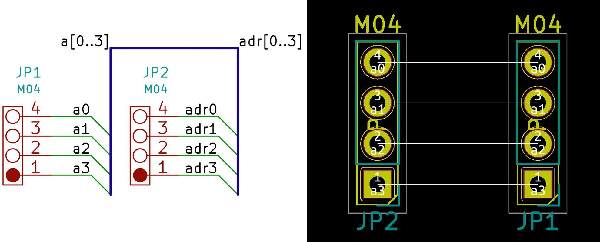
6. 原理图通过点选**批注**原理图符号可以批量给器件添加编号
7. 在画器件封装的时候，[如果焊盘只显示轮廓](https://gitee.com/KiCAD-CN/kicad-cn-forum/issues/I1JQ0U)，可以去查看下**视图->绘图模式**，是否勾选了焊盘草图，如果勾选，取消就可以了
8. 在**编辑->编辑文本和图形属性**可以批量修改文本和器件的编号丝印大小
9. 批量修改器件的封裝，可以使用 tools->Edit Symbols Fields，eg:效果如圖: 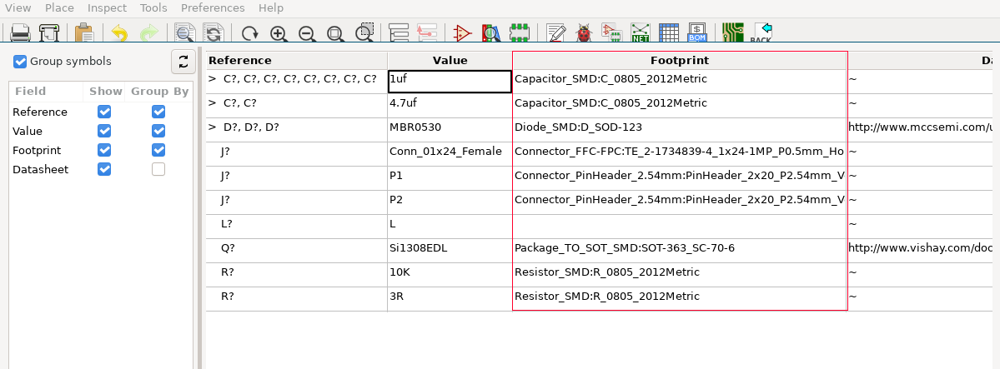
10. 選中一個位置，然後點擊**空格**，可以切換爲相對坐標，選中的點位就是相對原點
11. kicad pcbnew 的快捷鍵
---
|快捷鍵|功能|
|---|---|
|-|切換底層和頂層|
|~|高亮当前网络|
|v(布線中)|添加過孔|
|x|開始布線|
|q|布線時打開線寬編輯|
|B|重新绘制所有铜层|
|Z|3D 视图查看顶视图|
|shift + Z|3D 视图查看底视图|
|Y|3D 视图查看右视图|
|shift + Y|3D 视图查看左视图|
|X|3D 视图查看前视图|
|shift + X|3D 视图查看后视图|
|TAB|45 角度旋转|
|N|shiyong xiayige grid 的大小,修改网格大小|
|shift + N|shiyong shangyige grid 的大小,修改网格大小,|
|ctrl + 鼠标左键|高亮指定的网络|
|u|扩展连线|
|7|绘制单根等长线|
|8|绘制双根差分等长线|
|9|绘制差分等长线的单根|
|ctrl + l|打开绘制等长线的配置界面|

12. [庫文件搜索](https://componentsearchengine.com)，支持下載符號、封裝庫和 3D 模型
13. kicad 不同後綴名文件類型
	* .lib 文件， 符號文件
	* .pretty 文件， 封裝庫文件
14. l 按鍵在 PCB 設計中可以鎖定某一個器件
15. 可以通過創建陣列的方式，快速放置安裝孔
16. 覆銅時如果出現覆銅重疊，可以是使用覆銅優先級解決這個問題，優先級數值越大，優先級越高
17. 如果希望只删除链接线、或者其他某一类的对象，可以[首先全选所有的内容，然后右键鼠标，然后打开选择过滤器，勾选需要选择的内容](https://forum.kicad.info/t/how-to-delete-all-tracks-in-pcbnew/27844)，也可以 Pcbnew -> Edit -> Global Deletions。
18. ~ 符号在 Kicad 表示上划线
19. 原理图可以分为多个层次图的时候
    * 在子页面绘制的是 **hierarchical labels**
	* 在 root 页面绘制的是 **hierarchical pins**，绘制方法有两种，一种手动、另一种自动导出，建议第二种
		* 手动的方式，适用在先在 root 页面定义好符号，然后在子页面定义对应的 **hierarchical labels**
		* 自动导出方式，使用在先在子页面定义了 **hierarchical labels**，然后在 root 页面导出对应的 **hierarchical pins**
20. 器件搜索
	* 数码管器件搜索 7seg
21. 精确相对移动
	* 选中器件后 **ctrl + r** 可以选择参考目标，做相对移动
	* 选中器件后 **ctrl + m** 可以绝对移动，相对当前位置
22. align 对齐多个器件的时候，最后选择的器件是基准
23. Kicad 有一个层叫做 **CrtYd** 这个层绘制的图形必须也要封闭起来,否则会报 **has incorrect Courtyard** 错误
24. 查看 Kicad 的快捷键可以参看 **Preferences -> Hot Keys -> Export Hotkeys**
    * F 可以快速切换当前器件放置的层
25. Kicad 导出 geber
    ---
	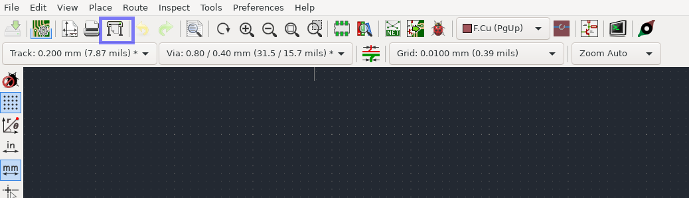
	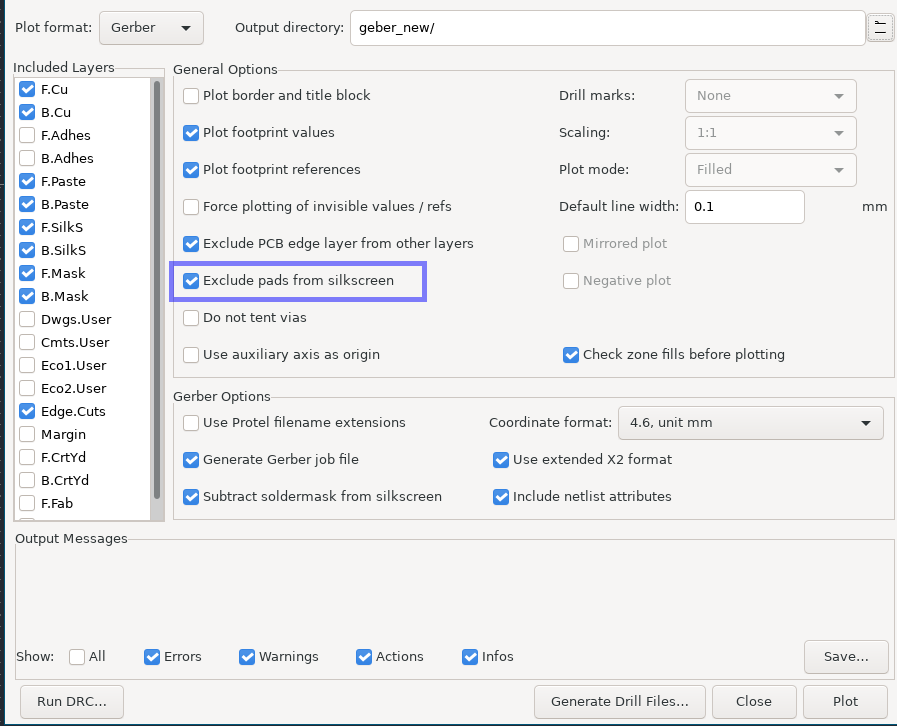
	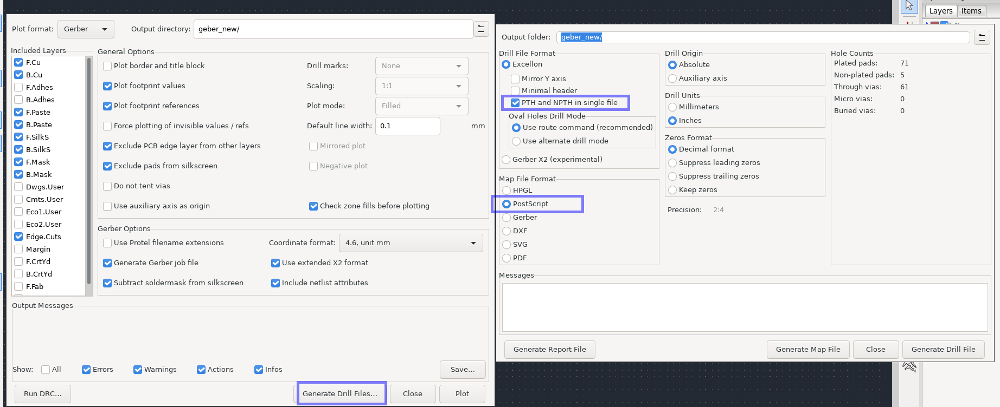
26. Kicad 导出 bom 的方法
	---
	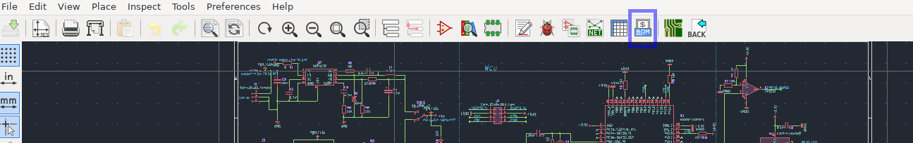
	---
	使用 bom2csv 插件导出 **csv 后缀名**的文件
    ---
	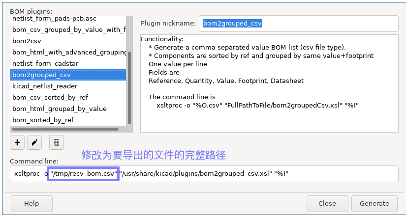
	---
	打开 libreoffice 打开 Text CSV 格式文件
	---
	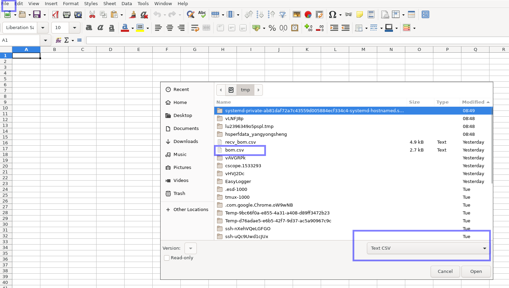
	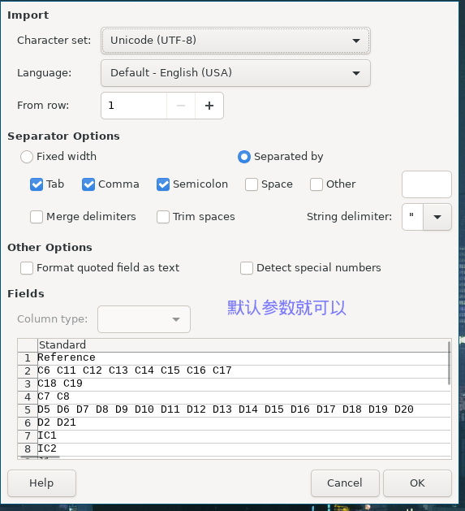
	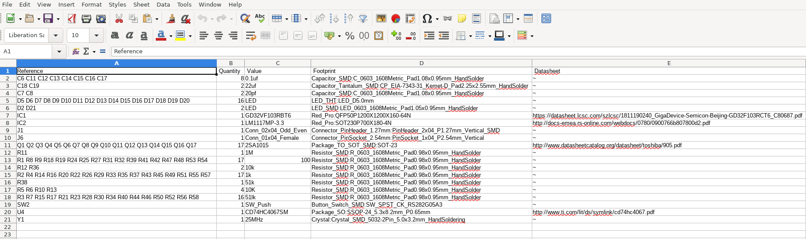
27. [plotgitsch](https://github.com/jnavila/plotkicadsch) 是一款对比 kicad 修改差异的开源工具
	* 对比当前工作区和 HEAD 差异 **plotgitsch -ifirefox**
	* 对比当前工作区和指定版本之间修改的差异 **plotgitsch -ifirefox <rev1> **
	* 对比指定版本之间修改的差异 **plotgitsch -ifirefox <rev1> <rev2>**
	* -k 选项可以将对比的 svg 文件保存到当前工作目录
28. [LibreCAD](https://wiki.librecad.org/index.php?title=LibreCAD_Brief_Overview) 是一款开源的 2D CAD 软件
	* 画图: 有两种方法, 鼠标和键盘
	* LibreCAD supports two drawing perspectives; orthogonal(正交,一般的 2D 图像) and isometric projections(等距投影.在 2D 结构中绘制 3D 效果,可以认为是 2.5D)
	* 相对坐标的使用需要在坐标前添加 **@** 符号,如果是笛卡尔坐标,也可以写作 **x..y** 等价 **@x,y**
	* 极坐标的方法是 **100@45** 表示 45 度 100 单位长度
	* entity 是几何形状,比如线\圆\弧等,这些实体组合起来构成了图
		* pens : 描述了一个实体的外观,包括有颜色(默认内置了 16 中颜色,支持 24 bit 的 RGB 颜色)/宽度(宽度范围是 0.0mm - 2.11mm)/类型(默认的类型是实心的,还支持 DOT/Dash/Divide/Center/Border)三种属性
		* layers : 提供了将这些实体组合起来的方法,层的使用是 libreoffice 最重要的一个特性,有点类似传统的手工草图.每一个实体只能关联到一个层
			* Construction layer : 是建造层,最基本的层,不会打印出来,用来容纳几何体构造线,所有在这个层的线长度都是无限长的
	* 创建实体的方法可以用鼠标或者键盘
	* 选择实体
		* sa: 选择所有实体
		* 单击一个实体后按住 shift 可以多选
		* 鼠标从左边向右边滑动,出现蓝色的矩形,选择包含所有边框的实体,必须用这个矩形包含所有的边框; 鼠标从右边向左边滑动选择,出现绿色矩形,可以选择对应边框的实体,画出的矩形不用包含所有的边框
	* di : 命令的对象可以是线\圆等不能是 close 的图形
	* snap 开启后,可以用鼠标自动捕获关键点,定位更加准确
	* 选择 object 之后可以使用右键，Attributes 然后可以修改对应 object 的 layer, 或者选择 object 之后，通过左侧的 modify 图表，找到 Attributes 属性然幕后修改对应的 layer
29. kicad 原理图绘制的快捷鍵
---
|快捷鍵|功能|
|---|---|
|q|放置 no connected 符号|
30. 绘制 pcb 时可以先覆铜,但是选择不显示铜层,绘制连线后再重新绘制铜层(B 快捷键)
31. kicad 导入 Autodesk 的边框时候,建议使用 R12 版本的 dxf 文件格式,可以使用 librecad 另存为 R12 版本的 dxf 文件
32. 场效应管(MOS 管, MOSFET)工作原理: 为保证N沟道结型场效应管能正常工作，要在栅(G)源(S)之间加负向电压，以保证反向电压要被耗尽层承受，以形成漏极电流；栅源之间负向电压越大，PN 结交界面所形成的耗尽区就越厚，导电沟道越窄，沟道电阻变大，漏极电流 iD 越小；相反，若栅源之间负向电压越小，耗尽区就越薄，导电沟道越宽，沟道电阻变小，漏极电流 iD 越大。
	* 结型场效应管
	* 绝缘栅型场效应管
		* 增强型场效应管, Vgs 为 0 时, 漏电流也为 0 的是增强型
			* N 沟道
			* P 沟道
		* 耗尽型场效应管, Vgs 为 0 时, 漏电流不为 0 的是耗尽型
			* N 沟道
			* P 沟道


    * 场效应管具有放大作用
    * 场效应管可以方便地构成恒流源，使之保持恒定
    * 场效应管很高的输入阻抗非常适合作阻抗变换
    * 场效应管可以用作可变电阻
    * 场效应管可以用作电子开关
33. **Kicad** 器件下載網址彙總
	* [snapeda](https://www.snapeda.com) 下載 3D 模型圖時選擇 ``NX.10`` 格式的，可以較好的支持帶有顏色的 3D
	* [componentsearchengine](https://componentsearchengine.com)
34. 避免检查 kicad courtyard overlap
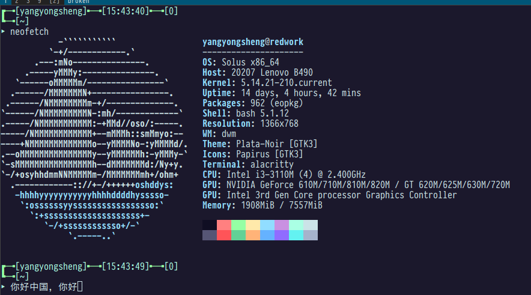
35. [pcad2kicad](https://github.com/iysheng/pcad2kicad.git) 一款 ad 封装库转 kicad 封装库的工具
	* csplit  AD.lib /ENDDEF/+1 {*} 将 kicad 的原理图库集合拆分为多个元器件符号文件,还需要继续处理,这里只是记录下使用 csplit 工具方便进行文本拆分
36. Kicad 下绘制 power 符号,管教属性选择 **power in**, 不然的话多个 power out 符号管教连载一起会报错,但是选择 power in 的话,可以通过添加 POWER FLAG 避免 ERC 检查错误
37. 不同的 Grid 设置会导致 ERC 检查出不同数量的警告 **symbol pin or wire end off grid**, 建议绘制原理图和元器件符号时,统一使用 50mil 的 grid 设置.
38. Kicad 选择一段线,在界面下方会显示这段线的长度(segment length)和这整个 **routed length**,也就是这根线所连的两端之间线的总长度,这个长度在绘制等长线的时候会使用到
39. Altium Designer 快捷键
	1. shift + x 查看一段线的信息
