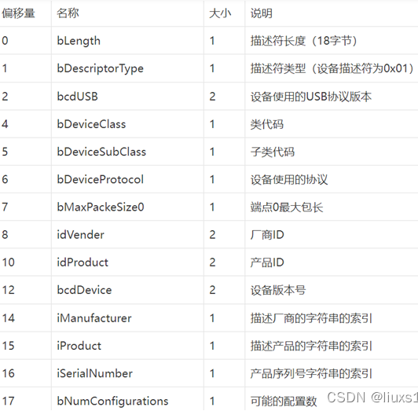
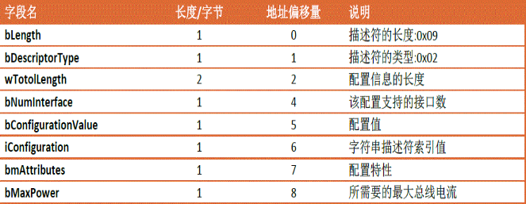
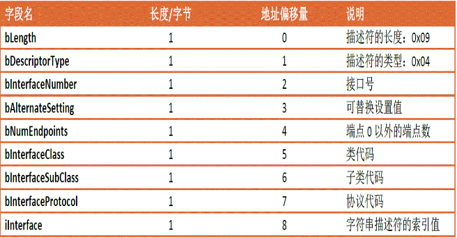
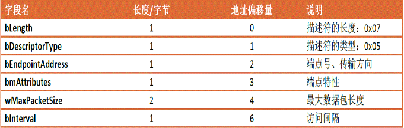
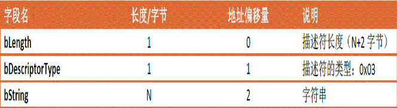

### USB 基础知识

#### 基础知识介绍

1. USB 总线上的传输数据以包(packet)为基本单位, 协议中规定包类型有令牌包、握手包和特殊包等
    1. 每个包由6部分组成: SYNC [PID 地址 [帧号 数据] CRC] EOP # 特别地,帧号和数据一般都归为数据段
    2. USB 有很多类型不同的包,通过 PID 来区分, PID 一共有 8 位,其中 USB 协议使用前4位 PIDO-PID3, 另外的4位 PID4-PID7 是 PID0-PID3 的取反,用来校验 PID, 所以包类型一共有16种
        1. 令牌包(Token) PID 有 4 种:
            1. OUT(0X87)   包中有地址和端口号
            2. IN(0X5A)    包中有地址和端口号
            3. SOF(0XA5)   包中有帧开始标记和帧号
            4. SETUP(0XB4) 包中有地址和端口号
        2. 数据包(Data) 有 2 种:
            1. DATA(0XC3)  偶数据包
            2. DATA1(0XD2) 奇数据包
        3. 握手包(HANDSHAKE) 有 3 种:
            1. ACK(0X4B)   接收器无错误接收
            2. NACK(0X5A)  接收设备忙不能接收
            3. STALL(0X1E) 设备出错通信不上
        4. 专用包(SPECIAL) 有 1 种:
            1. PRE(0X2C) 主机发送的前同步字,用来区分低速和高速设备
    3. 地址段中,设备地址 7 字节,端点地址 4 字节(但是低速设备最多支持3个端点;高速设备最多支持16个IN和OUT端点)
    4. 数据段种有帧号(帧号有11位,主机每发出一个帧,帧号就会自动加1;当帧号达到7FFH时,将归零重新开始计数;仅在每个SOF帧的帧首传输帧号)和数据(根据传输类型不同,数据域长度为0~1024字节)两部分
    5. CRC 校验:---------------
    6. 数据传输层,USB提供4种传输方式
        1. 控制传输(control transfers): 突发,非周期,由主机发起,用于命令和状态的传输
        2. 同步传输(isochronous transfers): 周期性,持续性的传输,用于传输与时效相关的信息,并且在数据中保存时间戳的信息
        3. 中断传输(interrupt transfers): 周期性,低效率,允许有限延迟的通信
        4. 大容量数据传输(bulk transfers): 非周期型,大容量突发数据的通信,数据可以占用任意带宽,并容忍延时
2. USB 会完成 CRC 校验、位填充、PID 识别、数据包切换、握手等协议处理
3. USB 传输是主从模式，主机负责发起数据传输过程，从机负责应答
4. USB 数据传输以小端结构,即先发送低数据位
5. 数据传输方向均以主机为参考, 比如 IN 令牌包(主机<-从机)，OUT 令牌包(主机->从机)
6. 一个 USB 设备通常有一个或者多个配置，但同一时刻只能有一个配置 config
7. 一个配置通常有多个接口 interface // 在 linux 驱动，是绑定到 USB 接口上的，而不是整个 USB 设备
8. 一个接口通常有一个或多个端点 endpoint
9. 当一个USB设备插入主机后,会有如下步骤:
```
供电
复位
获取 device descriptor
复位(可选)
分配地址
获取 device descriptor
获取 configuration descriptor
获取 string descriptor (可选)
配置
```
10. USB 描述符:通过一套描述符,USB设备向USB主机描述自己的功能,属性,配置信息等标准描述符:
    1. 设备描述符(device descriptor),描述设备的类型,厂商信息,USB的协议类型,端点的包数据的最大长度等,每个USB设备**只有一个**设备描述符
        j
    
    2. 配置描述符(configuration descriptor),每个配置描述符提供了设备特定的配置,描述了设备的接口和端点的性质,供电模式和设备的耗电
    
       
    
    3. 接口描述符(interface descriptor),描述了设备不同接口的特性,例如一个设备既有U盘功能,又有键盘功能,用两个接口描述符分别描述两个功能
    
       
    
    4. 端点描述符(endpoint descriptor)
    
       
    
    5. 字符串描述符(string descriptor),描述设备制造商,设备名称和序列号信息
    
       
