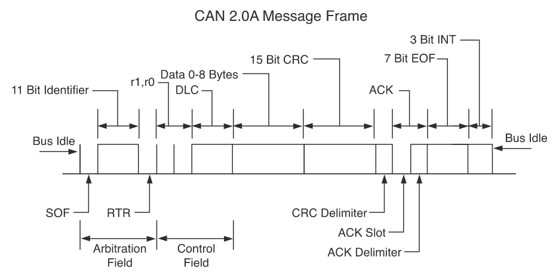
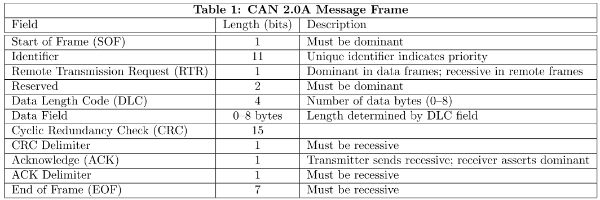
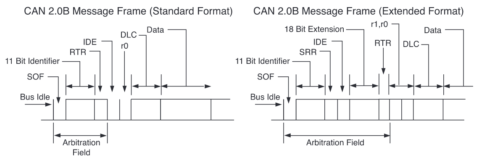
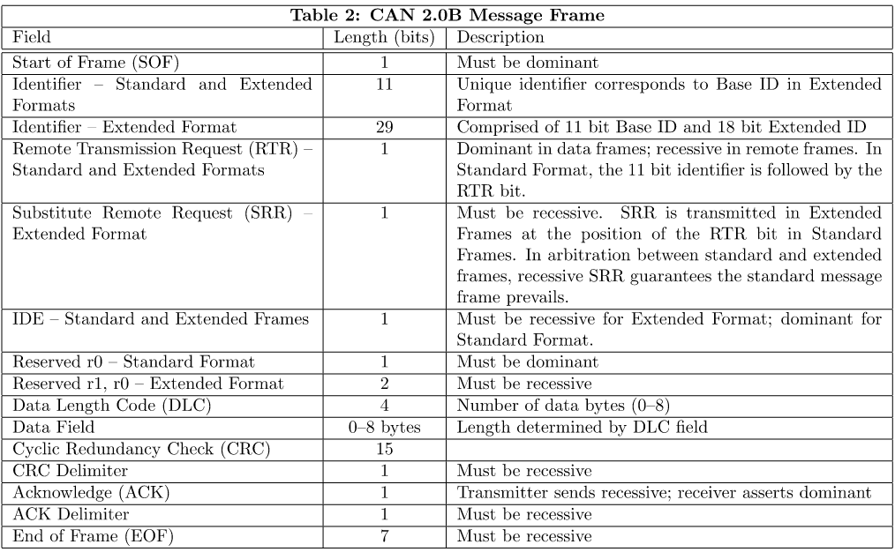
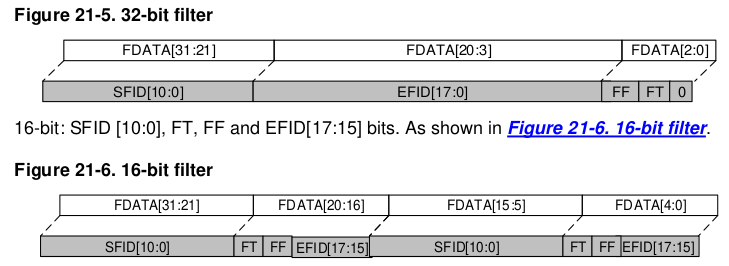
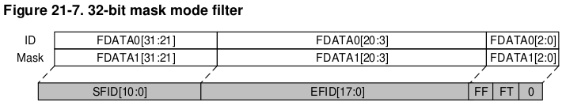
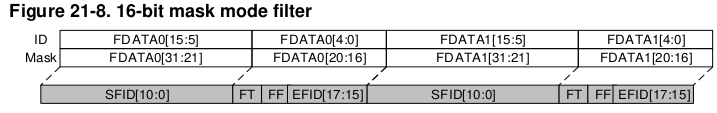
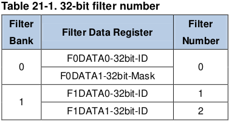

### 記錄 Cortex-M 系列處理器的模塊學習

### 系統部分
---
##### Cortex-M3
* 一個處理器核心
* 一個 NVIC
* 可選的 MPU
* 四條外部總線
	* ICode memory interface (0x00000000 to 0x1FFFFFFF)
	* DCode memory interface (0x00000000 to 0x1FFFFFFF)
	* System interface (0x20000000 to 0xDFFFFFFF) 和 (0xE0100000 to 0xFFFFFFFF)
	* Private Peripheral Bus (PPB) (0xE0040000 to 0xE00FFFFF)
* 兩種工作模式
	* thread mode : reset 後就會到該模式，退出異常後也會進入到該模式，特權和非特權指令都可以在該模式執行
	* handler mode : 異常後會進入到該模式
* 兩種工作狀態
	* thumb state：正常模式，可以執行 16 bit 和 32 bit 的 thumb 指令集
	* debug state：調試模式
* 特權模式對資源的訪問無限制，非特權模式只能訪問一定限度的資源
* 總線定義
	* Advanced High-performance Bus (AHB)-Lite
* 寄存器描述
---

* 有連個 sp 寄存器，一個 sp_process 爲，另一個 sp_main 爲 handler 模式使用的棧指針， thread mode 使用的棧指針可以配置爲 sp_process 也可以配置爲 sp_main
##### GD32F103
* Unique device ID (96 bits) 帶有 96 bits 的 Unique device ID
* 寄存器 0x4002103C 有一個 bit CEE 表示代碼執行增強
* 處理器有一個 NVIC
	* 所以的異常都是在 handler 模式
	* 異常發生時，系統狀態會自動保存到棧， （Interrupt Service Routine）ISR 執行完成後會自動從棧恢復
	* 向量与状态保存并行获取，从而实现高效的中断输入。
### flash 部分
---
* ICP(in-circuit programming) 使用 JTAG 或者 SWD 协议将 bootloader 程序下载到 32
* IAP(in-application programming) 使用 I/Os, USB, CAN, UART 等将程序下载到控制器，这些也需要这些控制器支持 IAP 下载程序，IAP 支持用户在程序运行的时候少些程序到 flash。尽管这样，部分应用程序还是必须提前通过 ICP 的方式烧录到 flash.
* flash 的指令访问和数据访问都是在 AHB 总线上。
##### GD32F103
gd32 的 flash 區有一個 information 區，這個區域存放的是 bootloader，這部分代碼是
固化好的不能被修改
|分類|page size|描述|information 區|
|---|---|---|---|
|GD32F10x_MD|1KB|容量在 128KB|0x1FFF F000- 0x1FFF F7FF|
|GD32F10x_HD|2KB||0x1FFF F000- 0x1FFF F7FF|
|GD32F10x_XD|2KB||0x1FFF E000- 0x1FFF F7FF|
|GD32F10x_CL|2KB||0x1FFF B000- 0x1FFF F7FF|

gd32 使用外部时钟，系統頻率選擇 108MHz
|總線名|頻率|
|---|---|
|sys|108MHz|
|AHB|108MHz|
|APB2|108MHz|
|APB1|54MHz|

### DMA 部分
---
##### GD32F103 系列
* DMA0 有 7 個通道
* DMA1 有 5 個通道
* 有優先級仲裁
	* 硬件優先級， 通道 0 的優先級最高，通道 6 的優先級最低
	* 軟優先級，(low, medium, high, ultra high)
* 可以配置 DMA 的數據長度，最多 65536
* 支持 8/16/32 bit 的數據訪問
* 支持固定地址和自增地址
* 支持循環發送模式
* 每一個通道的中斷有三種類型的 event flag
* 支持外設到內存、內存到外設以及內存到內存的數據傳輸

### ADC 部分
---
##### GD32F103 系列
* 12 bit 逐次逼近原理
* 18 個通道，包括 16 個外部通道和 2 個內部通道
* 模擬看門狗可以讓應用程序檢測輸入電壓是否在用戶定義的範圍外
* AD 支持單次、連續、掃描和不連續模式
* 支持對轉換後的 12 bit 數據設置左對齊或者右對齊
* 12 bit 的轉換速度可以達到 1MSPs，採樣速度
* 支持自校準
* 採樣時間可以配置
* 支持 DMA
* 1 路內部通道採集溫度
* 1 路內部通道測量內部的參考電壓
* 支持軟件和硬件觸發 AD 轉換
* 單個轉換、連續轉換指定的一個通道
* 掃描模式掃描指定的通道集合
* 非連續模式 AD 轉換
* ADC 的供電電壓是 2.6 ~ 3.6 典型是 3.3V
* 具有一個前臺的校準特性，觸發校準需要設置 CLB bit = 1,校準完成時，硬件會清零這個 bit 位，在校準期間不要使用 ADC，當環境發生變化後，建議重新校準 ADC，校準的一般步驟：
	1. 設置 ADCON = 1
	2. 延時 4 個 ADCCLK 等待 ADC 穩定
	3. 設置 RSTCLB = 1，復位 ADC 校準
	4. 設置 CLB = 1
	5. 等待 CLB 被硬件清零，完成校準的流程
* ADC 的時鍾在 APB 總線上，最大的時鍾頻率是 14MHz
* 開啓 ADCON = 1 後，需要延時 20us 以上
* ADC 支持 18 個通道，可以將這 18 個通道分爲兩類型，常規組和插入組(插入組的 AD 轉換有符號位)
	* 常規組最多支持 16 個轉換
	* 插入組最多支持 4 個轉換，如果兩個都有用，建議插入組的採樣時間不要選擇 1.5 和 7.5
* 連續轉換模式僅支持常規組，需要設置 CTN bit 爲 1，建議配合 DMA 使用
* 對 12 bit 的 ADC 的轉換，總的轉換時間是**採樣時間 + 12.5 個 ADC 時鍾周期**
* 外部觸發信號
	* AD 轉換過程可以被外部信號的上升沿觸發
* DMA 請求，可以將常規組的 AD 轉換結果直接 DMA 到指定的內存區域
* ADC 的中斷類型
	* AD 轉換完成
	* 模擬看門狗中斷

### CAN 总线部分
---
**CAN 2.0A 协议帧格式和对应的描述**

**CAN 2.0B 协议帧格式和对应的描述**

* GD32 的 can 工作模式有三种
	1. sleep 模式, 复位之后默认进入到该模式,在改模式 CAN 的 clock 停止,处在低功耗状态,sleep 模式可以直接转到 inital 模式也可以直接转到 normal 模式
	2. initial 模式, 当 CAN bus 的配置需要改变的时候, CAN 必须首先进入到 intial 模式.
	3. normal 模式, normal 模式下可以和其他的 CAN 设备正常通讯, 进一步地 CAN 的通讯模式也可以分为三种:
		1. silent 通讯模式, 该模式意味着只能接收不能发送
		2. loopback 通讯模式, 该模式发送出去的数据直接到接收 FIFO,接收管脚直接和外部隔离开来,发送管脚可以将数据发送出去
		3. loopback 和 silent 通讯模式, 该模式表示不能接收外部的也无法将数据发送到外部,一般用来自测
		4. normal 通讯模式,正常可以和外部收发的模式
* 有 3 个发送邮箱和 2 个接收 FIFO
* 滤波器
	* CAN 从 CAN 总线接收的数据必须要通过滤波器过滤才会确认是否可以接收.
	* 滤波器有 14 或者 28 个 bank,每一个 bank 都有两个 32bit 的寄存器,每一个滤波器的 bank 都可以配置为 32bit 或者 16bit,32 bit 和 16 bit 对应的滤波器的帧格式为:

	* 滤波器有两种模式:
		1. 掩码模式对应的也分为 32bit 和 16bit,匹配对应 bit 位的内容要一致.
		
		
		2. list 模式,这种模式直接确定的了帧 ID(32 bit 模式下需要匹配 29 bit 的 ID 位,16 bit 模式下需要匹配 SFID 的 11 bit 和 EFID 的高 2 bit),而不再是掩码方式对比.
		
		3. 滤波器编号的方法,比如两个 bank0 和 bank1,分别设置 bank0 为 32 bit 的 mask 模式,bank1 为 list 模式,那么滤波器的编号为:
		
		4. 滤波器可以关联到 FIFO0 或者 FIFO1, FIFO0 和 FIFO1 的滤波器器编号都是从 0 开始的.
		5. 滤波器的优先级:
			* 32 bit优先级比 16 bit高
			* list 模式的优先级比 mask 高
			* 滤波器编号越小,对应的优先级越高
		
### TIM 部分
---
##### GD32F103 系列
* TIM0 和 TIM7 在 APB2 總線，支持 4 個通道的輸入捕獲和輸出比較
* TIM1-3 和 TIM4-6 都是在 APB1 總線
* TIM1-4 使用 16bit 的計數， 16 bit 的分頻，有 PWM 模式，帶有自動重載，支持 4 個通道的輸入捕獲和比較
* 輸出比較模式的輸出時序受到 TIMERx_CAR and TIMERx_CHxCV 控制，CHxVAL 寄存器可以在執行過程修改這個值
* 輸出 PWM 模式，需要設置 CHxCOMCTL 爲 3’b110 (PWM mode0) 或者 3’b111(PWM mode1)，可以根據 TIMERx_CAR 和 TIMERx_CHxCV 寄存器的值輸出對應的波形
* 可以將 PWM 設置爲邊沿對齊 EAPWM 和中心對齊方式 CAPWM
* EAPWM 的周期受 TIMERx_CAR 決定，TIMERx_CHxCV 決定佔空比，選擇 EAPWM 模式
* CAPWM 的周期是 2*TIMERx_CAR, 佔空比是 2*TIMERx_CHxCV
* 如果 TIMERx_CHxCV 比 TIMERx_CAR 大, 在 PWM mode0 (CHxCOMCTL==3’b110) 時候，輸出總是在激活狀態
* 如果 TIMERx_CHxCV 等 0, 在 PWM mode0 (CHxCOMCTL==3’b110) 時候，輸出總是在未激活狀態

### (TCD1304)[https://hackaday.io/project/9829-linear-ccd-module]
---
The TCD1304 requires the following input to function
* The master clock (fM)
* The shift gate (SH)
* The integration clear gate (ICG)

TCD1304 需要如下輸入來正常驅動
* fm 主時鍾(頻率範圍是 0.8MHz ~ 4MHz，支持用戶修改，選取 2MHz)
* SH 移位門(定義曝光時間，)
* ICG 曝光清零門(定義像素數據移動到移位寄存器)

* OS 的輸出實在 1.5V ~ 3.5V 之間波動的
* 外部信號的高電平 3V ~ 5.5V，典型值是 4V
* 外部信號的低電平 0V ~ 0.44V，典型值是 0V
* 電源信號 VDD 和 VAD 電平在 3V~5.5V

---
1. SH must go high with a delay (t2) of between 100 and 1000 ns after ICG goes low.(SH 必須在 ICG 邊爲低電平後延時 100 ~ 1000ns 拉高，典型直是 500ns)
2. SH must stay high for (t3) a minium of 1000 ns.(t3 必須保持高電平至少 1000ns，來曝光)
3. ICG must go high with a delay (t1) of minimum 1000 ns after SH goes low(SH 變爲低電平後延時至少 1000ns， ICG 需要拉高，典型值是 5000ns)

This is all taken care of by the timers in the STM32F401RE.
In fact once they're set up the MCU is not doing any work.
The only thing the user has to do is to choose ICG-periods that are multiples of the SH-period.
所有的事情都可以交給定時器完成，實際上， MCU 完成初始化後就做的事情很少了，用戶
需要做的是選擇 ICG 的周期，算法是 piexl * SH-period ???

---
Reading the TCD1304(讀取 TCD1304 傳感器的數據):

The data rate of the CCD is 1/4 of fM, which means the pixels are clocked out at 0.50 MHz. The ADC in the STM32F401RE is fast enough to do 12 bit conversions at this rate. The pixel values are sent to a 16 bit array using DMA. From here they are sent to the Raspberry Pi over SPI at 16 MHz - also utilizing DMA - or through UART to a regular PC via the built-in ST-link's USB-connection.
( CCD 的數據速度是 1/4 的 fm。在 2MHz 輸出 fm 的情況下， 像素的數據輸出的頻率是 0.5MHz，32 的 12 bit 的ADC 足夠在這個速度下處理 AD 採樣。像素數據通過 DMA 存儲到一個 16 bit 的數組)
The voltage of an "dark" pixel is around 3.0 V and a "white" pixel has a voltage of around 1.5 V. In other words the data is upside down.(“暗”電壓大概在 3.0V，“白”電壓大概在 1.5V，換句話說和一般的 CCD 相比，“暗”和“亮”電壓剛好顛倒)

