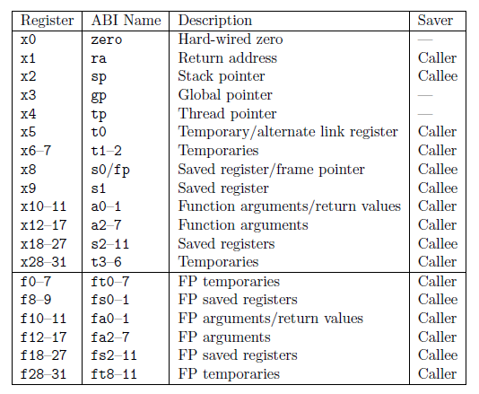

### Riscv 架构学习


#### 编译工具链
1. 下载源码
``` bash
▸git clone --filter=blob:none --no-checkout https://hub.fastgit.org/riscv/riscv-gcc.git # 下载关键的 default 分支相关的文件
▸git checkout master # 切换到 master 分支
▸git submodule # 确认下所需的 submodules 软件包是否已经下载完成
 57dfc2c4d51e770ed3f617e5d1456d1e2bacf3f0 qemu (v4.0.0-1854-g57dfc2c4d5)
 2cb5c79dad39dd438fb0f7372ac04cf5aa2a7db7 riscv-binutils (heads/riscv-binutils-2.35)
 4ea498a8e1fafeb568530d84db1880066478c86b riscv-dejagnu (heads/riscv-dejagnu-1.6)
+4e3d3e40726e1b68bf52fa205c68495124ea60b8 riscv-gcc (heads/master)
 63a44e5923c859e99d3a8799fa8132b49a135241 riscv-gdb (remotes/origin/fsf-gdb-10.1-with-sim)
 7395b0964db9cc4dd544926414960e9a16842180 riscv-glibc (heads/riscv-glibc-2.29)
 415fdd4279b85eeec9d54775ce13c5c412451e08 riscv-newlib (newlib-4.1.0)
```
2. 配置编译
``` bash
▸./configure --prefix=工具链条路径 --enable-multilib（同时支持 32 bit 和 64 bit，否则默认只支持 64 bit）
▸make -j
```
3. 运行测试
``` bash
▸ make
cc applications/main.c
/opt/riscv_tools/bin/../libexec/gcc/riscv64-unknown-elf/10.0.1/cc1: error while loading shared libraries: libmpfr.so.4: cannot open shared object file:
 No such file or directory
make: *** [/home/yangyongsheng/just4github/riscv_codes/ab32vg1-ab-prougen/rt-thread/tools/rtthread.mk:100: /home/yangyongsheng/just4github/riscv_codes/
ab32vg1-ab-prougen/build/bsp/applications/main.o] Error 1
（原因是因为在编译工具链的服务器上使用的是 libmpfr.so.4，笔记上使用的是 libmpfr.so.6，将服务器对应版本的 libmpfr.so.4 复制到笔记上就可以正常运行了,如果是因为电脑上没有安装对应的库文件，那么安装对应的的库文件）
▸ sudo dnf install mpfr-devel （如果是缺少该库，安装 mpfr 库文件， 针对 fedora）
```
4. riscv 寄存器描述



5. riscv 特殊寄存器描述
    1.  mstatus (机器模式下的状态寄存器, RISCV 架构规定,进入异常时,硬件自动更新机器模式状态寄存器 mstatus 的某些域, MPIE 的值被更新为异常发生前 MIE 的值, MPIE 的作用是在异常结束后,能够使用 MPIE 的值恢复到异常发生前的 MIE 的值. MIE 的值被更新为 0, 意味着进入异常服务后,中断被全局关闭,所有中断不被响应. MPP 的值被更新为异常发生前的模式, 如果只实现机器模式, MPP 的值永远是 11), MPP 的作用是在异常结束后可以恢复到之前的工作模式, 异常处理完成后, 从异常服务中推出到主程序, 可以使用 mret. sret, uret, 对机器模式使用的是 mret)
        1.1 MIE: 表示全局中断使能, MIE 为 1 时,全局中断打开, 0 时全局中断关闭
        1.2 MIPE: 保存进入异常之前 MIE 的值
        1.3 XS: 作用域和 FS 类型,用于维护和反应用户自定义的扩展指令单元状态,标准的 RISCV 架构中, XS 是只读的,在 E200 中,将 XS 设计为可读写的,用来控制打开和关闭协处理器
        1.4 SD: 只读的,反映了 XS 或者 FS 处于脏状态,逻辑表达式是 SD=((FS==11)) 或者 ((XS==11))
        1.5 MPP: 用来保存进入异常之前特权模式的值, 处理器进入异常时, MPIE 会被更新为 MIE, MIE 被更新为 0(意味着进入异常,中断被屏蔽). MPP 的值被更新为异常发生前的模式(如果只实现机器模式,则 MPP 的值永远是 11)
        1.6 FS: 用来维护和反映浮点单元的状态, FS 的更新准则为, FS 上电后默认为 0,如果需要打开浮点运算功能, 需要设置 FS 为非 0 值. 如果 FS 为 1 或者 2,当执行了任何浮点运算指令后, FS 都会变成 3.当处理器通过 csr 指令设置 FS 为 0 关闭浮点运算指令后,任何访问浮点 csr 或者执行浮点指令的行为都会触发非法指令异常

        |FS|FS meaning XS|meaning|
        |---|---|---|
        |00|off|all off|
        |01|initial|none dirty or clean, some on|
        |10|clean|no dirty, some clean|
        |11|dirty|some dirty|

    2. 使用 mret 推出异常时侯, 处理器硬件行为为:
        1. 停止执行当前程序流, 转而从 csr 寄存器 mepc 定义的 pc 处开始执行
        2. 不仅会让处理器从 pc 地址开始执行,还会让硬件同时更新 csr 寄存器机器模式状态寄存器 mstatus, MIE 被更新为 MPIE, MPIE 设置为 1
