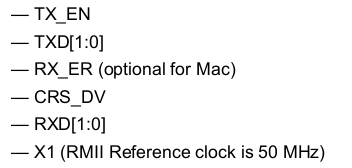

### RT-thread 是一款国产操作系统，本文档用来记录学习 RT-thread 的过程

#### 一、 配置过程
```
1. scons --target=makefile
2. 修改 config.mk 文件，有关交叉编译工具链变量**CROSS_COMPILE**的配置
3. make 编译
4. 因为这个单板没有连接外部晶振，所以需要修改源码配置使用内部晶振作为时钟
5. 使用 openocd 通过 stlink-v2 接口连接硬件，烧录程序
	1. openocd 支持的 reset 类型
		1.1 system Reset : SRST hardware 复位信号
		1.2 JTAG TAP Reset : TRST 硬件复位信号
		1.3 Emulation Reset :
```

#### 二、 組件包相關內容
1. RT-thread 操作系統在 Linux 的 pkgs 命令，需要使用 **source ~/.env/env.sh** 導出，然後就可以使用 pkgs 命令了， pkgs 算是一個 python 函數
2. 軟件包 pkgs 命令相關的內容
    2.1 pkgs --update 下載、更新選中的軟件包，還可以刪除沒有選中的軟件包
    2.2 pkgs --upgrade 更新軟件包列表信息


#### 三、 一些组件包的学习
1. [FlashDB](https://github.com/armink/FlashDB)
	* FlashDB 是新一代的超轻量化的嵌入式数据库，目标在为嵌入式设备提供一种数据存储解决方案。和传统的数据库不同的地方是， FlashDB 结合了 flash 等媒介的特点开发。并且尽量保证很低的资源开销。
		* FlashDB 是将 flash 分割为多个 sector，然后每一个 sector 的大小是擦除块的大小，每一个 sector 包含有 header 头部信息，header 头部信息保存 KV 数据
	* FlashDB 提供了两种数据库模式：
		* Key-value 数据库： 这是一种非关系型的数据库，数据就是以一种 KV 对保存，Key 通常是唯一的标志符， KVDB 具有简单的操作，以及很强的可扩展性
			1. 设备的参数保存
			2. 用户的配置信息
			3. 很小的文件管理
			4. 脏状态表示，该 sector 包含有旧无效的 KV1 信息，以及新的有效的 KV1 信息，即 KV1 在这个 sector 被更新过
		* Time Series 数据库：TSDB 是将数据按照时间序列进行保存，TSDB 的数据具有一个时间戳，一大段的数据以及很高的可插入以及查询特性， Time Series log(TSL) 是 TSDB 存储的每一条信息的简称
			1. 动态保存产生的结构体数据
			2. 记录操作日志

2. [EasyLogger](https://github.com/armink/EasyLogger.git)
	* EasyLogger 是一款超轻量级、高性能的 C/C++ 日志库，相比 log4c、zlog 这些知名的日志库， EasyLogger 功能更加简单，提供给用户的接口更少。
	* 输出级别参考安卓，级别最高是 0(Assert)，最低是5(Verbose)
		* 0 (A) 断言
		* 1 (E) 错误
		* 2 (W) 警告
		* 3 (I) 信息
		* 4 (D) 调试
		* 5 (V) 详细

3. [EasyFlash](https://github.com/armink/EasyFlash.git) 是 FlashDB 的初代版本
	* EasyFlash 是一款开源的轻量级嵌入式 flash 存储器库，主要包含三大功能：
		* ENV 快速保存产品参数，支持磨损均衡以及掉电保护
		* IAP 在线升级
		* Log 无需文件系统，日志可直接存储在 Flash。非常适合应用在小型不带文件系统的产品中，方便开发人员快速定位、查找系统发生崩溃或者死机的原因。同时配合 EasyLogger 一起使用，轻松实现 C 日志在 Flash 存储功能。

4. [ulog_easyflash](https://github.com/armink-rtt-pkgs/ulog_easyflash.git) 是在基于 easyflash 的 ulog 插件，就是创建了一个 ulog 的后端，将 ulog 的打印信息保存到 flash.
5. [lwip]() 嵌入式网络协议栈
* RMII 接口定义

51. [netdev](https://www.rt-thread.org/document/site/programming-manual/netdev/netdev/) 网络接口设备,又称网卡,每一个用来网络链接的设备都可以注册成网卡,为了适配更多种类的网卡,避免系统对单一网卡的依赖,RT-Thread 提供了 netdev 组件用来进行网卡管理和控制. netdev 组件的作用是解决设备多网卡链接时网络链接问题,用来统一管理各网卡信息和网络链接状态,并提供统一的网卡调试命令接口.
	* 协议栈是指网络中各层协议的总和,每种协议栈反应了不同的网络数据交互方式, RT-Thread 目前支持三种: LWIP(AF_INET), AT socket(AF_AT), wiznet TCP/IP 硬件协议栈(AF_WIZ).网卡的初始化和注册建立在协议簇类型上,所以每种网卡对应唯一的协议簇类型.
	* socket 套接字描述符的创建建立在 netdedv 网卡基础上,所以每一个创建的 socket 对应唯一的网卡.
	* 每一个网卡对应唯一的 ```struct netdev``` 结构体实例.
	* netdev 组件提供对网卡网络状态的管理和控制,其类型主要包括:
		* up/down : 底层网卡初始化完成后设置为 up 状态,用来判断网卡是开启还是禁用(可以通过 netdev 组件提供的接口设置,可以在应用层控制)
		* link_up/link_down : 判断网卡是否具有有效的链路链接,链接后可以与其他网络进行通信,该状态一般由底层网卡驱动设置
		* internet_up/internet_down : 判断该设备是否链接到因特网,接入后可以与外网进行通讯
		* dhcp_enable/dhcp_disable : 判断当前网口是否开启 DHCP 功能支持(可以通过 netdev 组件提供的接口设置,可以在应用层控制)
	* netdev 组件中提供网卡列表用来统一管理各网卡设备,系统中的每个网卡在初始化时候都会创建和注册网卡设备对象到 netdev 组件网卡列表中.网卡列表有且只有一个默认网卡,一般为系统第一个注册的网卡,可以通过函数```netdev_set_default()``` 设置默认的网卡,默认网卡的主要作用是确定有限使用进行网络通讯的网卡类型,方便网卡的切换和网卡信息的获取.
		* ```netdev_register``` 函数注册一个 netdev 设备
		* ```netdev_unregister```函数注销一个 netdev 设备
		* ```netdev_get_first_by_flags``` 通过传入状态获取第一个匹配的网卡,可以用来匹配网卡的状态:
		|状态|描述|
		|---|---|
		|NETDEV_FLAG_UP|网卡 up 状态|
		|NETDEV_FLAG_LINK_UP|网卡 link 状态|
		|NETDEV_FLAG_INTERNET_UP|网卡外网链接状态|
		|NETDEV_FLAG_DHCP|网卡 DHCP 功能开启状态|
		* ```netdev_get_by_family()``` 函数获取第一个指定协议簇类型获取网卡列表中第一个网卡对象:
		|协议簇|介绍|
		|---|---|
		|AF_INET|lwip 协议栈的网卡|
		|AF_AT|AT socket 协议栈的网卡|
		|AF_WIZ|使用 wiznet TCP/IP 硬件协议栈的网卡|
		* ```netdev_get_by_ipaddr()``` 函数使用 ip 地址获取网卡对象
		* ```netdev_get_by_name()``` 函数只用网卡名称获取网卡对象
		* ```netdev_set_default()``` 函数设置默认的网卡设备
		* ```netdev_set_up()``` 函数启用网卡
		* ```netdev_set_down()``` 函数禁用网卡
		* ```netdev_dhcp_enabled()``` 函数开启/禁止网卡的 dhcp 功能
		* ```netdev_set_ipaddr()``` 设置网卡的 IP 地址
		* ```netdev_set_gw()``` 设置网卡的网关地址
		* ```netdev_set_netmask()``` 设置网卡的子网掩码
		* ```netdev_set_dns_server()``` 设置 dns
		* ```netdev_set_status_callback()``` 设置网卡状态改变的回调函数,状态改变包括:up/down, link_up/link_down, internet_up/internet_down, dhcp_enable/dhcp_disable 等
		* ```netdev_set_addr_callback``` 设置网卡地址信息改变时的回调函数,包括: IP,子网掩码,网关,DNS 等
		* ```netdev_is_up()``` 判断网卡是否 up
		* ```netdev_is_link_up()``` 判断网卡是否 link_up
		* ```netdev_is_internet_up()``` 判断网卡是否 internet_up
		* ```netdev_is_dhcp_enable()``` 判断网卡是否 dhcp_enable