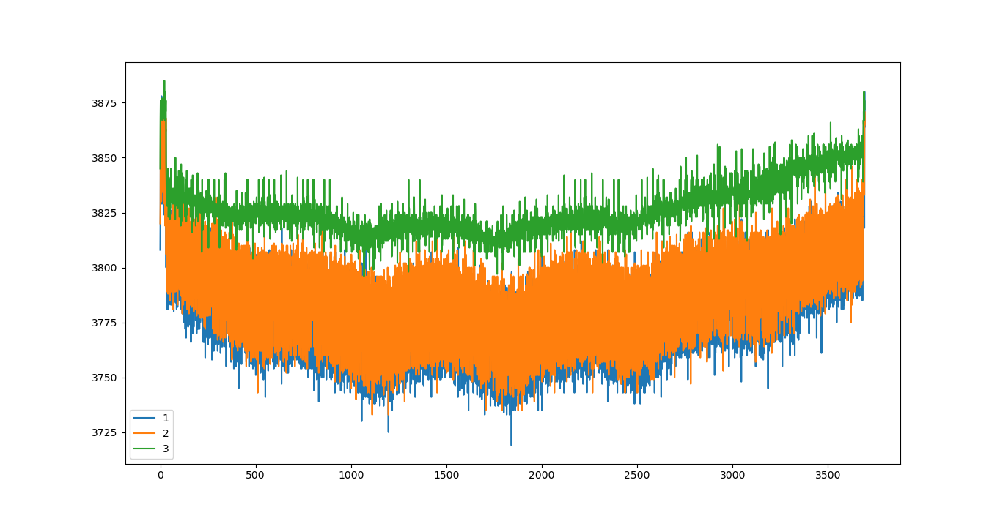

### 读书笔记
* python 具有大量的内置函数,用来处理不同类型的数据.python 是面向对象的语言.每一个数据和函数都可以称之为对象.面向对象区别之前的面向过程的语言.面向过程的语言数据和方法在语言中没有关联起来.
* 当一个类型的名字作为函数调用时,这就是一个构造函数.构造函数会创建一个新的对象然后立即返回.构造函数可以添加参数.
* 对象会有一些专门的方法和他们关联
* python 默认的搜索路径, import sys, 变量 sys.path 列表对应的是一个 list
* Most of the uses of inheritance can be simplified or replaced with composition, and multiple inheritance should be avoided at all costs.(继承的大多数用法都可以简化或者直接使用构造替代,而且应该不惜一起代价避免多重继承)
1. print 函数的 sep 参数，用来设置 print 的打印分隔符，默认是' '，空格
``` python
print('a','b') # a b
print('a','b',sep='') # ab
```
2. youcompleteme 安装 python 补全引擎**python-jedi**
```bash
sudo pacman -S python-jed
# 为了修改 vim 自动将当前路径添加到当前工程还需要修改 .vimrc 的配置
```
3. **help** 函数可以查看某一个模块的所有信息，比如定义的方法、变量等内容，help(待查询的函数)
``` bash
>>> help(str.join)
Help on method_descriptor:
join(self, iterable, /) # 参数列表中的 / 符号表示的限制参数列表的数量,不是真正意义的函数参数
```
4. 给变量赋值前加 r，表示后续内容不需要转义，eg A=r'\t' A 的值不会被转义为 tab
5. if 判断
``` python
if a == 1:
    do sth1
elif:
    do sth2
else:
    do sth3
```
6. python import 其他目錄的 python 文件時，首先需要將存在 python 腳本的目錄添加
到系統的 sys 目錄，方法是 import sys 包，然後執行 sys.path.append("路徑")，然後
再 import 包文件
7. python 執行 linux 命令並且獲取返回值
``` python
ret = os.system("linux 命令")
```
8. python 復制文件 copyfile 函數，在包 shutil 中
9. pip install pip-compile-multi # 该工具支持批量安装 python 包
	* 可以将需要安装的 python 包写在文件 a.in，然后执行 pip-compile -U a.in 就可以批量安装所有的 a.in 的 python 包
	* pip list # 可以列出已经安装的 python packages 以及他们对应的版本号
	* print(package.__version__) # 打印软件包的版本号
10. 注释
	* 单行注释
	``` python
	# 注释语句
	```
	* 多行注释
	``` python
	'''
	注释内容
	'''
	"""
	注释内容
	"""
	```
11. **numpy** 是 python 科学计算（数学）的包
	* y = np.arange(0,0) # 创建一个空数组
	* y = np.arange(2,3) # 创建一个 2 行 3 列的数组
	* y = np.append(y, 123) # append 函数是在数组 y 后追加内容 123, **重点需要将返回值赋值为 y**，否则起不到追加的效果
12. 对 str 类型变量 a 为例子
	* a.isdigit() 判断 a 是否只包含数字
	* a.isalpha() 判断 a 是否只包含字母
	* a.isalnum() 判断 a 是否只包含字母或者数字
13. int(string) # 格式化 string 类型为 int
	* int('12') # 默认转换为 10 进制
	* int('12', 16) # 默认转换为 16 进制
14. str(int) # 格式化为字符串格式
	* str(18) # 默认以 10 进制转换
	* hex(18) # 以 16 进制形式格式化为字符串
15. 绘制图形库 matplotlib.pyplot
	1. plot(x, y) # 以 x 轴和 y 轴绘制曲线图
	2. show() 显示绘制的图形
16. 字符串的内容在 ''' 字符串内容 '''
17. 字典中的变量用大括号括起来 {food}
18. **def** 是 definition function 的缩写
	``` python
	def say_sth(name):
		print (name)
	```
	* 函数的通常语法:
	``` python
		functionName (parameters)
	```
19. strting 字符串
	* format() 方法:格式化,可以替换字符串中字典变量的内容
	* 单引号 ' 定义一行的字符串,双引号中可以嵌套单引号包括的字符串
	* 三引号 ''' ''' 定义多行的字符串内容,三引号中可以嵌套双引号和单引号的字符串
20. 基本变量类型
	1. 数字: 1,2,-5
	2. 字符串: 'hello', 'who are you', python 中的字符串表示的是字符序列,必须使用引号限制字符串范围. python 解释器支持使用单引号 ' 定义字符串,还支持" ",以及 ''' '''
        * 字符串支持从后边索引
        ``` python
        a='abcdef'
        a[0] == 'a'
        a[5] == 'f'
        a[-1] == 'f'
        ```
		* 字符串支持片段截取
		``` python
		a = 'abcdef'
		a[:1] == 'ab'
		a[1:2] == 'bc'
		```
		* find() 函数可以在字符串中查找指定的字符串
		* split(sep) 以指定的字符拆分字符串,返回的是 list 类型
		* join 则是相反,将 list 类型合并为字符串类型
		* capitalize() 首字母大写,其他小写的方法
		* list(字符串) 可以将字符串拆分为单个字符组成的 list 返回
	3. lists: 可以表示组织任意类型, [1, 2, 3],['right', 'wrong', 'dog'], [[1,2], [2,3]] # list 可以互相嵌套
		* append('abc') # 直接将 'abc' 作为一个整体追加到 list 中
		* extend('abc') # 将 'abc' 拆分为 3 部分 'a' 'b' 'c' 添加到 list 中
		* a = [1,2,3] # 取 list 的索引 a[1:2] == [1], 还支持反向索引, a[1:-1] == [1] 左边是包含,右边不包含
		* b = a # 通过等号赋值相当引用实际指向的同一片区域,如果希望复制一个 list 可以使用
			* list.copy()
			* b = a * 1
			* b = a[:]
			* b = list(a)
			* b = a[x for x in a]
			* b = copy.deepcopy(a) # 深度拷贝,需要 import copy
		* list 前添加 * 号表示将 list 解开为多个独立的参数传入函数
		``` python
		def add(num1, num2):
			return num1 + num2
		data = [1,2]
		add(*data) == add(1, 2)
		import numpy as np
		np.arange(*data) == np.arange(1, 2)
		```
	4. 特殊的变量,无,表示 nothing: None
	5. F-strings 是新的变量类型, python3.6 引入
	6. list 类型可以包含重复的内容,但是 set 类型就不可以,set 就是类似数学的集合,可以通过对 list 执行构造函数,提取不同的 list 成员.
	``` python
	a=[1, 2, 3, 2, 1]
	b=set(a)
	b == [1, 2, 3]
	```
		* 借助 set 可以提取 list 的不重复内容
		``` python
		a = [1,2,3,4,5,6,6,1]
		b = list(set(a)) # [1,2,3,4,5,6]
		```
	* class 是 python 基本变量类型术语,用 type 命令查看时都会返回这个关键字
	``` bash
    >>> type(1)
    <class 'int'>
    >>> type(print)
    <class 'builtin_function_or_method'>
	```
	* strings 和 lists 都是序列数据,分别是字符串序列和元素序列. len() 函数可以返回序列变量的长度,字符串拼接.支持乘法和加法
	* 变量名必须以字母开头,可以包含字母\数组\下划线
	* python 区分大小写
	7. tuple 是元组类型,元组类型和 list 类似,但是元组类型不支持对指定索引编号的变量进行修改,但是可以将元组以一个整体进行拼接和删除,元组的定义使用的是 () 括号,而 list 使用的 [] 方括号
		* 访问元组的方法和 list 类型,可以直接使用索引编号
			``` python
			a =(1,2,3)
			a[1:]=(2,3)
			```
		* 元组连接组合
			``` python
			a = (1, 2)
			b = (3, 4)
			c = a + b # c =(1, 2, 3 ,4)
			```
		* 删除元组
			``` python
			a = (1,2)
			del a
			print (a) # NameError: name 'a' is not defined
			```
		* 定义元组,任意无符号的对象，以逗号隔开，默认为元组
			``` python
			a = 123, 'abc', 567
			print (type(a)) # <class 'tuple'>
			```
		* 元组前添加 *,和 list 类似,表示将元组的变量作为函数参数传入
21. 常见函数
	1. type() # 返回对象类型
	2. int(字符串) # 字符串转 int
	3. str(整形) # 整形转字符串
	4. 除法 / 打印浮点数据结果, // 整除,只会打印整数部分
	5. print() 函数可以打印变量的内容
		* 默认情况下, print 会在每一行的结尾添加换行符,可以使用 end 关键字修改结尾字符内容
		* sep 关键字作为打印参数之间的间隔
		* 关键字的修改都要放在 print 函数的结尾处
		* print(格式化 %(数据变量)) 示例:
		``` python
		print('num=%d string=%s' %(123, 'abc')) # num=123, string='abc'
		print('num=%x string=%s' %(123, 'abc')) # hexnum=7b, string='abc'
		print("num=%d string=%s" %(123, 'abc'))
		```
	6. input() 函数接收键盘输入赋值给变量
	7. locals() 返回所有当前视图变量组成的字典!!!
	8. range(序列大小) 自动产生常规的数字序列,一般地会讲过 range() 函数的返回值 list 化,格式化到一个 list 中. range() 直接返回的是 range 类型的数据. list(range(5)) 将 range 的输出直接格式化到一个 list
	9. count() 函数统计指定字符串出现的次数
	``` python
	'abca'.count('a') # 结果是 2
	```
	10. 内置的 dir() 函数可以列出指定对象所有的方法
	``` python
	dir('') # 列出字符串所有的方法
	dir(1) # 列出整形所有的方法
	```
	11. help() 方法查找指定对象方法的帮助文档
	``` python
	hkelpl(str.find)
	```
22. 字典,类似 KV 数据对的存储结构, python 有内置的字典类型 **dict**,提供一个 word 可以查找出他的定义
	* dict() 初始化一个空字典
	``` python
	fruit = dict()
	fruit['0'] = 'apple' # 给字典填充数据
	fruit['1'] = 'banana'
	```
	* 字典前加 ** 号表示将字典解开成为独立的参数作为形参,形参的名字是字典对应的 key 值 !!!
	``` python
	def add(x, y):
		print(x + y)
	data = {'a':7, 'b':6}
	add(**data) # error 会报错,因为形参是 x 和 y,但是字典中是 a 和 b 无法匹配形参列表
	newdata = {'x':7, 'y':6}
	add(**newdata) # ok 等价 add(7, 6) 结果是 13
	```
23. 循环
	* for 循环
	``` python
	for count in [1, 2, 3]:
		print (count)
	```
	* 元组类型和循环一起使用
	``` python
	list4tuple=[(1, 'one'), (2, 'two')]
	for (atuple_num, atuple_str) in list4tuple:
		print('galaxy (%d, %s)' %(atuple_num, atuple_str))
	```
24. python 使用下划线进行保护变量或者方法
	1. 单前置下划线
		* 阻止其他 python 脚本通过 from module import * 语句导入该名字,不会被 * 号匹配
		``` python foo.py
		def test0(x, y):
			return x + y
		def _test1(x, y):
			return x * y
		```
		不能通过 from foo import * 导入 _test1 方法,只能通过 from foo import \_test1 来导入这个方法
		* 作为类的属性名(成员名)或者方法名时,不希望下游的程序员直接访问该名字而导致意外覆盖这个属性,但是这种1情况只是一种命名约定, python 解释器不会对这种属性名做特殊处理.
	2. 前后均带有双下划线 __ 的命名,一般用来特殊的方法,用来实现对象的一些行为或者功能.这些方法也是可以直接调用的
		```
		* __new__() 方法用来创建对象
		* __init__() 方法用来初始化对象
		* x + y 被映射为 x.__add__(y), 序列或者字典的索引操作 x[k] 映射为 x.__getitem__(k)
		* __len__(), __str__() 分别被内置函数 len() 和 str() 调用
		```
	3. 仅开头带双下划线 __ 的命名,用来对象的数据封装,以此命名的属性或者方法为类的私有属性或者私有方法.这种实现的机制并不严格,机制是通过自动变形实现的,类中所有以双下划线开头的名称 __name 都会自动变为 _类名__name 的新名称.
	``` python
	class Foo(object):
		def __init__(self):
			self.__name = 'private name'
		def getname(self):
			return self.__name
		def __spam(self):
			print 'private method'
		def bar(self):
			self.__spam()
	f = Foo()
	f.__name # 会报错
	f._Foo__name # 可以打印
	```
25. python 获取命令行参数
	* import sys ,使用 sys.argv 获取指定的命令行参数
	``` python
	import sys
	print(len(sys.argv)) # 打印命令行参数的数量
	print(sys.argv[0]) # python 脚本本身
	```
26. exit() 函数整个退出 python 脚本
27. matplotlib.pyplot 库
	1. 一般绘图
	``` bash
	import matplotlib.pyplot as plt
	plt.plot(x, y, label="test demo")
	plt.legend() # 添加曲线的描述即 legend
	```
	
28. 对小数取整的四种方法
	* 向上取整: math.ceil()
	* 向下取整: math.floor()
	* 四舍五入: round()
	* 向 0 取整: int()
29. 获取命令行参数的两种方法
    1. getopt
        ``` python
        getopt(args, shortopts, longopts=[])
        getopt(args, options[, long_options]) -> opts, args
        # eg test.py -l 1 -t abc 5 6 -> opts=[(-l, 1), (-t, 2)] args=[5,6]
        opts,args = getopt.getopt(sys.argv[1:], 'l:t:', ["list=", "target="])
        ```
        * 当参数后跟随的是多个字符串时可以使用 str.split(字符串列表) 将字符串解析为 list 格式数据
        ``` python
        # eg test.py -l 'test0.txt test1.txt' -t abc 5 6 -> opts=[(-l, 'test0.txt test1.txt'), (-t, 2)] args=[5,6]
        opts,args = getopt.getopt(sys.argv[1:], 'l:t:', ["list=", "target="])
        for opt,param in opts:
            if opt == 't':
                print(str.split(param)) # ['test0.txt', 'test1.txt']
        ```
    2. argparse

30. 使用全局变量的方法,必须在函数中使用 global 关键字声明这个全局变量
``` python
g_data = 0
def print():
	global g_data # 必须显式声明这个全局变量,否则的话会运行出错
	print(g_data)
```
31. 文件
	* python 考虑到初始化初始化一个文件特别耗时,所以会缓存文件数据,一次性将文件所有的内容都写到文件
	* 文件的 **write** 方法不像 printf 一样会在末尾添加 '\n' 字符.
	* open(filenama) # 默认的方法就是 'r',所以只读文件的时候可以不添加爱 'r' 模式,会将文件的整个内容返回到一个字符串,只读模式下可以不用 close() 文件
		* 'a' 參數表示以追加方式打開文件
		* 't' 參數表示以文本方式(默認)打開文件
		* 'b' 參數以二進制打開文件
32. boolean 运算
	* **in** 是一个布尔运算符号,用来判断对象是否是所属成员,对应的还有 **not in** 这个布尔元算符号
	* 复合表达式的关键字, and / or / not
	* python 支持  `` 90 <= a <= 100 `` 类似的这种表达式
33. python 对类的支持
``` python
class demo_class(object):
	def __init__(self):
		self.string = 'Red demo'
	def hello(self):
		print(self.string)

# 构造一个类的对象
'''
1. 首先会查找 demo_class 发现是定义的一个类
2. 创建一个空的对象包含这个类使用 def 定义的所有方法
3. python 会查找是否存在名称为 __init__ 的函数,如果有的话调用这个函数
4. __init__ 参数有一个 self 参数,指向的就是对象本身的**指针**
'''
demo0 = demo_class()

# 类的继承,括号内为基类的名字,而不再是 **object**
class derive_demo0(demo_class):
    def __init__(self):
        print("hello derived class")

class demo_class(object):
    pass
# 派生类可以直接继承自多个基类
class derive_demo0(demo_class, demo1_class):
    def __init__(self):
        print("hello derived class from demo0 and demo1 ")
```
34. 遍历指定目录下所有目录的方法,os.walk() 返回的是一个 generator, 每一个成员是一个三维的 tuple:
	1. os.walk() 方法
	``` python
    for usb_root, usb_subdirs, usb_subdir_files in os.walk('.'):
		for subdir in usb_subdirs:
			# 获取对应的目录
		for subdir_files in usb_subdir_files:
			# 获取对应目录的文件
		# usb_root 对应的是每一次迭代的根目录
	```
	2. os.scandir() 方法
35. python 中如果使用了 yield 表达式,那么这就是一个 generator function. 只有当调用generator的next方法，generator会执行到yield 表达式处，返回yield表达式的内容，然后暂停（挂起）在这个地方，所以第一次调用next打印第一句并返回“first yield”。 暂停意味着方法的局部变量，指针信息，运行环境都保存起来，直到下一次调用next方法恢复。第二次调用next之后就暂停在最后一个yield，再次调用next()方法，则会抛出StopIteration异常。并且因为 for 语句可以自动捕捉 StopIteration 异常,所以 generator(本质上是任何 iterator)较为常见的方法是在循环中使用.
	``` python
    def generetor_foo():
        yield 1
        yield 2
    def func_fool():
        return 1
    for t in generator_foo():
        print('generator:%d' %(t))
        print('func_fool:%d' %(func_foo()))
	```
	结果为:
	``` bash
    ▸ python test_generator.py
    generator:1
    func_fool:1
    generator:2
    func_fool:1
	```
	一般函数和 genetrator 函数返回 generator 相比有什么区别呢:
	* function 每次都从第一行开始执行,而 generator 从上一次 yield 的地方执行
	* function 每调用一次返回一组/个值,而 generator 可以多次返回
	* function 可以无数次被调用执行,但是 generator 在 yield 最后一个值或者 return 之后不能继续调用了
	特别地函数中使用 yield 是生常 generator 的一种方式,另一种常见的方法是使用 generator expression:
	``` python
	times = [1,2]
	gen = (x * x for  x in times) # generator 表达式
	print(gen) # <generator object <genexpr> at 0x7f035b65ff90>
	```
36. 生成器表达式:
	1. 生成器表达式（generator expression）也叫生成器推导式或生成器解析式，用法与列表推导式非常相似，在形式上生成器推导式使用圆括号（parentheses）作为定界符，而不是列表推导式所使用的方括号（square brackets）。
	2. 与列表推导式最大的不同是，生成器推导式的结果是一个生成器对象。生成器对象类似于迭代器对象，具有惰性求值的特点，只在需要时生成新元素，比列表推导式具有更高的效率，空间占用非常少，尤其适合大数据处理的场合。
	3. 使用生成器对象的元素时，可以根据需要将其转化为列表或元组，也可以使用生成器对象的next()方法或者内置函数next()进行遍历，或者直接使用for循环来遍历其中的元素。但是不管用哪种方法访问其元素，只能从前往后正向访问每个元素，不能再次访问
	4. 已访问过的元素，也不支持使用下标访问其中的元素。当所有元素访问结束以后，如果需要重新访问其中的元素，必须重新创建该生成器对象，enumerate、filter、map、zip等其他迭代器对象也具有同样的特点。
37. 继承: 基类和派生类之间交互有三种方法:
    * 隐式继承(imply)
    ``` python
    class Parent(object):
        def implicit(self):
            print('PARENT implicit')
    class Child(Parent):
        pass
    ```
    * 覆盖继承(overrite)
    ``` python
    class Parent(object):
        def override(self):
            print('PARENT override')

    class Child(Parent):
        def override(self):
            print('CHILD override')

    dad = Parent()
    son = Child()

    dad.override()
    son.override()
    ```
    * 改变继承(alter)
    ``` python
    class Parent(object):
        def altered(self):
            print('PARENT altered')

    class Child(Parent):
        def altered(self):
            print('CHILD before PARENT altered')
            # 改变继承使用 parent 的 altered
            # 使用 super 函数调用基类的方法,调用 Child 类的基类,参数的类名必须是
            # 当前类的 __mro__ 成员中的内容
            super(Child, self).altered()
            # python3 支持直接使用 super 函数调用基类的方法,不用加额外的参数
            super().altered()
            print('CHILD after PARENT altered')

    dad = Parent()
    son = Child()

    dad.altered()
    son.altered()
    ```
38. 多态继承
    ``` python
    class Fruit(object):
        def altered(self):
            print('FRUIT altered')

    class AFruit(object):
        def altered(self):
            print('AFRUIT altered')

    # 多态继承
    class Apple(Fruit, AFruit):
        def altered(self):
            print('CHILD before altered')
            super(Apple, self).altered()
            super().altered()
            print('CHILD after FRUIT altered')

    f0 = Fruit()
    a0 = Apple()

    f0.altered()
    a0.altered()
    ```
	多态继承时,如果父类包含有同名的方法.这就涉及到如何让查找父类方法的问题,即 MRO(method resoluthion order).不同 python 版本使用不同的算法实现 MRO.
	* 在 python2 中存在两种类,一种是经典类,经典类在基类的根如果什么都不写,表示继承 xxx. 另一种是新式类,新式类的特点是基类的根是 object.在 python3 中不存在经典类了.经典类中采用的是深度优先原则.
	* 新式类的 MRO 采用的是 C3 算法,
	``` python
	class A:
		pass
	class B(A):
		pass
	class C(A):
		pass
	class D(B, C):
		pass
	class E(C, A):
		pass
	class F(D, E):
		pass
	class G(E):
		pass
	class H(G, F):
		pass
	# C3 算法,可以通过类的 __mro__ 变量获取类对应的 MRO 成员变量,类型是 tuple
	# + 表示的是 merge . merge 的原则是用每个院的头一项和后面元组的除头一项外的其他元素进行比较,看是否存在.如果存在,就从下一个元组的头一项继续找,如果找不到,就拿出来.作为 merge 的结果的一项.以此类推,直到元组之间的元素都相同了,也就不用再找了.
	# L(H) = H + L(G) + L(F) + (G,F)
	# L(G) = G + L(E)
	# L(F) = F + L(D) + L(E) + (D,E)
	# L(D) = D + L(B) + L(C) + (B,C)
	# L(E) = E + L(C) + L(A) + (C,A)
	# L(B) = B + L(A)
	# L(C) = C + L(A)
	# L(A) = A
	#
	# L(C) = C + A
	# L(B) = B + A
	# L(E) = E + (C,) + (A,) + (C,A) = E.C,A
	# L(D) = D + (B,A) + (C,A) + (B,C) = D,B,A
	# L(F) = F + (D,B,A) + (E,C,A) + (D,E) = F + D + (B,A) + (E,C,A) + (E) = 
	# F + D + B + (A) + (E,C,A) + (E)
	# F + D + B + (E,C,A) + (E)
	# F + D + B + E + (C,A)
	# F D B E C A
	# L(G) = G + (E,) = G + (F,D,B,E,C,A) = G F D B E C A
	# L(H) = H + (G,F,D,B,E,C,A) + (F,D,B,E,C,A) + (G,F) = H G F D B E C A
	```
39. 使用 numpy 包进行数据拟合
	* numpy.polyfit 函数可以对给定的数据进行拟合,并且可以指定拟合的阶数
	* numpy.poly1d 函数可对给定的对象进行格式化,打印出来拟合的数据格式
	``` python
	x=[1,2]
	y=[10, 90]
	func=numpy.polyfit(x, y, 1) # 一阶拟合
	func_format=numpy.poly1d(func)
	```
测试结果:
``` bash
▸ ./test.py
funcp=
80 x - 70
```
40. dearpygui 包
	* viewport 是传统意义上的 window 的概念,在 start_dearpygui() 函数之前,必须执行: create_viewport()/setup_viewport()/show_viewport()
	* 一旦这个 viewport 创建之后,可以使用 configure_viewport 或者其他的 set_viewport_*** 函数去配置这个 viewport
	* primary window 会填充 viewport, 并且会随着 viewport 的 size 变化而变化, 以及会一直保持在其他 window 之后
41. python 中文件夾想作爲一個模塊被引用，該文件夾必須要包含 __init__.py 文件，即使該文件爲空。如果此模塊想要運行，則必須要包含一個 __main__.py 文件。
	* __init__.py 文件中一般包含了所要引用的模塊
	``` python
	 from robot.rebot import rebot, rebot_cli
	 from robot.run import run, run_cli
	 from robot.version import get_version
	
	# __all__ 和 __version__ 都是系統變量
	# __all__ 表示導出包內的模塊
	 __all__ = ['run', 'run_cli', 'rebot', 'rebot_cli']
	 __version__ = get_version()
	```
	* __main__.py 文件可以理解爲一個模塊的入口函數執行模塊
42. os.sep 是目錄的分割符
43. python a.py 表示直接運行 a.py 腳本; python -m a.py 表示將 a 作爲一個模塊運行,此時要存在這個模塊名的目錄在 sys.path 路徑下。
44. [python if __name__ == '__main__'該如何理解](https://blog.csdn.net/weixin_41923961/article/details/86616127)
	* python 屬於腳本語言，是動態諸行執行的，也就是從腳本的第一行開始運行，沒有統一的入口。
	* 一個 python 源文件除了可以被直接運行外還可以作爲模塊（也就是庫）被導入。最頂層的代碼都會被運行（python 用縮進來區分代碼層次）。實際在作爲模塊導入的時候，有一部分代碼是不希望被運行的。
	* 創建 package 的時候(一般是一個目錄)，在文件夾下會有一個 __init__.py 文件，該文件的作用是將該目錄作爲一個 python 模塊. import 的時候會執行 __init__.py 文件
45. parser.add_argument('-f', help="full code compilation", action='store_true') # store_true 表示如果帶有 -f 選項參數，那麼 image 爲真，否則爲假.
46. from collections import defaultdict， 該函數使用一個工廠函數作爲參數創建一個字典。
``` python
A=defaultdict(list) # 如果之後在方位 A 字典的 b key， 但是 b 並不存在時會返回一個空的 list 而不是返回 KeyError
A={} # 創建空字典，如果後續在方位 A 字典的 b key, 但是 b 不存在時，會返回 KeyError
```
47. python 的修飾器
	* @property 創建只讀屬性函數，可以使用調用類參數的方法調用方法
	* @out_path.setter # out_path 屬性可以直接調用，並且具有設置屬性
48. 有多種方法可以修改 sys.path 變量。
	* 導出環境變量 PYTHONPATH
	* 在已經搜索的目錄下創建 .pth 文件，該文件中記錄搜索的路徑
	* 直接在源碼中修改 sys.path 這個 list 變量
49. python 有单例模式，即一个类只有对象在内存中。 Singleton
